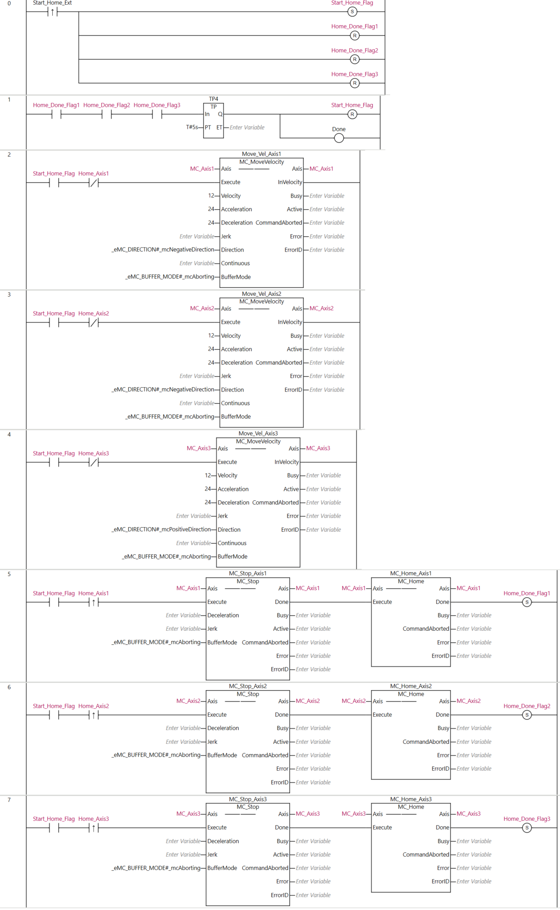
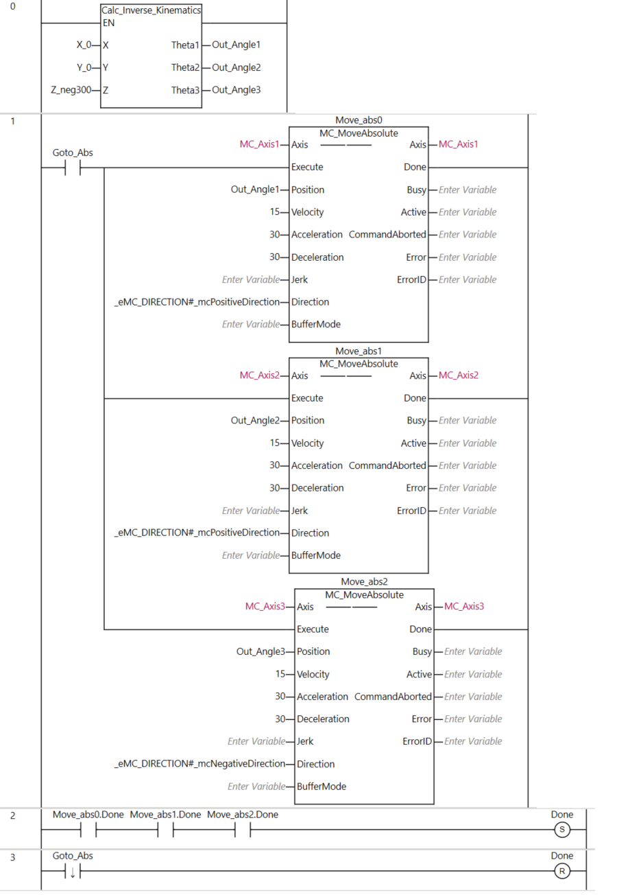

MC_Home_Delta: 
Goto_Absolute: 
MC_Inter_Curve_Vel:
    // ====================================================================
    // PHẦN 1: TÍNH TOÁN QUỸ ĐẠO BÊN TRONG STATE MACHINE
    // ====================================================================
    CASE State OF
        0:  // ================= Step 0: waiting for the new command =================
            IF Execute = TRUE THEN
                Out_Error_IK_OWS := FALSE;  // Reset all fault
                Out_Done_Inter := FALSE;  // Reset interpolation flag
                
                // Cal the inverse kinematic for check
                Check_IK_Error := calc_inverse_kinematics(
                    X := X_A, Y := Y_A, Z := Z_A, 
                    Theta1 => Target_Theta1, Theta2 => Target_Theta2, Theta3 => Target_Theta3
                );
                
                IF Check_IK_Error = TRUE THEN
                    Out_Error_IK_OWS := TRUE; 
                    State := 99; 
                ELSE
                    Enable_Motion := TRUE;
                    // Xoá thời gian của đoạn CŨ. Từ đây tới khi State 1 tính xong,
                    // Out_T_Segment = 0 -> caller biết giá trị chưa hợp lệ cho đoạn mới.
                    Out_T_Segment := 0.0;

                    // LỰA CHỌN LOGIC XUẤT PHÁT DỰA VÀO VẬN TỐC ĐẦU VÀO
                    IF V_Start_Req > 0.0 THEN
                        // ĐANG CHẠY NỐI TIẾP (Blend): 
                        // Bỏ qua State 10 làm mượt. Dùng luôn góc lý thuyết Target làm xuất phát để tránh giật
                        Theta1 := Target_Theta1;
                        Theta2 := Target_Theta2;
                        Theta3 := Target_Theta3;
                        State := 1; // Chuyển thẳng sang tính toán S-Curve
                    ELSE
                        // XUẤT PHÁT TỪ TRẠNG THÁI DỪNG HẲN: 
                        // Phải lấy vị trí thực tế Act.Pos để chạy mượt 20 chu kỳ triệt tiêu sai số
                        Start_Theta1 := Internal_Axis1.Act.Pos; 
                        Start_Theta2 := Internal_Axis2.Act.Pos;
                        Start_Theta3 := Internal_Axis3.Act.Pos;
                        cycle_count := 1;
                        State := 10; 
                    END_IF;
                END_IF;
            ELSE
                // KHI EXECUTE = FALSE
                // Ngắt cờ Blend thành dạng xung (Pulse) để Main Program bắt tín hiệu
                Out_Done_Blend := FALSE; 
                
                Enable_Motion := FALSE; 
                Theta1 := Internal_Axis1.Act.Pos;
                Theta2 := Internal_Axis2.Act.Pos;
                Theta3 := Internal_Axis3.Act.Pos;
            END_IF;

        10: (*
        // =====Step 10: smothing the point start and actual point (from servo) with 20 cyclic time=======
        *)
            IF cycle_count <= 20 THEN
                Theta1 := Start_Theta1 + (Target_Theta1 - Start_Theta1) * (INT_TO_REAL(cycle_count) / 20.0);
                Theta2 := Start_Theta2 + (Target_Theta2 - Start_Theta2) * (INT_TO_REAL(cycle_count) / 20.0);
                Theta3 := Start_Theta3 + (Target_Theta3 - Start_Theta3) * (INT_TO_REAL(cycle_count) / 20.0);
                cycle_count := cycle_count + 1;
            ELSE
                State := 1;
            END_IF;

        1:  // ================= BƯỚC 1: TÍNH TOÁN CẤU HÌNH ĐỘNG LỰC HỌC (S-CURVE/TRAPEZOIDAL) =================
            L := SQRT((X_B - X_A)**2 + (Y_B - Y_A)**2 + (Z_B - Z_A)**2); 

            IF L > 0.0 THEN
                IF Blend_Mode = FALSE THEN
                    // --- TRƯỜNG HỢP 1: LÀ ĐIỂM CUỐI CÙNG -> TỰ ĐỘNG PHANH VỀ 0 ---
                    Out_V_End := 0.0;
                    Use_Standard_SCurve := (V_Start_Req = 0.0); 
                    Actual_Vmax := V_max;

                    IF Use_Standard_SCurve = TRUE THEN
                        IF L < (0.75 * (Actual_Vmax**2) * (1.0/A_max + 1.0/D_max)) THEN
                            Actual_Vmax := SQRT(L / (0.75 * (1.0/A_max + 1.0/D_max)));
                        END_IF;

                        t_acc := 1.5 * (Actual_Vmax / A_max);
                        t_dec := 1.5 * (Actual_Vmax / D_max);
                        S_acc := 0.5 * Actual_Vmax * t_acc;
                        S_dec := 0.5 * Actual_Vmax * t_dec;
                        S_run := L - S_acc - S_dec;
                        t_run := S_run / Actual_Vmax;
                        T_total := t_acc + t_run + t_dec;
                    ELSE
                        S_limit := (ABS(Actual_Vmax**2 - V_Start_Req**2)/(2.0*A_max)) + (ABS(Actual_Vmax**2)/(2.0*D_max));
                        IF S_limit > L THEN
                            Actual_Vmax := SQRT((2.0*A_max*D_max*L + D_max*(V_Start_Req**2)) / (A_max + D_max));
                        END_IF;

                        t_acc := ABS(Actual_Vmax - V_Start_Req) / A_max;
                        t_dec := ABS(Actual_Vmax) / D_max; 
                        S_acc := (V_Start_Req + Actual_Vmax) * 0.5 * t_acc;
                        S_dec := Actual_Vmax * 0.5 * t_dec;
                        S_run := L - S_acc - S_dec;
                        
                        IF S_run < 0.0 THEN S_run := 0.0; END_IF;
                        t_run := S_run / Actual_Vmax;
                        T_total := t_acc + t_run + t_dec;
                    END_IF;

                ELSE
                    // --- TRƯỜNG HỢP 2: CHẠY NỐI TIẾP (BLEND) ---
                    Use_Standard_SCurve := FALSE;

                    // Blend mode: giữ vận tốc cao, không giảm tốc ở điểm B
                    Out_V_End := V_max;

                    // Tính toán cấu hình hình thang (Tăng tốc - Chạy đều)
                    Actual_Vmax := V_max;
                    S_limit := (ABS(Actual_Vmax**2 - V_Start_Req**2)/(2.0*A_max)) + (ABS(Actual_Vmax**2 - Out_V_End**2)/(2.0*D_max));

                    IF S_limit > L THEN
                        // Không đủ quãng đường để đạt V_max
                        Actual_Vmax := SQRT((2.0*A_max*D_max*L + D_max*(V_Start_Req**2) + A_max*(Out_V_End**2)) / (A_max + D_max));
                    END_IF;

                    t_acc := ABS(Actual_Vmax - V_Start_Req) / A_max;
                    t_dec := ABS(Actual_Vmax - Out_V_End) / D_max;

                    S_acc := (V_Start_Req + Actual_Vmax) * 0.5 * t_acc;
                    S_dec := (Out_V_End + Actual_Vmax) * 0.5 * t_dec;
                    S_run := L - S_acc - S_dec;

                    IF S_run < 0.0 THEN S_run := 0.0; END_IF;
                    t_run := S_run / Actual_Vmax;
                    T_total := t_acc + t_run + t_dec;
                END_IF;

                // Thời gian ước tính của ĐOẠN NÀY -> caller cộng dồn thành tổng quỹ đạo
                // và dùng làm gốc tính thời điểm nhả vật của bơm.
                Out_T_Segment := T_total;

                t := 0.0;
                State := 2;
            ELSE
                Execute := FALSE;
                State := 0;
            END_IF;

        2:  // ================= BƯỚC 2: NỘI SUY TỌA ĐỘ THEO THỜI GIAN =================
            IF t <= T_total THEN
                // 2.1 Tính quãng đường S_t
                IF Use_Standard_SCurve = TRUE THEN
                    IF t <= t_acc THEN
                        tau := t / t_acc; 
                        S_t := Actual_Vmax * t_acc * ((tau ** 3) - 0.5 * (tau ** 4));
                    ELSIF t <= (t_acc + t_run) THEN
                        S_t := S_acc + Actual_Vmax * (t - t_acc);
                    ELSE
                        t_phanh := t - (t_acc + t_run);
                        tau := t_phanh / t_dec; 
                        S_t := S_acc + S_run + Actual_Vmax * t_dec * (tau - (tau ** 3) + 0.5 * (tau ** 4));
                    END_IF;
                ELSE
                    IF t <= t_acc THEN
                        S_t := V_Start_Req * t + 0.5 * A_max * (t**2);
                    ELSIF t <= (t_acc + t_run) THEN
                        S_t := S_acc + Actual_Vmax * (t - t_acc);
                    ELSE
                        t_phanh := t - (t_acc + t_run);
                        S_t := S_acc + S_run + Actual_Vmax * t_phanh - 0.5 * D_max * (t_phanh**2);
                    END_IF;
                    
                    IF S_t > L THEN S_t := L; END_IF; 
                END_IF;

                // 2.2 Tính tọa độ Descartes X, Y, Z tại S_t
                X_t := X_A + (S_t / L) * (X_B - X_A);
                Y_t := Y_A + (S_t / L) * (Y_B - Y_A);
                Z_t := Z_A + (S_t / L) * (Z_B - Z_A);

                // 2.3 Giải Động Học Nghịch (IK) để tìm góc cho 3 trục
                Check_IK_Error := calc_inverse_kinematics(
                    X := X_t, Y := Y_t, Z := Z_t, 
                    Theta1 => tmp_Theta1, Theta2 => tmp_Theta2, Theta3 => tmp_Theta3
                );
                
                IF Check_IK_Error = TRUE THEN
                    Out_Error_IK_OWS := TRUE; 
                    State := 99; 
                    RETURN; 
                END_IF;

                // Cập nhật vị trí đẩy xuống lệnh gọi Servo
                Theta1 := tmp_Theta1;
                Theta2 := tmp_Theta2;
                Theta3 := tmp_Theta3;

                t := t + 0.004; // Chu kỳ lấy mẫu nội suy (4ms)

            ELSE
                // ================= KẾT THÚC ĐOẠN ĐƯỜNG (HẾT THỜI GIAN T_total) =================
                IF (Blend_Mode = TRUE) AND (Out_V_End > 0.0) THEN
                    // CHẠY NỐI TIẾP: Bật cờ Blend, chờ nhả Execute
                    Out_Done_Blend := TRUE; 
                    Execute := FALSE; 
                    State := 0; // Quay về State 0 chực chờ nạp điểm mới và nội suy tiếp
                ELSE
                    // DỪNG HẲN: Chuyển sang State 3 đợi Servo Settle
                    State := 3; 
                END_IF;
            END_IF;

        3:  // ================= BƯỚC 3: KIỂM TRA SAI SỐ DỪNG (SETTLE) =================
            Enable_Motion := FALSE; 
            
            // Đọc ACT.POS để xác nhận Servo đã bám sát điểm đích với sai số < 0.0005 độ
            IF (ABS(Theta1 - Internal_Axis1.Act.Pos) <= 0.0005) AND 
            (ABS(Theta2 - Internal_Axis2.Act.Pos) <= 0.0005) AND 
            (ABS(Theta3 - Internal_Axis3.Act.Pos) <= 0.0005)
            THEN
                Out_Done_Inter := TRUE;
            ELSE
                Out_Done_Inter := FALSE;
            END_IF;

            // Xả cờ và reset State khi Servo báo hết Busy
            IF (MC_Sync_Axis1.Busy = FALSE) AND 
            (MC_Sync_Axis2.Busy = FALSE) AND 
            (MC_Sync_Axis3.Busy = FALSE) THEN
                
                Execute := FALSE;  
                State := 0;        
            END_IF;

        99: // ================= BƯỚC 99: LỖI KINEMATICS =================
            Execute := FALSE;
            Enable_Motion := FALSE; 
            IF Out_Error_IK_OWS = FALSE THEN
                State := 0;
            END_IF;
    END_CASE;

    // ====================================================================
    // PHẦN 2: GỌI HÀM SERVO (LUÔN ĐƯỢC QUÉT Ở CUỐI CHU KỲ)
    // ====================================================================
    // Sử dụng hàm đồng bộ vị trí, servo sẽ bám theo biến Theta liên tục
    MC_Sync_Axis1(Axis := Internal_Axis1, Execute := Enable_Motion, Position := Theta1);
    MC_Sync_Axis2(Axis := Internal_Axis2, Execute := Enable_Motion, Position := Theta2);
    MC_Sync_Axis3(Axis := Internal_Axis3, Execute := Enable_Motion, Position := Theta3);

FB_Teaching_Mode:
    // =========================================================================================
    // FUNCTION_BLOCK: FB_TeachingMode
    // =========================================================================================

    // -----------------------------------------------------------------------------------------
    // Reset xung báo mỗi chu kỳ quét
    // -----------------------------------------------------------------------------------------
    teaching_done := FALSE;
    teaching_err  := FALSE;

    // -----------------------------------------------------------------------------------------
    // Sườn lên của start_teaching_mode: vừa VÀO Teaching Mode
    // -> tránh bắt sườn giả nếu button_teaching đã lỡ giữ sẵn từ trước khi vào mode
    // -----------------------------------------------------------------------------------------
    IF start_teaching_mode AND NOT start_teaching_mode_old THEN
        button_teaching_old := button_teaching;
    END_IF;
    start_teaching_mode_old := start_teaching_mode;

    IF start_teaching_mode THEN

        // 1. Bắt sườn xuống của nút button_teaching (khoảnh khắc vừa nhả tay)
        button_teaching_fall := NOT button_teaching AND button_teaching_old;
        button_teaching_old  := button_teaching;

        // 2. Điều khiển nguồn Servo theo trạng thái nút
        IF button_teaching THEN
            // Giữ nút: tắt mô-men Servo, thắng NC 24V đang mở sẵn -> kéo tay tự do
            Pw_servo_on := FALSE;
        ELSE
            // Thả nút: bật Servo ON để khóa giữ vị trí ngay lập tức
            Pw_servo_on := TRUE;
        END_IF;

        // 3. Ghi nhận điểm dạy khi vừa thả nút (sườn xuống)
        IF button_teaching_fall THEN

            // a. Đọc chính xác góc Encoder thực tế 3 trục tại thời điểm vừa nhả tay (độ)
            theta_teaching1 := inter_MC_Axis1.Act.Pos;
            theta_teaching2 := inter_MC_Axis2.Act.Pos;
            theta_teaching3 := inter_MC_Axis3.Act.Pos;

            // b. Gọi Động Học Thuận (Forward Kinematics) để tính tọa độ Cartesian (X, Y, Z)
            fk_err := Calc_Forward_Kinematic(
                EN        := TRUE,
                Theta1    := theta_teaching1,
                Theta2    := theta_teaching2,
                Theta3    := theta_teaching3,
                Calc_OutX => pos_teaching1,
                Calc_OutY => pos_teaching2,
                Calc_OutZ => pos_teaching3
            );

            // c. Báo kết quả cho caller (Program_Main) qua xung teaching_done / teaching_err
            IF fk_err THEN
                teaching_err := TRUE;
            ELSE
                teaching_done := TRUE;
            END_IF;

        END_IF;

    ELSE
        // Ngoài Teaching Mode: luôn giữ Servo ON, không cho button_teaching có tác dụng
        Pw_servo_on := TRUE;
        button_teaching_fall := FALSE;
        button_teaching_old  := button_teaching; // tránh sườn giả khi vào lại mode lần sau
    END_IF;

    // 4. Thực thi khối điều khiển MC_Power cho 3 trục Delta (chạy mọi scan)
    Pw_Power_0(Axis := inter_MC_Axis1, Enable := Pw_servo_on);
    Pw_Power_1(Axis := inter_MC_Axis2, Enable := Pw_servo_on);
    Pw_Power_2(Axis := inter_MC_Axis3, Enable := Pw_servo_on);

FB_ICV_Sequencer:
    // =====================================================================================
    // FUNCTION_BLOCK: FB_ICV_Sequencer
    // Chạy quỹ đạo N điểm bằng DUY NHẤT 1 instance MC_Inter_Curve_Vel bên trong.
    // Thay thế toàn bộ Rung 13..18 (6 FB nối cứng) của bản cũ.
    //
    //   N điểm  ->  N-1 đoạn  ->  chỉ số đoạn SegIdx = 0 .. (N_Points - 2)
    //   Đoạn i  :  Pos[i] -> Pos[i+1]
    //   Blend   :  TRUE với i < N_Points-2 ; FALSE với đoạn cuối (phanh về 0)
    //   V_Start :  0.0 với i = 0 ; = Out_V_End của đoạn trước với i > 0
    //
    // FB này CHỈ lo quỹ đạo. Không đụng tới bơm/van — caller tự làm, dùng 3 output
    // SegIdx / IsLastSeg / T_SegNow. Nhờ vậy FB dùng lại được cho máy khác.
    //
    // ---------------------------------------------------------------------------------
    // BẢNG KHAI BÁO (gõ vào tab khai báo của FB trong Sysmac Studio)
    // ---------------------------------------------------------------------------------
    // VAR_INPUT
    //     Execute    : BOOL;      // SƯỜN LÊN = chạy quỹ đạo mới
    //     Abort      : BOOL;      // huỷ ngay lập tức
    //     ErrReset   : BOOL;      // xoá lỗi, đưa FB về IDLE
    //     N_Points   : INT;       // SỐ ĐIỂM (không phải số đoạn)
    //     Max_Index  : INT;       // chỉ số LỚN NHẤT của mảng Pos_X (31 nếu ARRAY[0..31])
    //     V_max      : LREAL;
    //     A_max      : LREAL;
    //     D_max      : LREAL;
    // END_VAR
    //
    // VAR_IN_OUT                              // ARRAY[*] = truyền THAM CHIẾU, không copy
    //     Pos_X      : ARRAY[*] OF LREAL;     // toạ độ X, PHẢI đánh chỉ số từ 0
    //     Pos_Y      : ARRAY[*] OF LREAL;     // toạ độ Y
    //     Pos_Z      : ARRAY[*] OF LREAL;     // toạ độ Z
    //     T_Seg      : ARRAY[*] OF LREAL;     // FB GHI thời gian từng đoạn ra đây
    //     Int_Axis1  : _sAXIS_REF;            // BẮT BUỘC In/Out ở MỌI TẦNG
    //     Int_Axis2  : _sAXIS_REF;            // Đặt tên Int_* để phân biệt với biến global
    //     Int_Axis3  : _sAXIS_REF;            // MC_Axis* của trục thật bên ngoài
    // END_VAR
    //
    // CHUỖI TRUYỀN TRỤC - chỉ cần 1 tầng khai sai là gãy cả chuỗi:
    //
    //   Program_Main          ICV_Sequencer          MC_Inter_Curve_Vel      MC_Sync_Axis*
    //   MC_Axis1  ────────►   Int_Axis1  ────────►   Internal_Axis1  ────►   Axis
    //   (global thật)         (In/Out)               (In/Out)                (yêu cầu Omron)
    //
    //   Ở Program_Main:   Traj( Int_Axis1 := MC_Axis1, ... )
    //   Ở FB này:         ICV_Run( Internal_Axis1 := Int_Axis1, ... )
    //                                    ▲                ▲
    //                                    │                └── biến In/Out của FB này
    //                                    └── tên tham số của MC_Inter_Curve_Vel
    //
    // MC_Inter_Curve_Vel PHẢI khai 3 trục ở tab In/Out. Nếu để ở tab Externals thì nó
    // không có chân tham số -> lời gọi dưới đây báo
    //   "The variable 'MC_Axis1' is not an in-out variable"
    // và lỗi sẽ trỏ vào TÊN THAM SỐ bên TRÁI dấu := (cột 5), không phải argument.
    //
    // VAR_OUTPUT
    //     Busy       : BOOL;      // đang chạy quỹ đạo
    //     Done       : BOOL;      // XUNG 1 SCAN: xong cả quỹ đạo, servo đã settle
    //     Error      : BOOL;      // có lỗi, FB đứng yên chờ ErrReset
    //     ErrorID    : INT;       // 1 = N_Points sai/mảng quá nhỏ ; 2 = IK ngoài vùng
    //     SegIdx     : INT;       // đang chạy đoạn thứ mấy (0 .. N_Points-2)
    //     IsLastSeg  : BOOL;      // TRUE khi đang ở đoạn cuối -> caller dùng cho bơm
    //     T_Total    : LREAL;     // TỔNG thời gian cộng dồn (giây)
    //     T_SegNow   : LREAL;     // thời gian đoạn đang chạy (0 = chưa tính xong)
    // END_VAR
    //
    // VAR
    //     ICV_Run    : MC_Inter_Curve_Vel;    // 1 instance DUY NHẤT
    //     State      : INT;                   // 0=idle 1=running 2=done 9=error
    //     Last_Idx   : INT;                   // chỉ số đoạn cuối = N_Points - 2
    //     Exec_Prev  : BOOL;
    //     Exec_Edge  : BOOL;
    //     Blend_Prev : BOOL;
    //     Blend_Edge : BOOL;
    //     Inter_Prev : BOOL;
    //     Inter_Edge : BOOL;
    //     Seq_Exec   : BOOL;
    //     Seq_Load   : BOOL;
    //     Seq_Blend  : BOOL;
    //     Seq_X_A    : LREAL;
    //     Seq_Y_A    : LREAL;
    //     Seq_Z_A    : LREAL;
    //     Seq_X_B    : LREAL;
    //     Seq_Y_B    : LREAL;
    //     Seq_Z_B    : LREAL;
    //     Seq_V_Start: LREAL;
    //     i          : INT;
    // END_VAR
    //
    // ---------------------------------------------------------------------------------
    // THỨ TỰ 7 KHỐI DƯỚI ĐÂY LÀ BẮT BUỘC
    //   (1) xoá xung -> (2) GỌI FB NỘI SUY -> (3) bắt sườn -> (4) abort
    //   -> (5) state machine -> (6) nạp đoạn kế -> (7) xuất output
    // Vì (2) đứng TRƯỚC (5)(6): đoạn i vừa xong thì đoạn i+1 được nạp NGAY trong cùng
    // chu kỳ quét -> thời gian chuyển đoạn bằng đúng kiến trúc 6-FB cũ, không chậm thêm.
    // =====================================================================================

    // -------------------------------------------------------------------------------------
    // (1) XUNG 1 SCAN: XOÁ Ở ĐẦU CHU KỲ
    // -------------------------------------------------------------------------------------
    Done := FALSE;

    // -------------------------------------------------------------------------------------
    // (2) GỌI FB NỘI SUY  (1 instance duy nhất, dùng lại cho mọi đoạn)
    //     Execute của ICV_Run là VAR_IN_OUT: nó tự hạ Seq_Exec khi chạy xong 1 đoạn.
    // -------------------------------------------------------------------------------------
    ICV_Run(
        Execute     := Seq_Exec,
        X_A         := Seq_X_A,
        Y_A         := Seq_Y_A,
        Z_A         := Seq_Z_A,
        X_B         := Seq_X_B,
        Y_B         := Seq_Y_B,
        Z_B         := Seq_Z_B,
        V_Start_Req := Seq_V_Start,
        V_max       := V_max,
        A_max       := A_max,
        D_max       := D_max,
        Blend_Mode  := Seq_Blend,
        // TRÁI  = tên tham số của MC_Inter_Curve_Vel  (Internal_AxisN)
        // PHẢI  = biến In/Out của FB này              (Int_AxisN)
        Internal_Axis1 := Int_Axis1,
        Internal_Axis2 := Int_Axis2,
        Internal_Axis3 := Int_Axis3
    );

    // -------------------------------------------------------------------------------------
    // (3) BẮT SƯỜN LÊN
    //     Out_Done_Blend BẮT BUỘC dùng sườn, KHÔNG dùng mức. Lý do: khi ta nạp đoạn kế
    //     ngay lập tức, Seq_Exec lên TRUE trở lại nên nhánh ELSE của State 0 trong ICV_Run
    //     (nơi nó tự hạ Out_Done_Blend) không bao giờ chạy -> cờ giữ mức TRUE suốt quỹ đạo.
    //     Dùng mức sẽ nhảy đoạn mỗi 4 ms và đốt hết waypoint trong ~50 ms.
    // -------------------------------------------------------------------------------------
    Blend_Edge := ICV_Run.Out_Done_Blend AND NOT Blend_Prev;
    Blend_Prev := ICV_Run.Out_Done_Blend;

    Inter_Edge := ICV_Run.Out_Done_Inter AND NOT Inter_Prev;
    Inter_Prev := ICV_Run.Out_Done_Inter;

    Exec_Edge  := Execute AND NOT Exec_Prev;
    Exec_Prev  := Execute;

    // -------------------------------------------------------------------------------------
    // (4) ABORT
    // -------------------------------------------------------------------------------------
    IF Abort THEN
        Seq_Exec := FALSE;
        Seq_Load := FALSE;
        Busy     := FALSE;
        State    := 0;
    END_IF;

    // -------------------------------------------------------------------------------------
    // (5) MÁY TRẠNG THÁI
    // -------------------------------------------------------------------------------------
    CASE State OF

        0:  // ============ IDLE: chờ sườn lên của Execute ============
            Busy     := FALSE;
            Seq_Exec := FALSE;

            IF Exec_Edge THEN

                // Max_Index = chỉ số LỚN NHẤT của mảng Pos_X, do caller truyền vào
                // (31 nếu khai ARRAY[0..31]). Không dùng UpperBound vì bản Sysmac này
                // không có lệnh đó.
                // N điểm cần chỉ số 0..N-1, nên N-1 phải <= Max_Index.
                IF (N_Points < 2) OR ((N_Points - 1) > Max_Index) THEN
                    // Số điểm vô lý, hoặc mảng không đủ chỗ -> chặn trước khi động cơ chạy
                    Error   := TRUE;
                    ErrorID := 1;
                    State   := 9;
                ELSE
                    Error   := FALSE;
                    ErrorID := 0;

                    // Chốt chỉ số đoạn cuối NGAY LÚC NÀY. Nếu caller lỡ đổi N_Points
                    // giữa chừng thì quỹ đạo đang chạy vẫn dùng giá trị cũ -> an toàn.
                    Last_Idx := N_Points - 2;

                    // Reset bộ đếm thời gian của lượt chạy mới
                    T_Total := 0.0;
                    // T_Seg nhỏ hơn Pos_X đúng 1 phần tử: 32 điểm -> 31 đoạn
                    FOR i := 0 TO (Max_Index - 1) DO
                        T_Seg[i] := 0.0;
                    END_FOR;

                    SegIdx      := 0;
                    Seq_V_Start := 0.0;         // đoạn đầu luôn xuất phát từ dừng
                    Seq_Load    := TRUE;        // -> khối (6) nạp Pos[0] -> Pos[1]
                    Busy        := TRUE;
                    State       := 1;
                END_IF;
            END_IF;

        1:  // ============ RUNNING: đang chạy đoạn SegIdx ============
            IF ICV_Run.Out_Error_IK_OWS THEN
                // Điểm nằm ngoài vùng làm việc -> dừng cả quỹ đạo
                Error    := TRUE;
                ErrorID  := 2;
                Seq_Exec := FALSE;
                State    := 9;

            ELSIF Blend_Edge THEN
                // --- Đoạn SegIdx vừa xong ở chế độ NỐI TIẾP ---
                // Out_T_Segment vẫn giữ T_total của đoạn vừa xong (ICV_Run chỉ xoá nó ở
                // State 0 của đoạn kế, tức chu kỳ sau) -> đọc ở đây là chính xác.
                T_Seg[SegIdx] := ICV_Run.Out_T_Segment;
                T_Total       := T_Total + T_Seg[SegIdx];

                Seq_V_Start   := ICV_Run.Out_V_End;   // NỐI VẬN TỐC: V_end(i) -> V_start(i+1)
                SegIdx        := SegIdx + 1;
                Seq_Load      := TRUE;                // -> khối (6) nạp đoạn kế

            ELSIF Inter_Edge THEN
                // --- Đoạn CUỐI vừa dừng hẳn và servo đã bám đúng đích ---
                T_Seg[SegIdx] := ICV_Run.Out_T_Segment;
                T_Total       := T_Total + T_Seg[SegIdx];

                Seq_Exec      := FALSE;
                State         := 2;
            END_IF;

        2:  // ============ DONE ============
            Busy  := FALSE;
            Done  := TRUE;                      // xung 1 scan
            State := 0;

        9:  // ============ ERROR: đứng yên chờ ErrReset ============
            Busy     := FALSE;
            Seq_Exec := FALSE;
            IF ErrReset THEN
                Error   := FALSE;
                ErrorID := 0;
                State   := 0;
            END_IF;

    END_CASE;

    // -------------------------------------------------------------------------------------
    // (6) NẠP ĐOẠN HIỆN TẠI  (Pos[SegIdx] -> Pos[SegIdx + 1])
    //     Chạy SAU máy trạng thái để dùng đúng SegIdx vừa tăng.
    // -------------------------------------------------------------------------------------
    IF Seq_Load THEN
        Seq_Load := FALSE;

        Seq_X_A := Pos_X[SegIdx];
        Seq_Y_A := Pos_Y[SegIdx];
        Seq_Z_A := Pos_Z[SegIdx];

        Seq_X_B := Pos_X[SegIdx + 1];
        Seq_Y_B := Pos_Y[SegIdx + 1];
        Seq_Z_B := Pos_Z[SegIdx + 1];

        // Đoạn cuối có chỉ số Last_Idx (= N_Points - 2) -> Blend = FALSE -> phanh về 0.
        // N_Points = 7: đoạn 0..4 Blend=TRUE, đoạn 5 Blend=FALSE.
        // N_Points = 2: chỉ có đoạn 0, (0 < 0) = FALSE -> phanh luôn. Đúng.
        Seq_Blend := (SegIdx < Last_Idx);

        Seq_Exec := TRUE;
    END_IF;

    // -------------------------------------------------------------------------------------
    // (7) XUẤT OUTPUT PHỤ TRỢ CHO CALLER
    //     Caller dùng 2 cái này để điều khiển bơm/van mà không cần biết ruột FB.
    // -------------------------------------------------------------------------------------
    IsLastSeg := Busy AND (SegIdx = Last_Idx);
    T_SegNow  := ICV_Run.Out_T_Segment;
