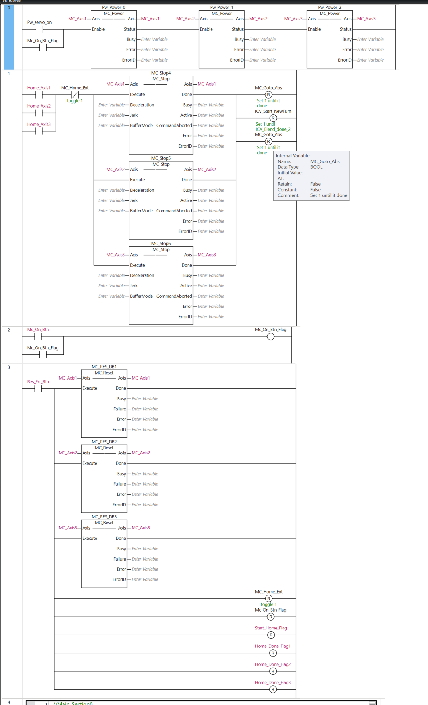
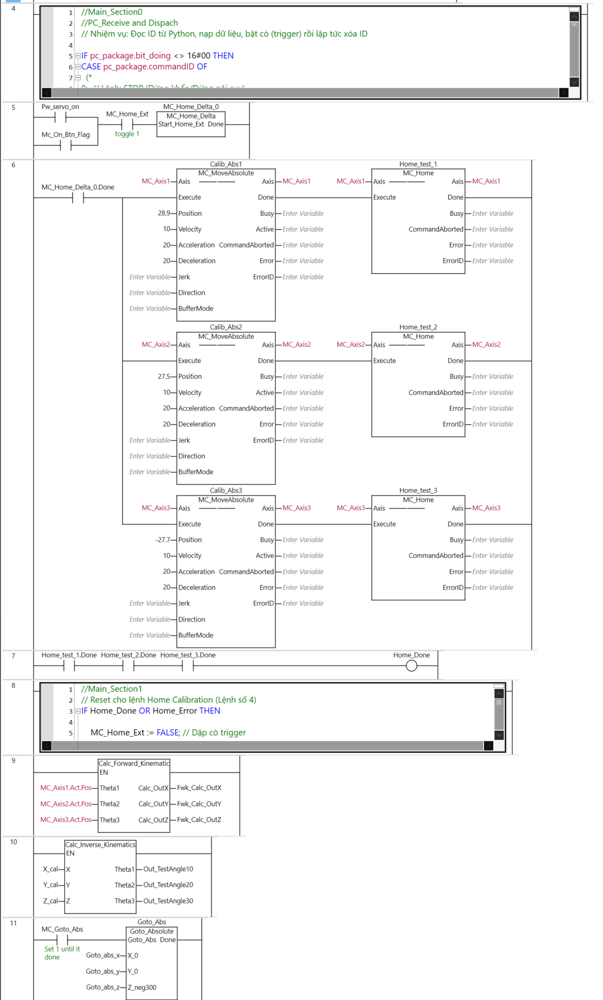
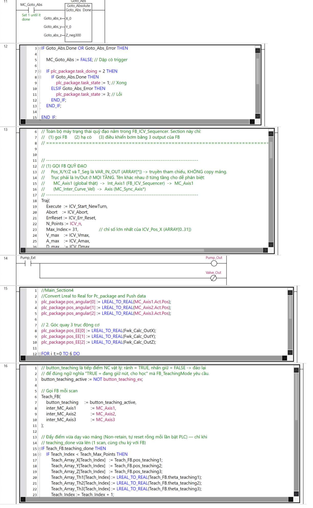

4th line code:
'//Main_Section0 
//PC_Receive and Dispach
// Nhiệm vụ: Đọc ID từ Python, nạp dữ liệu, bật cò (trigger) rồi lập tức xóa ID

IF pc_package.bit_doing <> 16#00 THEN
CASE pc_package.commandID OF
  (*  
0:  // Lệnh: STOP (Dừng khẩn/Dừng nội suy)
	        MC_Stop_Delta := TRUE;
	        
	        plc_package.task_doing := 0;
	        plc_package.task_state := 1; // 1: Done
	        pc_package.commandID := -1;  // Xóa lệnh (Handshake)
			*)
    2:  // Lệnh: GOTO ABSOLUTE
		// Convert Real to Lreal for plc_package
		Goto_abs_x:= REAL_TO_LREAL(pc_package.argument_x[0]);
		Goto_abs_y := REAL_TO_LREAL(pc_package.argument_y[0]);
		Goto_abs_z:= REAL_TO_LREAL(pc_package.argument_z[0]);
        
        MC_Goto_Abs := TRUE;         // Bật cò chạy
        plc_package.task_doing := 2;
        plc_package.task_state := 2; // 2: Busy
        pc_package.commandID := -1;

    3:  // Lệnh: GO TRAJECTORY (Chạy quỹ đạo theo mảng tọa độ)
        ICV_Start_NewTurn := TRUE; //auto turn off
        FOR i1 := 0 TO 6 DO
			ICV_Pos_X[i1] := REAL_TO_LREAL(pc_package.argument_x[i1]);
			ICV_Pos_Y[i1] := REAL_TO_LREAL(pc_package.argument_y[i1]);
			ICV_Pos_Z[i1] := REAL_TO_LREAL(pc_package.argument_z[i1]);
			ICV_Pos_E[i1] := pc_package.argument_e[i1];
		END_FOR;
        plc_package.task_doing := 3;
        plc_package.task_state := 2; // Busy
        pc_package.commandID := -1;

    4:  // Lệnh: HOME CALIBRATION (Tìm gốc)
        MC_Home_Ext := TRUE;
        
        plc_package.task_doing := 4;
        plc_package.task_state := 2; // Busy
        pc_package.commandID := -1;

    5:  // Lệnh: PICK (Hút vật)
        Pump_Ext := TRUE;
        
        plc_package.task_doing := 5;
        plc_package.task_state := 1; // 1: Done (Do bật bơm là xong ngay)
        pc_package.commandID := -1;

    6:  // Lệnh: RELEASE (Nhả vật)
        Pump_Ext := FALSE;
        
        plc_package.task_doing := 6;
        plc_package.task_state := 1; // Done
        pc_package.commandID := -1;
		END_CASE;
pc_package.bit_doing :=16#00;
END_IF;'

8th line code:
'//Main_Section1 
// Reset cho lệnh Home Calibration (Lệnh số 4)
IF Home_Done OR Home_Error THEN
 
    MC_Home_Ext := FALSE; // Dập cò trigger
	
    IF plc_package.task_doing = 4 THEN
        IF Home_Done THEN
            plc_package.task_state := 1; // Xong
        ELSIF Home_Error THEN
            plc_package.task_state := 3; // Lỗi
        END_IF;
    END_IF;
    
END_IF;'

 12th line code:
 '//Main_Section2
// Reset cho Move_Abs (Lệnh số 2)
IF Goto_Abs.Done OR Goto_Abs_Error THEN
 
    MC_Goto_Abs := FALSE; // Dập cò trigger
	
    IF plc_package.task_doing = 2 THEN
        IF Goto_Abs.Done THEN
            plc_package.task_state := 1; // Xong
        ELSIF Goto_Abs_Error THEN
            plc_package.task_state := 3; // Lỗi
        END_IF;
    END_IF;
    
END_IF;'
 
 13th line code:
 '// =====================================================================================
// SECTION trong Program_Main: gọi FB_ICV_Sequencer + điều khiển bơm
// Thay thế Rung 13..18 (6 FB nối cứng) và Main_Section3 (logic bơm cũ).
// Đặt SAU Rung 12, TRƯỚC Rung 20 (Pump & Valve output).
//
// Toàn bộ máy trạng thái quỹ đạo nằm trong FB_ICV_Sequencer. Section này chỉ:
//   (1) gọi FB      (2) hạ cò      (3) điều khiển bơm bằng 3 output của FB
// =====================================================================================

// -------------------------------------------------------------------------------------
// (1) GỌI FB QUỸ ĐẠO
//     Pos_X/Y/Z và T_Seg là VAR_IN_OUT (ARRAY[*]) -> truyền tham chiếu, KHÔNG copy mảng.
//     Trục phải là In/Out ở MỌI TẦNG. Tên khác nhau ở từng tầng cho dễ phân biệt:
//       MC_Axis1 (global thật)  ->  Int_Axis1 (FB_ICV_Sequencer)  ->  MC_Axis1
//       (MC_Inter_Curve_Vel)  ->  Axis (MC_Sync_Axis*)
// -------------------------------------------------------------------------------------
Traj(
    Execute  := ICV_Start_NewTurn,
    Abort    := ICV_Abort,
    ErrReset := ICV_Err_Reset,
    N_Points := ICV_n,
    Max_Index:= 31,                 // chỉ số lớn nhất của ICV_Pos_X (ARRAY[0..31])
    V_max    := ICV_Vmax,
    A_max    := ICV_Amax,
    D_max    := ICV_Dmax,
    Pos_X    := ICV_Pos_X,
    Pos_Y    := ICV_Pos_Y,
    Pos_Z    := ICV_Pos_Z,
    T_Seg    := ICV_t,
    // TRÁI = tên tham số của FB_ICV_Sequencer ; PHẢI = biến global của trục thật
    Int_Axis1:= MC_Axis1,
    Int_Axis2:= MC_Axis2,
    Int_Axis3:= MC_Axis3
);

// -------------------------------------------------------------------------------------
// (2) HẠ CÒ NGAY SAU LỜI GỌI
//     FB đã bắt SƯỜN LÊN của Execute ở khối (1) rồi, nên hạ ngay là an toàn.
//
//     KHÔNG dùng "IF Traj.Busy THEN": khi FB TỪ CHỐI lệnh (N_Points sai -> ErrorID = 1)
//     thì Busy KHÔNG BAO GIỜ lên TRUE -> cò kẹt TRUE vĩnh viễn -> mọi lệnh sau đó không
//     tạo được sườn lên nữa -> quỹ đạo chết hẳn, phải khởi động lại PLC.
// -------------------------------------------------------------------------------------
IF ICV_Start_NewTurn THEN
    ICV_Start_NewTurn := FALSE;
END_IF;

// Xoá cờ ErrReset sau 1 chu kỳ (nút Res_Err_Btn có thể bị giữ lâu)
IF ICV_Err_Reset AND NOT Traj.Error THEN
    ICV_Err_Reset := FALSE;
END_IF;

// -------------------------------------------------------------------------------------
// (3) ĐIỀU KHIỂN BƠM / END-EFFECTOR
//     Đoạn 0 .. n-3 : bơm bám theo ICV_Pos_E[SegIdx]
//     Đoạn cuối     : bơm nhả sớm ở 50% thời gian đoạn, cho vật kịp rơi trước khi tay đi
// -------------------------------------------------------------------------------------

// "Đoạn cuối SẴN SÀNG" = đang ở đoạn cuối VÀ FB đã tính xong thời gian của đoạn đó.
//
// PHẢI chờ T_SegNow > 0. Ngay chu kỳ vừa chuyển sang đoạn cuối, Out_T_Segment của
// MC_Inter_Curve_Vel VẪN ĐANG GIỮ thời gian của đoạn TRƯỚC (nó chỉ bị xoá ở State 0
// của đoạn mới, tức chu kỳ sau). Chốt vội sẽ lấy nhầm số của đoạn trước.
Seq_LastSegReady := Traj.IsLastSeg AND (Traj.T_SegNow > 0.0);

IF Seq_LastSegReady THEN
    Mem_T_LastSeg := Traj.T_SegNow;
END_IF;

Timing_for_EEF := NanoSecToTime(LREAL_TO_LINT(0.5 * Mem_T_LastSeg * 1000000000.0));

// IN dùng Seq_LastSegReady, KHÔNG dùng Traj.IsLastSeg.
// TP chốt PT tại SƯỜN LÊN của IN -> phải đợi PT đúng rồi mới cho timer chạy.
// Trễ 2 chu kỳ (8 ms) so với đầu đoạn cuối, không đáng kể.
fb_PumpTimer(IN := Seq_LastSegReady, PT := Timing_for_EEF);

IF NOT Traj.Busy THEN
    Pump_Ext := FALSE;

ELSIF Traj.IsLastSeg THEN
    // GIỮ NGUYÊN biểu thức của code cũ: đúng khi fb_PumpTimer khai báo là TP (Pulse).
    //   TP  -> .Q = TRUE trong 50% đầu, tự hạ sau đó -> bơm nhả ở giữa đoạn.  ĐÚNG
    //   TON -> .Q = FALSE trong 50% đầu -> bơm chỉ bật ở nửa SAU. NGƯỢC Ý ĐỒ.
    // Nếu instance đang là TON, đổi thành:  AND NOT fb_PumpTimer.Q
    //
    // "OR NOT Seq_LastSegReady" giữ bơm ON trong 2 chu kỳ chờ timer khởi động,
    // tránh hụt chân không 8 ms ngay đầu đoạn cuối.
    Pump_Ext := (ICV_Pos_E[Traj.SegIdx] = 1)
                AND (fb_PumpTimer.Q OR NOT Seq_LastSegReady);

ELSE
    Pump_Ext := (ICV_Pos_E[Traj.SegIdx] = 1);
END_IF;
'

15th line code:
    '//Main_Section4
    //Convert Lreal to Real for Pc_package and Push data
    plc_package.pos_angular[0] := LREAL_TO_REAL(MC_Axis1.Act.Pos);
    plc_package.pos_angular[1] := LREAL_TO_REAL(MC_Axis2.Act.Pos);
    plc_package.pos_angular[2] := LREAL_TO_REAL(MC_Axis3.Act.Pos);

    // 2. Góc quay 3 trục động cơ
    plc_package.pos_EE[0] := LREAL_TO_REAL(Fwk_Calc_OutX); 
    plc_package.pos_EE[1] := LREAL_TO_REAL(Fwk_Calc_OutY); 
    plc_package.pos_EE[2] := LREAL_TO_REAL(Fwk_Calc_OutZ);

    FOR i_t:=0 TO 6 DO
        plc_package.Total_Time_Estimate[i_t]:=LREAL_TO_REAL(ICV_t[i_t]);
    END_FOR;'

16th line code:
    '// button_teaching là tiếp điểm NC vật lý: rảnh = TRUE, nhấn giữ = FALSE -> đảo lại
// để đúng ngữ nghĩa "TRUE = đang giữ nút, cho học" mà FB_TeachingMode yêu cầu.
button_teaching_active := NOT button_teaching_ex;

// Gọi FB mỗi scan
Teach_FB(
    button_teaching     := button_teaching_active,
    inter_MC_Axis1            := MC_Axis1,
    inter_MC_Axis2            := MC_Axis2,
    inter_MC_Axis3            := MC_Axis3	
);

// Đẩy điểm vừa dạy vào mảng (Non-retain, tự reset rỗng mỗi lần bật PLC) — chỉ khi
// teaching_done vừa lên (1 scan, cùng chu kỳ với FB)
IF Teach_FB.teaching_done THEN
    IF Teach_Index < Teach_Max_Points THEN
        Teach_Array_X[Teach_Index]   := Teach_FB.pos_teaching1;
        Teach_Array_Y[Teach_Index]   := Teach_FB.pos_teaching2;
        Teach_Array_Z[Teach_Index]   := Teach_FB.pos_teaching3;
        Teach_Array_Th1[Teach_Index] := LREAL_TO_REAL(Teach_FB.theta_teaching1);
        Teach_Array_Th2[Teach_Index] := LREAL_TO_REAL(Teach_FB.theta_teaching2);
        Teach_Array_Th3[Teach_Index] := LREAL_TO_REAL(Teach_FB.theta_teaching3);
        Teach_Index := Teach_Index + 1;
        Teach_Array_Full_E := FALSE;
    ELSE
        // Mảng đã đầy: không có chỗ lưu, báo lỗi rõ ràng thay vì âm thầm bỏ qua
        Teach_Array_Full_E := TRUE;
    END_IF;
END_IF;

// HMI / Python PC (poll chậm qua TCP/IP) nên theo dõi Teach_Index tăng dần
// thay vì bắt xung teaching_done — tránh miss tín hiệu do chu kỳ poll không đồng bộ scan PLC.'