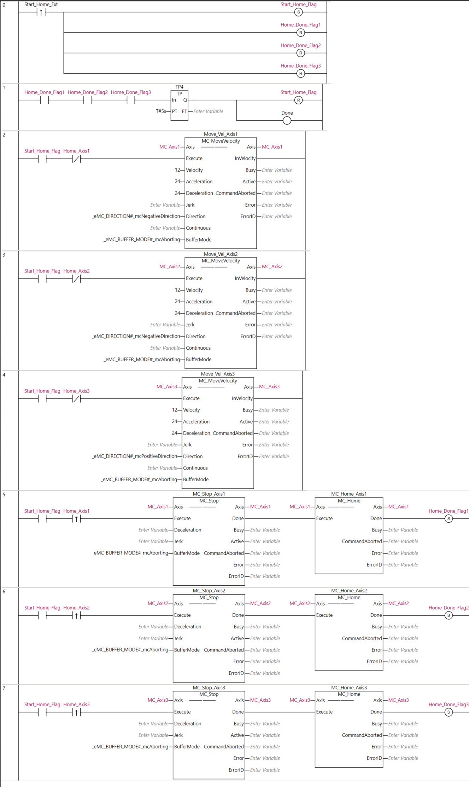
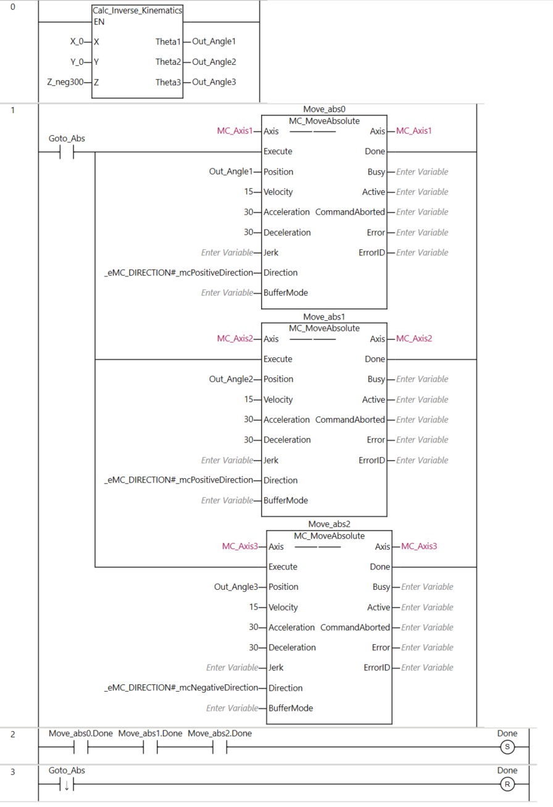

MC_Home_Delta:

Goto_Absolute:

MC_inter_curve_vel:
'// ====================================================================
// PHẦN 1: TÍNH TOÁN QUỸ ĐẠO BÊN TRONG STATE MACHINE
// ====================================================================
CASE State OF
    0:  // ================= Step 0: waiting for the new command =================
        IF Execute = TRUE THEN
            Out_Error_IK_OWS := FALSE;  // Reset all fault
            Out_Done_Inter := FALSE;  // Reset interpolation flag
            
            // Cal the inverse kinematic for check the valid of the point
            Check_IK_Error := calc_inverse_kinematics(
                X := X_A, Y := Y_A, Z := Z_A, 
                Theta1 => Target_Theta1, Theta2 => Target_Theta2, Theta3 => Target_Theta3
            );
            
            IF Check_IK_Error = TRUE THEN
                Out_Error_IK_OWS := TRUE; 
                State := 99; 
            ELSE
                Enable_Motion := TRUE;  
                
                // LỰA CHỌN LOGIC XUẤT PHÁT DỰA VÀO VẬN TỐC ĐẦU VÀO
                IF V_Start_Req > 0.0 THEN
                    // ĐANG CHẠY NỐI TIẾP (Blend): 
                    // Bỏ qua State 10 làm mượt. Dùng luôn góc lý thuyết Target làm xuất phát để tránh giật
                    Theta1 := Target_Theta1;
                    Theta2 := Target_Theta2;
                    Theta3 := Target_Theta3;
                    State := 1; // Chuyển thẳng sang tính toán S-Curve
                ELSE
                    // XUẤT PHÁT TỪ TRẠNG THÁI DỪNG HẲN: 
                    // Phải lấy vị trí thực tế Act.Pos để chạy mượt 20 chu kỳ triệt tiêu sai số
                    Start_Theta1 := MC_Axis1.Act.Pos; 
                    Start_Theta2 := MC_Axis2.Act.Pos;
                    Start_Theta3 := MC_Axis3.Act.Pos;
                    cycle_count := 1;
                    State := 10; 
                END_IF;
            END_IF;
        ELSE
            // KHI EXECUTE = FALSE
            // Ngắt cờ Blend thành dạng xung (Pulse) để Main Program bắt tín hiệu
            Out_Done_Blend := FALSE; 
            
            Enable_Motion := FALSE; 
            Theta1 := MC_Axis1.Act.Pos;
            Theta2 := MC_Axis2.Act.Pos;
            Theta3 := MC_Axis3.Act.Pos;
        END_IF;

    10: (*
    // =====Step 10: smothing the point start and actual point (from servo) with 20 cyclic time=======
    *)
        IF cycle_count <= 20 THEN
            Theta1 := Start_Theta1 + (Target_Theta1 - Start_Theta1) * (INT_TO_REAL(cycle_count) / 20.0);
            Theta2 := Start_Theta2 + (Target_Theta2 - Start_Theta2) * (INT_TO_REAL(cycle_count) / 20.0);
            Theta3 := Start_Theta3 + (Target_Theta3 - Start_Theta3) * (INT_TO_REAL(cycle_count) / 20.0);
            cycle_count := cycle_count + 1;
        ELSE
            State := 1;
        END_IF;

    1:  // ================= BƯỚC 1: TÍNH TOÁN CẤU HÌNH ĐỘNG LỰC HỌC (S-CURVE/TRAPEZOIDAL) =================
        L := SQRT((X_B - X_A)**2 + (Y_B - Y_A)**2 + (Z_B - Z_A)**2); 

        IF L > 0.0 THEN
            IF Blend_Mode = FALSE THEN
                // --- TRƯỜNG HỢP 1: LÀ ĐIỂM CUỐI CÙNG -> TỰ ĐỘNG PHANH VỀ 0 ---
                Out_V_End := 0.0;
                Use_Standard_SCurve := (V_Start_Req = 0.0); 
                Actual_Vmax := V_max;

                IF Use_Standard_SCurve = TRUE THEN
                    IF L < (0.75 * (Actual_Vmax**2) * (1.0/A_max + 1.0/D_max)) THEN
                        Actual_Vmax := SQRT(L / (0.75 * (1.0/A_max + 1.0/D_max)));
                    END_IF;

                    t_acc := 1.5 * (Actual_Vmax / A_max);
                    t_dec := 1.5 * (Actual_Vmax / D_max);
                    S_acc := 0.5 * Actual_Vmax * t_acc;
                    S_dec := 0.5 * Actual_Vmax * t_dec;
                    S_run := L - S_acc - S_dec;
                    t_run := S_run / Actual_Vmax;
                    T_total := t_acc + t_run + t_dec;
                ELSE
                    S_limit := (ABS(Actual_Vmax**2 - V_Start_Req**2)/(2.0*A_max)) + (ABS(Actual_Vmax**2)/(2.0*D_max));
                    IF S_limit > L THEN
                        Actual_Vmax := SQRT((2.0*A_max*D_max*L + D_max*(V_Start_Req**2)) / (A_max + D_max));
                    END_IF;

                    t_acc := ABS(Actual_Vmax - V_Start_Req) / A_max;
                    t_dec := ABS(Actual_Vmax) / D_max; 
                    S_acc := (V_Start_Req + Actual_Vmax) * 0.5 * t_acc;
                    S_dec := Actual_Vmax * 0.5 * t_dec;
                    S_run := L - S_acc - S_dec;
                    
                    IF S_run < 0.0 THEN S_run := 0.0; END_IF;
                    t_run := S_run / Actual_Vmax;
                    T_total := t_acc + t_run + t_dec;
                END_IF;

            ELSE
                // --- TRƯỜNG HỢP 2: CHẠY NỐI TIẾP (BLEND) CÓ TÍNH TOÁN LOOK-AHEAD GÓC CUA ---
                Use_Standard_SCurve := FALSE;
                
                // 1. Tính toán 2 Vector để xác định góc rẽ tại B
                Vec1_X := X_B - X_A; Vec1_Y := Y_B - Y_A; Vec1_Z := Z_B - Z_A;
                Vec2_X := X_C - X_B; Vec2_Y := Y_C - Y_B; Vec2_Z := Z_C - Z_B;
                
                Len1 := L; 
                Len2 := SQRT(Vec2_X**2 + Vec2_Y**2 + Vec2_Z**2); 
                
                // 2. Tính Cosin của góc lệch (Cos_Theta)
                IF (Len1 > 0.0) AND (Len2 > 0.0) THEN
                    Cos_Theta := (Vec1_X*Vec2_X + Vec1_Y*Vec2_Y + Vec1_Z*Vec2_Z) / (Len1 * Len2);
                    // Ép kiểu an toàn tránh lỗi dấu phẩy động (NaN) của PLC
                    IF Cos_Theta > 1.0 THEN Cos_Theta := 1.0; ELSIF Cos_Theta < -1.0 THEN Cos_Theta := -1.0; END_IF;
                ELSE
                    Cos_Theta := 1.0; // Đi thẳng nếu 2 điểm vô tình trùng nhau
                END_IF;

                // 3. Quy đổi góc ra giới hạn vận tốc an toàn tại góc cua
                V_Corner_Max := V_max * SQRT((Cos_Theta + 1.0) / 2.0);

                // 4. Kiểm tra vận tốc dự phóng và chốt Vận tốc cuối (Out_V_End)
                V_reach := SQRT(V_Start_Req**2 + 2.0 * A_max * L);
                
                Out_V_End := V_Corner_Max;
                IF Out_V_End > V_reach THEN Out_V_End := V_reach; END_IF;
                IF Out_V_End > V_max THEN Out_V_End := V_max; END_IF;

                // 5. Tính toán cấu hình hình thang (Tăng tốc - Chạy đều - Giảm tốc vào cua)
                Actual_Vmax := V_max;
                S_limit := (ABS(Actual_Vmax**2 - V_Start_Req**2)/(2.0*A_max)) + (ABS(Actual_Vmax**2 - Out_V_End**2)/(2.0*D_max));

                IF S_limit > L THEN
                    // Không đủ quãng đường để đạt V_max, tạo Profile hình tam giác chóp
                    Actual_Vmax := SQRT((2.0*A_max*D_max*L + D_max*(V_Start_Req**2) + A_max*(Out_V_End**2)) / (A_max + D_max));
                END_IF;

                // Safety Clamp: Đảm bảo sai số làm tròn không khiến Actual_Vmax nhỏ hơn các điểm mút
                IF Actual_Vmax < V_Start_Req THEN Actual_Vmax := V_Start_Req; END_IF;
                IF Actual_Vmax < Out_V_End THEN Actual_Vmax := Out_V_End; END_IF;

                t_acc := ABS(Actual_Vmax - V_Start_Req) / A_max;
                t_dec := ABS(Actual_Vmax - Out_V_End) / D_max; 
                
                S_acc := (V_Start_Req + Actual_Vmax) * 0.5 * t_acc;
                S_dec := (Out_V_End + Actual_Vmax) * 0.5 * t_dec;
                S_run := L - S_acc - S_dec;
                
                IF S_run < 0.0 THEN S_run := 0.0; END_IF;
                t_run := S_run / Actual_Vmax;
                T_total := t_acc + t_run + t_dec;
            END_IF;

            // ====================================================================
            // TÍNH TOÁN t_total_estimate BAO GỒM MỌI TRƯỜNG HỢP
            // ====================================================================
            IF V_Start_Req = 0.0 THEN
                t_total_estimate := T_total + 0.08; // Cộng thêm 20 chu kỳ (0.08s) của State 10
            ELSE
                t_total_estimate := T_total;
            END_IF;
            ICV_t5_out := t_total_estimate;
            t := 0.0;     
            State := 2;   
        ELSE
            Execute := FALSE;
            State := 0;
        END_IF;

    2:  // ================= BƯỚC 2: NỘI SUY TỌA ĐỘ THEO THỜI GIAN =================
        IF t <= T_total THEN
            // 2.1 Tính quãng đường S_t
            IF Use_Standard_SCurve = TRUE THEN
                IF t <= t_acc THEN
                    tau := t / t_acc; 
                    S_t := Actual_Vmax * t_acc * ((tau ** 3) - 0.5 * (tau ** 4));
                ELSIF t <= (t_acc + t_run) THEN
                    S_t := S_acc + Actual_Vmax * (t - t_acc);
                ELSE
                    t_phanh := t - (t_acc + t_run);
                    tau := t_phanh / t_dec; 
                    S_t := S_acc + S_run + Actual_Vmax * t_dec * (tau - (tau ** 3) + 0.5 * (tau ** 4));
                END_IF;
            ELSE
                IF t <= t_acc THEN
                    S_t := V_Start_Req * t + 0.5 * A_max * (t**2);
                ELSIF t <= (t_acc + t_run) THEN
                    S_t := S_acc + Actual_Vmax * (t - t_acc);
                ELSE
                    t_phanh := t - (t_acc + t_run);
                    S_t := S_acc + S_run + Actual_Vmax * t_phanh - 0.5 * D_max * (t_phanh**2);
                END_IF;
                
                IF S_t > L THEN S_t := L; END_IF; 
            END_IF;

            // 2.2 Tính tọa độ Descartes X, Y, Z tại S_t
            X_t := X_A + (S_t / L) * (X_B - X_A);
            Y_t := Y_A + (S_t / L) * (Y_B - Y_A);
            Z_t := Z_A + (S_t / L) * (Z_B - Z_A);

            // 2.3 Giải Động Học Nghịch (IK) để tìm góc cho 3 trục
            Check_IK_Error := calc_inverse_kinematics(
                X := X_t, Y := Y_t, Z := Z_t, 
                Theta1 => tmp_Theta1, Theta2 => tmp_Theta2, Theta3 => tmp_Theta3
            );
            
            IF Check_IK_Error = TRUE THEN
                Out_Error_IK_OWS := TRUE; 
                State := 99; 
                RETURN; 
            END_IF;

            // Cập nhật vị trí đẩy xuống lệnh gọi Servo
            Theta1 := tmp_Theta1;
            Theta2 := tmp_Theta2;
            Theta3 := tmp_Theta3;

            t := t + 0.004; // Chu kỳ lấy mẫu nội suy (4ms)

        ELSE
            // ================= KẾT THÚC ĐOẠN ĐƯỜNG (HẾT THỜI GIAN T_total) =================
            IF (Blend_Mode = TRUE) AND (Out_V_End > 0.0) THEN
                // CHẠY NỐI TIẾP: Bật cờ Blend, chờ nhả Execute
                Out_Done_Blend := TRUE; 
                Execute := FALSE; 
                State := 0; // Quay về State 0 chực chờ nạp điểm mới và nội suy tiếp
            ELSE
                // DỪNG HẲN: Chuyển sang State 3 đợi Servo Settle
                State := 3; 
            END_IF;
        END_IF;

    3:  // ================= BƯỚC 3: KIỂM TRA SAI SỐ DỪNG (SETTLE) =================
        Enable_Motion := FALSE; 
        
        // Đọc ACT.POS để xác nhận Servo đã bám sát điểm đích với sai số < 0.0005 độ
        IF (ABS(Theta1 - MC_Axis1.Act.Pos) <= 0.0005) AND 
           (ABS(Theta2 - MC_Axis2.Act.Pos) <= 0.0005) AND 
           (ABS(Theta3 - MC_Axis3.Act.Pos) <= 0.0005)
           THEN
            Out_Done_Inter := TRUE;
        ELSE
            Out_Done_Inter := FALSE;
        END_IF;

        // Xả cờ và reset State khi Servo báo hết Busy
        IF (MC_Sync_Axis1.Busy = FALSE) AND 
           (MC_Sync_Axis2.Busy = FALSE) AND 
           (MC_Sync_Axis3.Busy = FALSE) THEN
            
            Execute := FALSE;  
            State := 0;        
        END_IF;

    99: // ================= BƯỚC 99: LỖI KINEMATICS =================
        Execute := FALSE;
        Enable_Motion := FALSE; 
        IF Out_Error_IK_OWS = FALSE THEN
             State := 0;
        END_IF;
END_CASE;

// ====================================================================
// PHẦN 2: GỌI HÀM SERVO (LUÔN ĐƯỢC QUÉT Ở CUỐI CHU KỲ)
// ====================================================================
// Sử dụng hàm đồng bộ vị trí, servo sẽ bám theo biến Theta liên tục
MC_Sync_Axis1(Axis := MC_Axis1, Execute := Enable_Motion, Position := Theta1);
MC_Sync_Axis2(Axis := MC_Axis2, Execute := Enable_Motion, Position := Theta2);
MC_Sync_Axis3(Axis := MC_Axis3, Execute := Enable_Motion, Position := Theta3);'