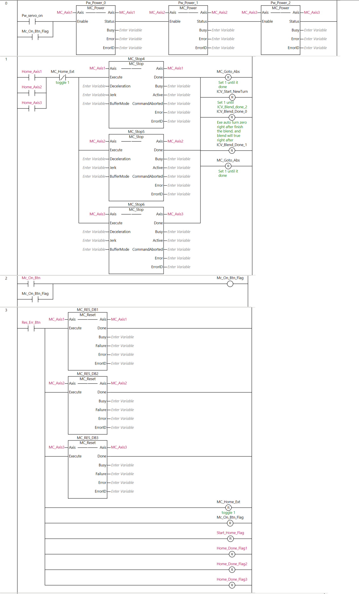
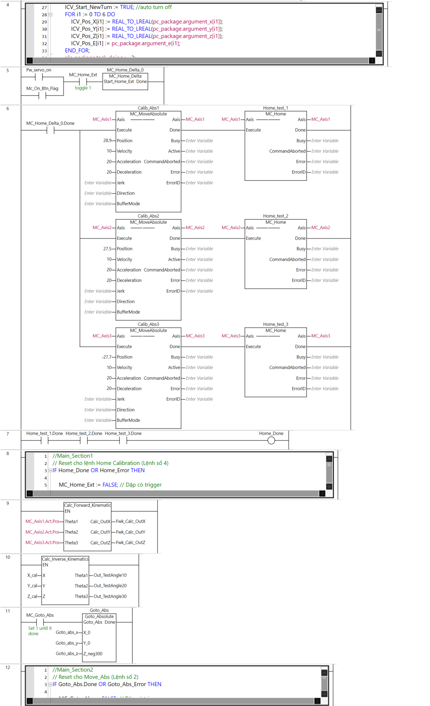
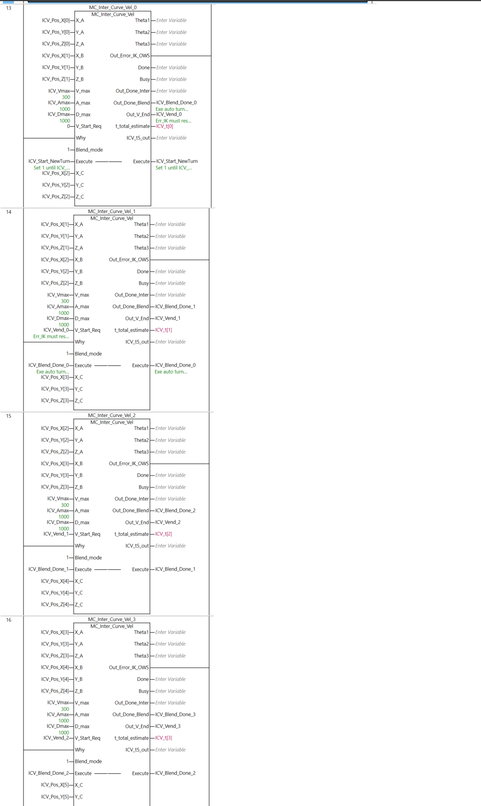
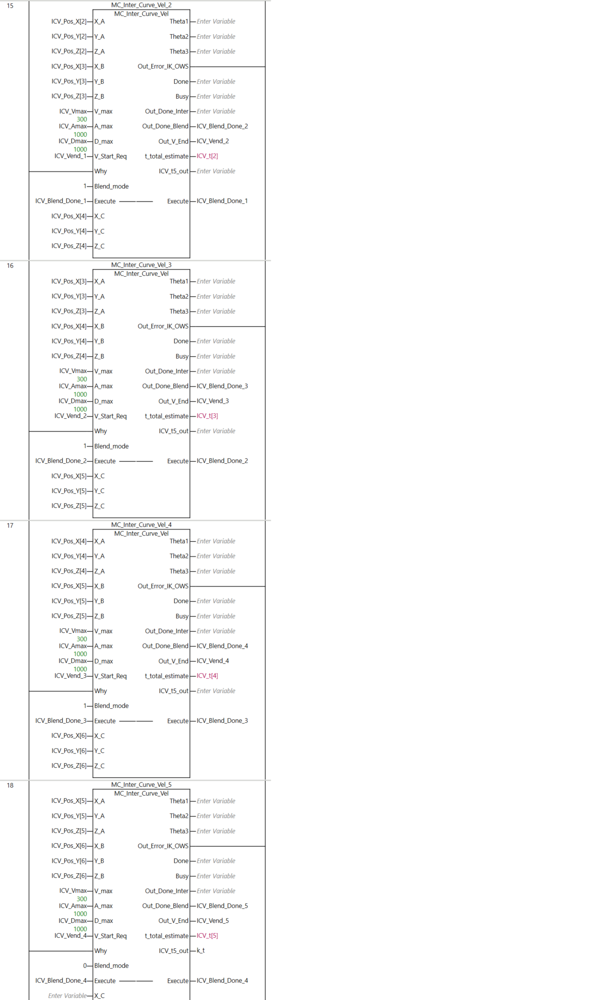
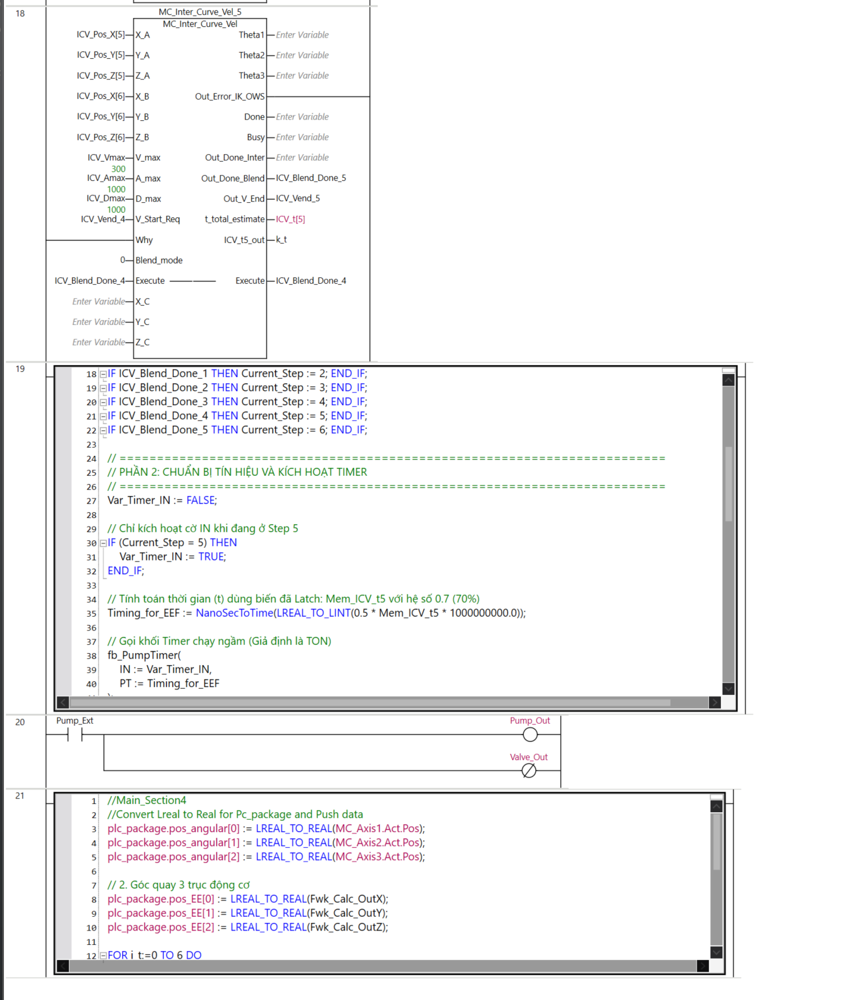

4th line code:
'//Main_Section0 
//PC_Receive and Dispach
// Nhiệm vụ: Đọc ID từ Python, nạp dữ liệu, bật cò (trigger) rồi lập tức xóa ID

IF pc_package.bit_doing <> 16#00 THEN
CASE pc_package.commandID OF
  (*  
0:  // Lệnh: STOP (Dừng khẩn/Dừng nội suy)
	        MC_Stop_Delta := TRUE;
	        
	        plc_package.task_doing := 0;
	        plc_package.task_state := 1; // 1: Done
	        pc_package.commandID := -1;  // Xóa lệnh (Handshake)
			*)
    2:  // Lệnh: GOTO ABSOLUTE
		// Convert Real to Lreal for plc_package
		Goto_abs_x:= REAL_TO_LREAL(pc_package.argument_x[0]);
		Goto_abs_y := REAL_TO_LREAL(pc_package.argument_y[0]);
		Goto_abs_z:= REAL_TO_LREAL(pc_package.argument_z[0]);
        
        MC_Goto_Abs := TRUE;         // Bật cò chạy
        plc_package.task_doing := 2;
        plc_package.task_state := 2; // 2: Busy
        pc_package.commandID := -1;

    3:  // Lệnh: GO TRAJECTORY (Chạy quỹ đạo theo mảng tọa độ)
        ICV_Start_NewTurn := TRUE; //auto turn off
        FOR i1 := 0 TO 6 DO
			ICV_Pos_X[i1] := REAL_TO_LREAL(pc_package.argument_x[i1]);
			ICV_Pos_Y[i1] := REAL_TO_LREAL(pc_package.argument_y[i1]);
			ICV_Pos_Z[i1] := REAL_TO_LREAL(pc_package.argument_z[i1]);
			ICV_Pos_E[i1] := pc_package.argument_e[i1];
		END_FOR;
        plc_package.task_doing := 3;
        plc_package.task_state := 2; // Busy
        pc_package.commandID := -1;

    4:  // Lệnh: HOME CALIBRATION (Tìm gốc)
        MC_Home_Ext := TRUE;
        
        plc_package.task_doing := 4;
        plc_package.task_state := 2; // Busy
        pc_package.commandID := -1;

    5:  // Lệnh: PICK (Hút vật)
        Pump_Ext := TRUE;
        
        plc_package.task_doing := 5;
        plc_package.task_state := 1; // 1: Done (Do bật bơm là xong ngay)
        pc_package.commandID := -1;

    6:  // Lệnh: RELEASE (Nhả vật)
        Pump_Ext := FALSE;
        
        plc_package.task_doing := 6;
        plc_package.task_state := 1; // Done
        pc_package.commandID := -1;
		END_CASE;
pc_package.bit_doing :=16#00;
END_IF;'

8th line code:
'//Main_Section1 
// Reset cho lệnh Home Calibration (Lệnh số 4)
IF Home_Done OR Home_Error THEN
 
    MC_Home_Ext := FALSE; // Dập cò trigger
	
    IF plc_package.task_doing = 4 THEN
        IF Home_Done THEN
            plc_package.task_state := 1; // Xong
        ELSIF Home_Error THEN
            plc_package.task_state := 3; // Lỗi
        END_IF;
    END_IF;
    
END_IF;'

12th line code:
'//Main_Section2
// Reset cho Move_Abs (Lệnh số 2)
IF Goto_Abs.Done OR Goto_Abs_Error THEN
 
    MC_Goto_Abs := FALSE; // Dập cò trigger
	
    IF plc_package.task_doing = 2 THEN
        IF Goto_Abs.Done THEN
            plc_package.task_state := 1; // Xong
        ELSIF Goto_Abs_Error THEN
            plc_package.task_state := 3; // Lỗi
        END_IF;
    END_IF;
    
END_IF;'

19th line code:
'//Main_Section3
//=========================================================================
// [MỚI] CHỐT GIỮ BIẾN THỜI GIAN (LATCHING)
// Phải đặt ngoài cùng và ở phía trên để luôn theo dõi biến ICV_t5
// =========================================================================
IF k_t> 0.0 THEN
    Mem_ICV_t5 := k_t;
END_IF;

// =========================================================================
// PHẦN 1: CẬP NHẬT TRẠNG THÁI (BẮT SƯỜN XUNG CỦA CÁC CỜ DONE)
// =========================================================================
IF ICV_Start_NewTurn THEN
    Current_Step := 0;
END_IF;

IF ICV_Blend_Done_0 THEN Current_Step := 1; END_IF;
IF ICV_Blend_Done_1 THEN Current_Step := 2; END_IF;
IF ICV_Blend_Done_2 THEN Current_Step := 3; END_IF;
IF ICV_Blend_Done_3 THEN Current_Step := 4; END_IF;
IF ICV_Blend_Done_4 THEN Current_Step := 5; END_IF;
IF ICV_Blend_Done_5 THEN Current_Step := 6; END_IF;

// =========================================================================
// PHẦN 2: CHUẨN BỊ TÍN HIỆU VÀ KÍCH HOẠT TIMER
// =========================================================================
Var_Timer_IN := FALSE; 

// Chỉ kích hoạt cờ IN khi đang ở Step 5
IF (Current_Step = 5) THEN
    Var_Timer_IN := TRUE; 
END_IF;

// Tính toán thời gian (t) dùng biến đã Latch: Mem_ICV_t5 với hệ số 0.7 (70%)
Timing_for_EEF := NanoSecToTime(LREAL_TO_LINT(0.5 * Mem_ICV_t5 * 1000000000.0));

// Gọi khối Timer chạy ngầm (Giả định là TON)
fb_PumpTimer(
    IN := Var_Timer_IN, 
    PT := Timing_for_EEF 
);

// =========================================================================
// PHẦN 3: ĐIỀU KHIỂN BƠM (STATE MACHINE)
// =========================================================================
CASE Current_Step OF
    0: Pump_Ext := (ICV_Pos_E[0] = 1);
    1: Pump_Ext := (ICV_Pos_E[1] = 1);
    2: Pump_Ext := (ICV_Pos_E[2] = 1);
    3: Pump_Ext := (ICV_Pos_E[3] = 1);
    4: Pump_Ext := (ICV_Pos_E[4] = 1);
    
    5: 
        // Bơm bật nếu mảng lệnh cho phép (=1) VÀ Timer chưa đếm xong 70% thời gian.
        // Khi TON đếm đủ giờ, .Q = TRUE -> NOT .Q = FALSE -> Bơm ngắt.
        // Nếu khối fb_PumpTimer của bạn là loại TP (Pulse Timer), hãy đổi thành: AND fb_PumpTimer.Q;
        Pump_Ext := (ICV_Pos_E[5] = 1) AND fb_PumpTimer.Q; 
        
    6: 
        Pump_Ext := FALSE;
        
ELSE 
    Pump_Ext := FALSE;
END_CASE;'

21th line code:
'//Main_Section4
//Convert Lreal to Real for Pc_package and Push data
plc_package.pos_angular[0] := LREAL_TO_REAL(MC_Axis1.Act.Pos);
plc_package.pos_angular[1] := LREAL_TO_REAL(MC_Axis2.Act.Pos);
plc_package.pos_angular[2] := LREAL_TO_REAL(MC_Axis3.Act.Pos);

// 2. Góc quay 3 trục động cơ
plc_package.pos_EE[0] := LREAL_TO_REAL(Fwk_Calc_OutX); 
plc_package.pos_EE[1] := LREAL_TO_REAL(Fwk_Calc_OutY); 
plc_package.pos_EE[2] := LREAL_TO_REAL(Fwk_Calc_OutZ);

FOR i_t:=0 TO 6 DO
	plc_package.Total_Time_Estimate[i_t]:=LREAL_TO_REAL(ICV_t[i_t]);
END_FOR;'

