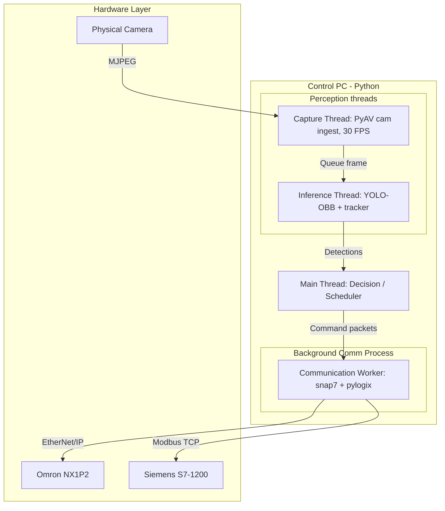

# Basis Programming — Delta Robot Pick-and-Place

> **Scope**: How the program is put together and how data flows through it — process/thread
> architecture, PLC data contracts, trajectory templates, scenarios, and the config key
> reference. This is the operational counterpart to [`basis-theory.md`](basis-theory.md)
> (the algorithms) — read that for *why* a computation is shaped the way it is; read this for
> *where* it runs and *what* talks to what.
> **Companions**: [`context.md`](context.md) (AI onboarding / directory map),
> [`dev-note.md`](dev-note.md) (developer notes, pending calibration).

---

## 1. Module Map

| Module | Responsibility |
|---|---|
| `main.py` | Orchestrator: CLI/scheduler entry point, IPC worker process, scenario dispatch |
| `modules/scheduler.py` | Real-time two-thread pick loop (`RealtimePickExecutor`), trajectory generation, adaptive speed controller, simulated scenarios |
| `modules/conveyor.py` | Coordinate transforms (`ConveyorFrame`), `BeltPositionTracker`, `BeltTracker` object tracking |
| `modules/EthernetCom.py` | PLC socket gateway — `snap7` (Siemens) + `pylogix` (Omron), packet structs |
| `modules/image_processing.py` | YOLO-OBB inference, PyAV camera capture threads, marker-based heading |
| `modules/interface.py` | In-process web dashboard (stdlib `http.server` + SSE + MJPEG) |
| `modules/cli.py` | Interactive command-line command builder/parser |
| `modules/test_module.py` | Standalone fake PLC simulator (TCP socket, JSON-lines) |
| `modules/latency_probe.py` | Calibration tool: measures PLC status round-trip latency |
| `modules/config.json` | Active system configuration (see §7) |
| `camera_calibrate.py` | Camera calibration tool (ROI, trigger line, pixels/mm) |
| `calibrate_everything.py` | Whole-config consistency + workspace boundary checker |

---

## 2. Concurrency Architecture



### 2.1. The real pick path (`production`) — two cooperating threads

1. **Communication worker** (`multiprocessing.Process`, spawned in `main.py`): the single
   gateway for snap7 & pylogix I/O. Every dispatch/status round-trip goes through it via an
   IPC queue, isolating network jitter from the control loops.
2. **Decision/execution — main thread** (`_run_realtime_pick_loop`, `scheduler.py`): selects
   the highest-priority unclaimed object (danger-zone tier first), predicts the pick point +
   lead (`basis-theory.md` §4.3), builds goto/pick packets, claims the object, dispatches, and
   runs `RealtimePickExecutor`. Its wait loops (`_wait_for_arm_arrival`,
   `_wait_for_object_arrival`) read arm/object state **from shared memory and issue no PLC
   I/O of their own**.
3. **Perception/state — daemon thread** (`_realtime_perception_loop`, ~25 ms tick): the
   **only** regular PLC status read. Updates belt position/speed and `pos_EE`, polls vision,
   refreshes the `BeltTracker` (pruning only *unclaimed* stale objects), re-derives the
   adaptive speed target, and emits dashboard/`[SPEED]`/`[DETECT]` events. Never renders the
   OpenCV GUI.
4. **Perception capture** (`image_processing.py` background threads): PyAV frame ingest +
   YOLO-OBB inference feeding thread 3.
5. **UI dashboard** (`interface.py`): serves MJPEG video + SSE telemetry to a browser.

**Two locks:**
* `ipc_lock` — wraps every dispatch/status round-trip so exactly one is in flight (the IPC
  worker drains and discards mismatched responses; concurrent callers would eat each other's
  replies).
* `state_lock` — guards `RealtimeState` (belt/pose snapshot, `BeltTracker` mutation, the
  `claimed_object_ids` set) between the perception thread (ingest/prune) and the main thread
  (read/claim).

The simulated scenarios (`test_throughput`, `test_accuracy`, `test_acceptance`, `evaluate`)
run on the **original single-threaded harness**, not this two-thread loop — their targets are
synthetic, not a live tracked belt, so there is no perception thread to isolate.

---

## 3. PLC Data Contracts

### 3.1. Byte order

| Side | Byte order |
|---|---|
| PC (x86/x64) | Little-endian |
| Siemens S7-1200 | **Big-endian** |
| Omron NX1P2 (via pylogix tags) | Handled by pylogix — no manual swap |

Structs exchanged with Siemens via `snap7` **must** use `ctypes.BigEndianStructure`. Do
**not** use `_pack_` with `BigEndianStructure` (unsupported by ctypes); if all fields are
4-byte aligned (`c_int32`, `c_float`), dropping `_pack_ = 1` has no effect on layout.

### 3.2. PC ↔ Siemens S7-1200 DB contracts

`snap7` over TCP. CPU must have PUT/GET communication enabled; DB1/DB2 must have
**"Optimized block access" disabled** (to expose physical byte offsets).

**DB1 (PC → PLC, 12 bytes):**

| Offset | Field | Type | Description |
|---|---|---|---|
| 0 | `CommandID` | DINT | Command ID (§3.4) |
| 4 | `rotate` | REAL | Absolute rotation angle, 4th DOF, **degrees, verbatim** (`basis-theory.md` §5.2 Layer 3) |
| 8 | `speed` | REAL | Requested conveyor speed (mm/s) |

**DB2 (PLC → PC, 20 bytes):**

| Offset | Field | Type | Description |
|---|---|---|---|
| 0 | `rotate_current` | REAL | Current suction cup rotation angle |
| 4 | `speed_current` | REAL | Current conveyor belt speed (mm/s) |
| 8 | `task_doing` | DINT | Command ID currently executing |
| 12 | `task_state` | DINT | Inconsistent/legacy status — use `bit_doing` instead |
| 16 | `conveyor_position` | REAL | Pre-decoded belt position in mm (`scale = 1.0`) |

> **Invariant** (from `CLAUDE.md`): never remove or reorder fields in `SiemensSendPacket` /
> `SiemensReceivePacket` — the byte layout must match these DB offsets exactly.

### 3.3. PC → Omron NX1P2 packet contract

Written to the Omron global tag `pc_package` via `pylogix` (EtherNet/IP):

```python
{
    "commandID": int,
    "argument_number": int,
    "argument_x": [float] * 7,
    "argument_y": [float] * 7,
    "argument_z": [float] * 7,
    "argument_e": [byte] * 7,     # gripper: 0 = OFF, 1 = ON
    "argument_time": [float] * 7,  # segment duration (s); ignored by the PLC
    "bit_doing": byte              # handshake: PC writes 1, PLC resets to 0
}
```

The array length must be padded to exactly `interpolar_points` elements (default 7) — do not
change this default without updating every downstream array that pads to it. `goto_absolute`
commands require `argument_e` all-zero. The Omron firmware **ignores** `argument_time`
(motors run at fixed maximum speed); PC-side values are scheduler approximations only, used
for logs/ETA, never for real timing.

### 3.4. Command ID mapping

```python
COMMAND_ID = {
    "stop": 0,             # Omron + Siemens
    "goto_relative": 1,    # Omron
    "goto_absolute": 2,    # Omron
    "go_trajectory": 3,    # Omron
    "calibrate": 4,        # Omron
    "pick": 5,             # Omron
    "release": 6,          # Omron
    "rotate_absolute": 7,  # Siemens (4th DOF suction cup)
    "change_speed": 8,     # Siemens (conveyor speed)
    "plan_siemen": 9,      # Siemens (planning)
    "enable": 10,          # Omron
}
```

---

## 4. Trajectory Templates & Safety Invariants

### 4.1. The 7-point trajectory template

Every pick-and-place operation is two sequential phases, each a 7-point template aligned with
the Omron packet layout:

```
       B_goto (Clearance) ── diagonal 3D slope ──> C_goto (Slope transition)
              ▲                                              │
              │                                              ▼
        A_goto/start                                 D_goto (Pre-pick)
                                                             │
                                                             ▼
                                                      A_pick (Suction ON)
                                                             │
                                                             ▼
       C_pick (Clearance) <── diagonal 3D slope ─── B_pick (Slope transition)
              │
              ▼
       D_pick/place (Release)
```

**Goto trajectory** (move to pre-pick): A (start, gripper OFF) → B (lift to
`clearance_height`) → C (clearance blend) → D, E (clearance cruise) → F (slope transition,
angled down) → G (pre-pick, standby above the moving item).

**Pick trajectory** (pick & sort): P1 (intercept — descend to `pickup_height` at the
interception coordinate, gripper ON) → P2 (lift to `slope_transition_height`) → P3–P6 (3D
sloped transfer to the sorting bin) → P7 (place — final descent to `place_height`, release).

### 4.2. Safety heights & workspace boundaries

* **Height hierarchy** (validated at config load):
  `clearance_height > slope_transition_height > pre_pick_height > pickup_height`.
* **Workspace window**: `conveyor.workspace_window_uv = [u_min, u_max, v_min, v_max]` in
  C-frame. Objects outside are **discarded, not clamped**.
* **Physical reach boundary**: a circle of radius `limit_radius_xy` around the robot origin
  `(0, 0)`, enforced at `PLCGateway.send_package` — violations raise `WorkspaceLimitError`
  and reject the command. This is the PC-side redundant safety layer (the PLC also hardcodes
  motion limits independently).

---

## 5. Camera & Exposure Control

Auto-exposure changes exposure time with ambient light, dropping FPS below 15 and
introducing motion blur that breaks tracking. Manual exposure holds a constant **30 FPS**:
disable auto-exposure **before** writing the manual exposure value.

* **Windows (DirectShow)**: `cv2.CAP_PROP_AUTO_EXPOSURE = 1` (manual);
  `cv2.CAP_PROP_EXPOSURE` is log2 (e.g. `-6` ≈ 15 ms).
* **Linux (V4L2)**: `cv2.CAP_PROP_AUTO_EXPOSURE = 1` (manual); `cv2.CAP_PROP_EXPOSURE` is in
  microseconds (e.g. `10000` = 10 ms).

The project captures frames with **PyAV** (FFmpeg-backed) in `image_processing.py`, bypassing
OpenCV's V4L2 backend — the actual bottleneck behind 30 FPS at 1080p MJPG (not the model or
GPU). `vision.v4l2_controls.exposure_time_absolute` also feeds the camera-latency backdating
in `basis-theory.md` §4.2.

---

## 6. Scenario Matrix

All scenarios run via `main.py --scheduler --scenario <name>`.

| Scenario | Vision | Robot | Conveyor speed | Display |
|---|---|---|---|---|
| `test_throughput` | Simulated | Sim/Real (`RealtimePickExecutor`) | Synthetic | Web (`--interface`) |
| `test_accuracy` | Simulated | Sim/Real (`EvaluateExecutor`) | Static (none) | Web (`--interface`) |
| `test_acceptance` | Simulated | Sim/Real (`EvaluateExecutor`) | Static (none) | Web + console `[ACCEPT]`/`[ACCEPT-SUMMARY]` |
| `evaluate` | Simulated | Sim/Real (`EvaluateExecutor`) | Synthetic | Console |
| `test_vision_only` | **Real camera** | Idle (`NullExecutor`) | Siemens PLC | Web or native cv2 |
| `production` | **Real camera** | Real (two-thread) | Siemens PLC | Web or native cv2 |

**`production`** runs the §2.1 two-thread loop: danger-zone priority selection, a downstream
park lead, and a positional pick gate (fires when the live tracked object reaches the parked
pick `u`; no post-park arrival-time computation). **`test_vision_only`** keeps the perception
thread live but drives a `NullExecutor` (no arm). **`test_accuracy`/`test_acceptance`/
`evaluate`** use `EvaluateExecutor` — no belt gate (targets are static, not a moving tracked
object): dispatch a phase, poll `pos_EE` until convergence, record wall time. These three plus
`test_throughput` run on the single-threaded harness, not the two-thread realtime loop.

`production` cannot be dry-run with `--simulate-executor` — it requires live PLC
`conveyor_position` feedback by design. Use `test_throughput` for the simulated pick pipeline.

---

## 7. Config Key Reference (`modules/config.json`)

Every key below is read by live code. Renamed/removed keys are not re-listed here — treat the
table as the current contract, not a changelog (see `dev-note.md` for the history of what
changed and why).

### Top level

| Key | Purpose (consumer) |
|---|---|
| `ip_address`, `port` | Omron NX1P2 EtherNet/IP endpoint (`EthernetCom.py`) |
| `siemens_ip`, `siemens_port` | Siemens S7-1200 snap7 endpoint (`EthernetCom.py`) |
| `interpolar_points` | Omron packet array padding length — do not change without downstream review (`EthernetCom.py`) |
| `limit_radius_xy` | Physical reach circle (mm); enforced at `PLCGateway.send_package` |
| `object_types.{QFP,TQFP}` | Per-class `destination`/`thickness_mm`/`w`/`h` (`scheduler.py`) |
| `QFP`, `TQFP` (3-elem arrays) | R-frame drop positions, looked up via `object_types.*.destination` |

### `conveyor`

| Key | Purpose |
|---|---|
| `conveyor_position_scale_mm` | Belt encoder → mm scale (1.0: PLC reports mm) |
| `velocity_ema_alpha` | Belt velocity EMA smoothing (`BeltPositionTracker`) |
| `frame.theta_deg`, `frame.robot_origin_uv` | C-frame → R-frame transform (`basis-theory.md` §1.1) |
| `camera_window_uv`, `workspace_window_uv` | Tracking/pickable windows in belt UV |
| `accuracy_points_uv` | Preferred `evaluate` targets (C-frame u,v,z) |

### `vision`

| Key | Purpose |
|---|---|
| `model_weights`, `imgsz`, `conf`, `conf_marker`, `iou`, `device`, `half`, `class_map`, `show_window` | YOLO-OBB inference setup |
| `capture.{camera_usb_id,device,width,height,pixelformat,fps}` | PyAV camera capture (backend hardwired to PyAV) |
| `v4l2_controls.*` | Applied verbatim via v4l2 (manual exposure); `exposure_time_absolute` also feeds latency backdating |
| `pixels_per_mm`, `roi.*`, `trigger_line.*` | Camera calibration / detection gating |
| `orientation.{enabled,pcb_classes,marker_map,cross_check,offset_by_class,symmetry_by_class,marker_max_dist_mm}` | Marker-based board heading (per-class offset/symmetry) |
| `tracker.*`, `belt_estimator.*` | Centroid tracker + informational belt-speed estimate |

### `scheduler`

| Key | Purpose |
|---|---|
| `home_position`, `clearance_height`, `slope_transition_height`, `pre_pick_height`, `pickup_height`, `place_height`, `corner_blend_xy` | Trajectory template geometry (§4.2 height hierarchy) |
| `intercept_lead_time_s`, `release_descent_time_s` | Realtime park lead / place-phase timing |
| `nominal_xy_speed`, `nominal_z_speed` | Coarse constant-velocity ETA (logs only) — NOT the trajectory timing model |
| `interpolator.{v_max,a_max,d_max,soft_start_s,scurve_shape_factor}` | Exact PLC S-curve trajectory-time model (`basis-theory.md` §3) |
| `stale_timeout_s`, `speed_timeout_s`, `poll_interval_s` | Tracker staleness / speed staleness / status poll cadence |
| `default_speed` | **Simulated** belt speed only; real belt uses `belt_speed_static_mm_s` |
| `robot_movement_delay_s`, `ethernet_delay_s` | Dispatch→motion latency model (gate lead); calibrate via `[GATE]` log / `latency_probe` |
| `rotate_offset_deg`, `rotate_sign`, `rotate_home_tolerance_deg`, `rotate_refresh_max_delta_deg` | Post-grip rotation normalisation chain (`basis-theory.md` §5) |
| `pick_arrival_tolerance_mm`, `pick_arrival_tolerance_max_mm` | `RealtimePickExecutor` arm-arrival tolerance, speed-mapped: linear from the floor (`_mm`, at/below `belt_speed_min_mm_s`) to the ceiling (`_max_mm`, at/above `belt_speed_max_mm_s`), re-evaluated per wait-loop tick from live belt speed. `_max_mm` omitted or ≤ floor ⇒ static floor |
| `belt_speed_static_mm_s` | Startup/static real-belt setpoint; adaptive controller's seed |
| `adaptive_speed_enabled`, `pick_cycle_s`, `pick_transit_min_s`, `belt_speed_headroom`, `belt_speed_min_mm_s`, `belt_speed_max_mm_s`, `belt_speed_hw_max_mm_s`, `belt_speed_deadband_mm_s`, `belt_speed_max_step_mm_s`, `belt_density_length_mm` | Adaptive belt speed law (`basis-theory.md` §6) |
| `belt_accel_mm_s2`, `belt_ramp_s` | Informational only: document $a_{\text{nom}}$ and the ramp-settle invariant; not used in computation |
| `oblique_descent_enabled` | Opt-in belt-tracking slanted descent (default off = vertical) |
| `throughput_object_types`, `throughput_lanes`, `throughput_spawn_y`, `throughput_emit_interval_s` | `test_throughput` spawner |
| `accuracy_spawn_uv`, `accuracy_object_types`, `accuracy_emit_interval_s`, `test_acceptance_cycles` | `test_accuracy`/`test_acceptance` spawner + cycle count |
| `execution_margin_s`, `evaluate_position_tolerance_mm`, `evaluate_wait_timeout_s` | `EvaluateExecutor` wait margins/tolerances |
| `log_path` | Performance log file |

### `interface`

| Key | Purpose |
|---|---|
| `port`, `mjpeg_fps` | Web dashboard HTTP port / MJPEG frame rate |

**Look-alike keys, disambiguated:** `default_speed` (sim belt) ≠ `belt_speed_static_mm_s`
(real belt); `accuracy_spawn_uv` (fake-object spawn points) ≠ `conveyor.accuracy_points_uv`
(evaluate movement targets); `nominal_xy/z_speed` (rough ETA) ≠ `interpolator.*` (real timing
model).

---

## 8. Verification Commands

```bash
# 1. Compile check all python files (run after touching EthernetCom.py, scheduler.py, or cli.py)
python3 -m py_compile main.py modules/cli.py modules/EthernetCom.py modules/image_processing.py modules/scheduler.py modules/test_module.py modules/conveyor.py modules/interface.py

# 2. Scheduler simulation — throughput scenario
python3 main.py --scheduler --scenario test_throughput --duration 12.0 --simulate-executor

# 3. Scheduler simulation — accuracy scenario
python3 main.py --scheduler --scenario test_accuracy --duration 5.0 --simulate-executor

# 4. Fake PLC dry run
python3 -m modules.test_module --port 1502 --self-test --duration 2.0

# 4b. Interactive CLI against an in-process fake PLC (no hardware)
python3 main.py --cli --dummy

# 5. Continuous evaluate scenario (Ctrl-C to stop)
python3 main.py --scheduler --scenario evaluate --simulate-executor --duration 10.0

# 6. Vision smoke test + overlay window (requires physical camera)
python3 -m modules.image_processing

# 7. production requires live PLC conveyor_position feedback — cannot use --simulate-executor.
#    Use test_throughput for the simulated pick pipeline, or run production on real hardware.

# 8. Web dashboard smoke test (no hardware)
python3 -m modules.interface

# 9. Vision-only (real camera, no robot) + live web dashboard
python3 main.py --scheduler --scenario test_vision_only --interface --duration 20

# 10. Real-hardware acceptance run: exactly test_acceptance_cycles picks, then stops,
#     printing a final [ACCEPT-SUMMARY] (per-phase goto/pick wall times).
python3 main.py --scheduler --scenario test_acceptance --interface
```
