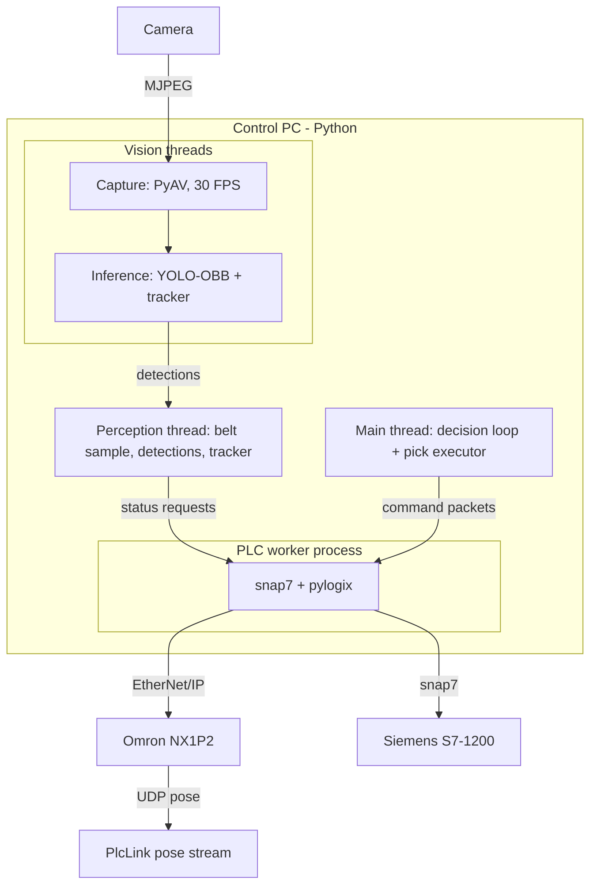

# Basis Programming — Delta Robot Pick-and-Place

> **Scope**: How the program is put together and how data flows through it — layers and
> modules, the decision cycle, the scheduling framework, PLC data contracts, trajectory
> templates, scenarios, the offline bench and the config key reference. This is the
> operational counterpart to [`basis-theory.md`](basis-theory.md) (the algorithms) — read that
> for *why* a computation is shaped the way it is; read this for *where* it runs and *what*
> talks to what.
> **Companions**: [`context.md`](context.md) (AI onboarding / directory map),
> [`open-issues.md`](open-issues.md) (everything unresolved),
> [`decision-log.md`](decision-log.md) (superseded designs),
> [`../modules/scheduling/README.md`](../modules/scheduling/README.md) (writing a planner or a
> speed law), [`../sandbox/README.md`](../sandbox/README.md) (the offline bench).
> **Status policy**: this document describes the system **as it currently is**. It carries no
> history and no roadmap.

---

## 1. Layers and modules

```
  app         main.py · modules/ui (dashboard, console, cli) · modules/tools · calibration scripts
   │
  runtime     modules/runtime: decision loop · perception thread · pick executor · speed controller
   │                                                            sandbox/  (offline bench)
  scheduling  modules/scheduling: rules · planners · speed laws · gates · commit policy
   │                                                               │ imports core, scheduling,
  core        modules/core: frames · tracking · kinematics · motion · trajectories · arm models
   │                                                               │ settings only
  comm        modules/comm: packets · Omron / Siemens gateways · PLC worker · pose stream
```

**Imports only point downward.** `core` never imports `scheduling`; `scheduling` never imports
`runtime`; nothing under `modules/` imports `sandbox/`. Every scheduling plugin can therefore
run without threads, sockets or a camera — on the robot and in the sandbox alike.

| Module | Owns | Must not |
|---|---|---|
| `modules/settings.py` | every config key, its type and its one default; loading, validation, moved-key errors, `--set` overrides | hold runtime state |
| `modules/core/` | geometry and time models — `frames` (belt ↔ robot ↔ vision), `tracking` (belt position, tracked parts), `kinematics` (the PLC's IK/FK), `motion` (PLC trajectory-time model), `trajectory` (7-point templates), `forecast` (belt under a setpoint), `arm_model` (the `ArmModel` interface), `delta` (the cell's arm), `angles`, `feeders` (seeded arrival generators, shared by the sandbox and `simulate_feeder`) | sleep, lock, print, do I/O |
| `modules/scheduling/` | *which* part next and *what* belt speed: plugin registry, rules, planners, speed laws, setpoint gates, the commit policy, the job model | know about threads, PLCs, the camera |
| `modules/runtime/` | *when* each decision is taken and executing it: `loop` (decision cycle), `perception` (thread), `planning` (tracker → plan), `plan` (PickPlan, packets), `pick_gate`, `pick_executor`, `speed` (speed controller), `speed_source`, `state`, `scenarios`, `outcomes` (the part record, §2.6), `virtual_feed` (seeded virtual parts), `cell_view` (dashboard geometry) | contain a decision rule |
| `modules/comm/` | bytes on the wire: `packets` (DB layouts, command IDs), `omron` (pylogix gateway + mock), `siemens` (snap7 gateway + mock), `plc_link` (worker process + `PlcLink`), `pose_stream` (UDP) | interpret scheduling data |
| `modules/vision/` | camera capture (`camera`), board heading (`heading`), ROI geometry (`roi`), centroid tracking (`tracking`), the YOLO pipeline (`pipeline`) | — |
| `modules/ui/` | web dashboard (`dashboard`), operator console back-end (`supervisor`, §6.1), interactive CLI (`cli`) | — |
| `modules/tools/` | stand-alone probes: `latency_probe`, `test_rotate`, `rotate_sweep_sim`, `frame_convert`, `derive_rank_bounds`, `udp_receiver`; `flow_report` (input vs throughput across runs, §2.6) | — |
| `modules/plc_sim/` | scan-accurate PLC simulator ([`plc/simulator.md`](plc/simulator.md)); `python3 -m modules.plc_sim` serves it stand-alone | — |
| `modules/config_io.py` | the only reader/writer of `config.yaml` (comment-preserving round trip) | — |
| `modules/runlog.py` | per-run debug logs (§2.5) | — |
| `sandbox/` | offline algorithm bench (§7) | define a plugin outside `modules/scheduling` |
| `tests/` | unit and integration tests (§9) | — |
| `main.py` | argument parsing and mode dispatch | — |
| `camera_calibrate.py`, `calibrate_everything.py` | camera calibration; whole-config consistency and workspace check | — |

---

## 2. Concurrency architecture


```mermaid
graph TD
    subgraph PC_Software [Control PC - Python]
        MainThread[Main thread: decision loop + pick executor]
        Perception[Perception thread: belt sample, detections, tracker]
        subgraph Vision_Threads [Vision threads]
            CapThread[Capture: PyAV, 30 FPS]
            InferThread[Inference: YOLO-OBB + tracker]
        end
        subgraph Comm_Process [PLC worker process]
            PLC_Worker[snap7 + pylogix]
        end
    end
    Cam[Camera] -->|MJPEG| CapThread
    CapThread --> InferThread
    InferThread -->|detections| Perception
    Perception -->|status requests| PLC_Worker
    MainThread -->|command packets| PLC_Worker
    PLC_Worker -->|EtherNet/IP| Omron[Omron NX1P2]
    PLC_Worker -->|snap7| Siemens[Siemens S7-1200]
    Omron -->|UDP pose| MainProcess[PlcLink pose stream]
```

### 2.1. Threads and processes of a `production` run

1. **PLC worker** (`comm/plc_link._worker`, a spawned process): the single gateway for snap7 and
   pylogix I/O. Every dispatch/status round trip goes through its queue. It routes the rotation
   commands (7, 9) to the Siemens and every other command, the belt speed (8) included, to the
   Omron; it converts the rotation angle verbatim at the wire (`core/angles`) and scales the
   real belt feedback (Omron `conveyor_velocity` / `conveyor_position`, renamed
   `speed_current` / `conveyor_position` in the status dict) by `conveyor.position_scale_mm`. The main process talks to it through `PlcLink`, which also owns
   the UDP pose stream (§3.5) and the run log (§2.5).
2. **Main thread — decision loop** (`runtime/loop.run_pick_loop`, §2.2) and the **pick
   executor** (`runtime/pick_executor.RealtimePickExecutor`) it calls. The executor's wait loops
   read arm and part state from `RealtimeState` and issue no status I/O of their own.
3. **Perception thread** (`runtime/perception.Perception`, every 25 ms): the only regular status
   read. Updates belt position/speed, pose and rotation feedback, polls the image source,
   ingests detections into the `BeltTracker` (anchored at their capture time) and prunes parts
   that left the belt, and emits the dashboard `status` / `detect` events. It decides nothing.
4. **Vision threads** (`vision/pipeline`): PyAV capture and YOLO-OBB inference.
5. **Dashboard** (`ui/dashboard`): serves MJPEG video and SSE telemetry; the native OpenCV
   window, when enabled, is pumped from the main thread (Qt requirement).

**Two locks** (`runtime/state.RealtimeState`), never nested:
* `ipc_lock` — one PLC round trip in flight at a time (the worker's queue is not re-entrant);
* `state_lock` — the belt sample, pose, tracker and claimed-part set, between the perception
  thread and the main thread.

### 2.2. The decision cycle (`runtime/loop.py`)

```
arm becomes free ─► speed.tick("arm_free")        setpoint gate → speed law → commit
                    planner.plan_next(...)         the law's schedule if it was scored with the
                                                   executing planner, else planner(jobs)
                    first entry that re-validates → PickPlan → executor.execute(plan)
                          goto ─► pick gate ─► pick dispatched ─► cup contact
                                                                    └► speed.tick("contact")
                          carry to the bin ─────────────────────────► speed.tick("busy") …
arm stays free   ─► speed.tick("idle"), re-plan every runtime.poll_interval_s
```

* **Setpoint freeze (L9).** `RealtimeState.pick_committed` is set before the goto is dispatched
  and cleared at cup contact (or when the pick aborts). While it is set, the speed controller
  does nothing, whatever the gate says: the plan, the gate lead and the grip all assume a
  steady belt.
* **Commit of a plan** (`runtime/planning.PickPlanner.commit`), under `state_lock`: walk the
  schedule and claim the first entry whose part is still tracked and unclaimed, whose fresh
  intercept (live arm position, live belt forecast) meets its deadline minus
  `scheduling.safety_margin_s`, and whose every waypoint passes the PLC IK (O1).
* **Exactly once.** After the executor returns, a part whose pick was dispatched is never
  planned again (suction is not verified); a pre-grip abort (goto failed, gate late or stalled,
  track lost) leaves the part on the belt to be planned again. After a failed pick the next plan
  starts from the arm's last reported pose (T9).

### 2.3. The pick executor (`runtime/pick_executor.py`, `runtime/pick_gate.py`)

1. Dispatch the goto packet, home the suction axis to 0 rad.
2. Wait for arrival: within the speed-mapped tolerance (`pick_gate.arrival_tolerance_mm` →
   `_max_mm` between `speed.band.min_mm_s` and `max_mm_s`) **and** inside the final vertical
   segment (O2); time out after the packet's `argument_time` plus
   `pick_gate.arrival_timeout_margin_s`.
3. **Pick gate**: poll every 5 ms (`core/delta.GATE_POLL_S`) with the belt position extrapolated
   to the present, and fire once the part reaches `u_pick − v · lead`, `lead = command delay +
   gate sampling latency + descent lead` (`core/delta.DeltaArm.gate_lead_s`). Abort (re-queue) if the
   part is already more than `pick_gate.late_abort_mm` past the threshold, or has not advanced
   for 3 s.
4. Refresh the post-grip rotation from the part's latest heading (within
   `robot.rotation.refresh_max_delta_deg`), dispatch the pick packet, log `[GATE]` at contact,
   rotate the board once it is lifted clear, log `[ROTATE]`.

### 2.4. The scheduling framework (`modules/scheduling/`)

`scheduling.planner` and `speed.law` name registered plugins; unknown names stop the program at
start-up with the list of known ones (`python3 -m modules.scheduling` prints it). The contracts,
with worked examples, are in [`modules/scheduling/README.md`](../modules/scheduling/README.md).

| Kind | Registered with | Signature | Registered today |
|---|---|---|---|
| Dispatch rule | `@dispatch_rule` | `(jobs, ctx) -> Job \| None` | `spt` (shortest path), `edd`, `fifo`, `least_slack` |
| Sequence planner | `@planner` | `(jobs, ctx[, cfg]) -> list[ScheduledPick]` | `kim`, `kim_release` (Kise-Ibaraki-Mine), `cardinality_arrival`, `cardinality_release` (Lawler), `drop_longest`, `dp` (exact search), `<rule>_rollout` |
| Speed law | `@speed_law(default_gate=…)` | `(view[, cfg]) -> SpeedDecision` | `constant`, `inverse_density`, `predictive_rank`, `predictive_rank_hysteresis`, `bound_only`, `backlog_patience`, `min_slack`, `rate_schedule`, `periodic_two_speed` |
| Setpoint gate | `@setpoint_gate` | `(event, since_last_s, period_s) -> bool` | `never`, `arm_free`, `at_contact`, `periodic`, `always` |

* A rule is expanded by the registry into a full ranking (applied repeatedly to the remaining
  jobs), so the loop has one code path for rules and planners.
* A plugin's parameters are its own config section (`scheduling.planners.<name>`,
  `speed.laws.<name>`), parsed into its declared dataclass; an unknown key is an error.
* The robot's arm reaches a plugin only through `Job` and `PlanContext` (`DeltaArm.predict`,
  `DeltaArm.costs`); belt speed only through the jobs' r_j, d_j, p_j and the `SpeedView`.
* **Commit policy** (`scheduling/commit.py`), the same for every law: clamp to
  `[speed.band.min_mm_s, min(speed.band.max_mm_s, conveyor.hw_max_mm_s)]`, limit the step to
  `speed.commit.max_step_mm_s`, hold inside `speed.commit.deadband_mm_s` (a law registered with
  `deadband=False` — `predictive_rank` — bypasses the deadband: its candidates are already
  discrete and step-limited), and re-send an unchanged setpoint when the measured belt still
  diverges by more than twice the deadband 3 s after the last commit.
* The runtime controller (`runtime/speed.SpeedController`) and the sandbox call the same gate,
  law and commit policy.

**Logs:**

* `[SCHEDULE] {planner, jobs, scheduled[ids], committed, reused, decision_s, rank, drift_s, snapshot_age_s}` — once per committed pick. `drift_s` = fresh contact time − planned contact time.
* `[SPEED-LAW] {law, event, target_mm_s, setpoint_before_mm_s, objects, …law info}` — once per speed decision; a resulting commit prints `[SPEED] belt -> <v> mm/s (target <t>)`.
* `[BELT] vx= vy= p= t=` — the measured belt, about once a second.
* `[WARN] … took N s` — a decision slower than 0.5 s (the arm idles meanwhile).
* `[INFO] planner=… speed_law=… gate=…` — once at start-up.

### 2.5. Run log

Every `main.py` run (CLI, scheduler, console, with or without `--sim`) writes
`log/<YYYYmmdd-HHMMSS>_<mode>/` (`logging.enabled`, `logging.dir`; `--no-log` skips one run;
`log/` is git-ignored). Every record carries `t_mono` (`time.monotonic()`, the clock of `[PLAN]`
times, gate times and pose samples; the worker process shares it) and `t_wall` (`time.time()`).

| File | Content |
|---|---|
| `meta.json` | argv, mode, start time on both clocks, git revision (`+dirty` if uncommitted), PLC IP, pose-stream settings, `--set` overrides |
| `config.yaml` | copy of the config at start |
| `console.log` | all main-process output (`[PLAN]`, `[GATE]`, `[SPEED]`, `[SPEED-LAW]`, `[CONSOLE]`, …), each line prefixed `t_wall t_mono` |
| `worker.log` | same for the PLC worker process |
| `commands.jsonl` | one line per `PlcLink.dispatch`: `t_mono_send`, `t_mono_done`, `rtt_s`, `commandID`, the packet with waypoint arrays trimmed to `argument_number`, the worker's reply, `ok`/`error` |
| `status.csv` | one row per status poll: `t_mono`, `rtt_s`, `omron_read`, `pose_source` (`udp`/`omron`), `pose_age_s`, x/y/z, belt position and speed, rotation, Omron and Siemens handshake fields |
| `pose.csv` | one row per UDP pose sample (`t_mono`, `t_wall`, x, y, z) |

To line a command up with the motion it caused, take its `t_mono_send` from
`commands.jsonl` and read `pose.csv` from that time on.

A scheduler run also writes its part record there (§2.6); a console run writes one
`run<NN>_<HHMMSS>_<scenario>/` sub-folder per scenario started.

### 2.6. Part record: input, throughput, misses (`runtime/outcomes.py`)

Every scenario run keeps one record per part, opened at its first camera sighting and closed
exactly once:

| Outcome | Meaning | Reasons |
|---|---|---|
| `picked` | the cup came down on the part | `gripped`; `unverified` (the pose poll missed the contact band; the pick completed) |
| `miss_grip` | a pick was dispatched, the part was not taken | `cup_off_part`: part centre − cup at contact > `runtime.grip_tolerance_mm`; `pick_motion_failed`: no contact before the trajectory failed |
| `miss_late` | left the workspace (`u > u_max`) never dispatched | `never_planned`, or the last pre-grip abort: `goto_failed`, `gate_late`, `object_stalled`, `object_missing` |
| `lost_track` | the track went stale inside the camera view | `stale_in_camera` (reopened if the id is seen again) |
| `on_belt` | still on the belt when the run ended | `run_ended` |

The grip is judged from geometry, not from suction (no vacuum sensor, L6): at the first pose
sample inside the contact band (`[GATE]`, which also logs `contact_error_uv_mm`), the part's
tracked centre is compared with the cup. With a virtual feed the tracked centre is the part's
true position; with real parts it carries the tracking error (open-issues L17). **Input** is
counted at the first sighting, **throughput** at contact.

| File | Content |
|---|---|
| `parts.csv` | one row per part: type, source, first sighting (t, u, v), plans, last abort, dispatch and contact times, contact error (u, v, norm), belt speed at contact, outcome, reason |
| `flow.csv` | per `runtime.flow_bin_s` bin: parts seen, outcomes booked, input and throughput per minute, mean belt speed and density |
| `summary.json` | the run's set-up (scenario, planner, speed law, speeds, feeder kind/seed/parameters, `--set` or console overrides) and totals: outcome counts, miss reasons, pick rate, input and throughput per minute, median contact error |
| `arrivals.csv` | `simulate_feeder` only: the arrivals that landed (time, type, lane, heading), replayable as a sandbox `script` feeder |

The dashboard receives the same record live (`flow` at 1 Hz, `outcome` per closed part,
`run_summary` at the end). `python3 -m modules.tools.flow_report log/` gathers every
`summary.json` / `flow.csv` below a folder into `runs.csv`, `windows.csv` (30 s bins by default)
and `flow_report.png` (throughput against input per bin and per run, outcome split per run).

---

---

## 3. PLC Data Contracts

### 3.1. Byte order

| Side | Byte order |
|---|---|
| PC (x86/x64) | Little-endian |
| Siemens S7-1200 | **Big-endian** |
| Omron NX1P2 (via pylogix tags) | Handled by pylogix — no manual swap |

Structs exchanged with Siemens via `snap7` **must** use `ctypes.BigEndianStructure`. Do
**not** use `_pack_` with `BigEndianStructure` (unsupported by ctypes); if all fields are
4-byte aligned (`c_int32`, `c_float`), dropping `_pack_ = 1` has no effect on layout.

### 3.2. PC ↔ Siemens S7-1200 DB contracts

`snap7` over TCP. CPU must have PUT/GET communication enabled; DB1/DB2 must have
**"Optimized block access" disabled** (to expose physical byte offsets).

**DB1 (PC → PLC, 12 bytes):**

| Offset | Field | Type | Description |
|---|---|---|---|
| 0 | `CommandID` | DINT | Command ID (§3.4) |
| 4 | `rotate` | REAL | Absolute rotation angle, 4th DOF, **degrees, verbatim** (`basis-theory.md` §5.2 Layer 3) |
| 8 | `speed` | REAL | Unused: the PC writes 0 and sends the belt speed to the Omron (§3.3) |

**DB2 (PLC → PC, 20 bytes):**

| Offset | Field | Type | Description |
|---|---|---|---|
| 0 | `rotate_current` | REAL | Current suction cup rotation angle |
| 4 | `speed_current` | REAL | Unused by the PC: the belt is driven and reported by the Omron (§3.3) |
| 8 | `task_doing` | DINT | Command ID currently executing |
| 12 | `task_state` | DINT | Reports inconsistent values — unusable; use Omron's `bit_doing` handshake instead (`open-issues.md` **L3**) |
| 16 | `conveyor_position` | REAL | Unused by the PC: the belt is driven and reported by the Omron (§3.3) |

> **Invariant** (from `CLAUDE.md`): never remove or reorder fields in `SiemensSendPacket` /
> `SiemensReceivePacket` (`modules/comm/packets.py`) — the byte layout must match these DB
> offsets exactly.

### 3.3. PC → Omron NX1P2 packet contract

Written to the Omron global tag `pc_package` via `pylogix` (EtherNet/IP). This section is the
PC-side summary; the full tag tables for both Omron program versions, the handshake
semantics and the changes the target PLC program requires are in
[`plc/data-contract.md`](plc/data-contract.md).

```python
{
    "commandID": int,
    "argument_number": int,
    "argument_x": [float] * 7,
    "argument_y": [float] * 7,
    "argument_z": [float] * 7,
    "argument_e": [byte] * 7,     # gripper: 0 = OFF, 1 = ON
    "argument_time": [float] * 7,  # segment duration (s); ignored by the PLC
    "bit_doing": byte              # handshake: PC writes 1, PLC resets to 0
}
```

The array length must be padded to exactly `plc.interpolar_points` elements (7) — do not
change this default without updating every downstream array that pads to it. `goto_absolute`
commands require `argument_e` all-zero.

**Belt (axis `MC_Conveyor`, EtherCAT servo, unit mm).** Command 8 writes only
`pc_package.conveyor_speed` (REAL, mm/s ≥ 0), `commandID = 8` and `bit_doing = 1`, so the
trajectory arguments are left untouched; the gateway rejects a negative speed (the belt runs
one way, the servo's negative direction, fixed in the PLC). The PLC clamps the request to
`Conv_Vel_Max` (300 mm/s), stops with `MC_Stop` below 0.5 mm/s, ramps at `Conv_Acc` = `Conv_Dec`
= 500 mm/s², and does **not** write `task_doing` / `task_state`. Because all Omron commands
share one `commandID`, `PLCGateway` waits (≤ 0.1 s) for `bit_doing` to return to 0 after a
command 8, so a goto sent right after cannot overwrite it before the PLC scanned it.

Belt feedback in `plc_package` (Section4 telemetry):

| Member | Type | Meaning |
|---|---|---|
| `conveyor_velocity` | REAL | `-MC_Conveyor.Act.Vel` (mm/s, positive along the belt; 20 ms velocity filter in the axis) |
| `conveyor_position` | REAL | `-MC_Conveyor.Act.Pos` (mm, increasing along the belt; linear count mode) |
| `conveyor_state` | INT | 0 stopped, 1 ramping, 2 at speed, 3 error, 4 servo off |

The worker renames `conveyor_velocity` to `speed_current`; the belt tracker
(`core/tracking.BeltPositionTracker`) takes it as the belt velocity and differentiates the
position only when it is missing.

> The Omron firmware **ignores** `argument_time` — motors always run at the interpolator's
> fixed limits, so PC-side times are approximations for logs/ETA only and the PC cannot
> modulate execution speed. Command ID 1 (`goto_relative`) is likewise not implemented on the
> PLC side. Both are permanent properties of the current firmware:
> `open-issues.md` **L1**, **L4**.

### 3.4. Command ID mapping

```python
COMMAND_ID = {
    "stop": 0,             # Omron + Siemens
    "goto_relative": 1,    # Omron
    "goto_absolute": 2,    # Omron
    "go_trajectory": 3,    # Omron
    "calibrate": 4,        # Omron
    "pick": 5,             # Omron
    "release": 6,          # Omron
    "rotate_absolute": 7,  # Siemens (4th DOF suction cup)
    "change_speed": 8,     # Omron (conveyor speed, pc_package.conveyor_speed)
    "plan_siemen": 9,      # Siemens (rotation; the CLI command sends 7 + 8)
    "enable": 10,          # Omron
}
```

### 3.5. Omron → PC realtime pose stream (UDP)

`Program_UDP` on the Omron sends the end-effector position to the PC:

| Property | Value |
|---|---|
| Transport | UDP, PLC → PC, unsolicited |
| Payload | 12 bytes: `X, Y, Z` as 3 × REAL (IEEE-754 float32), **little-endian**, mm |
| Period | ≈ 12 ms measured (83.3 packets/s, 0.04 ms jitter, no loss over 40 s) |
| Destination | IP and port set in the PLC program: currently `192.168.250.101:9001` |

Because the PLC chooses the destination, the PC's `eno1` must own that IP and the firewall
must accept UDP to the port from `192.168.250.1`. `modules/comm/pose_stream.PoseStream` receives it
on a thread, rejects packets of the wrong size or from another source, and stamps each sample
with the kernel receive time (`SO_TIMESTAMPNS`) converted to `time.monotonic()`.

`PlcLink.request_status` merges it into every status dict: while the newest sample is younger
than `pose_stream.stale_s`, `pos_EE` comes from the stream (`pose_source = "udp"`, plus
`pos_EE_t` and `pose_age_s`), the worker reads only the three Omron belt members
(`PLCGateway.get_conveyor`) and the Siemens DB, and the Omron block (`task_state`,
`task_doing`, `bit_doing`, `end_effector`) is re-read at most every
`pose_stream.omron_status_period_s` and merged from cache. `latency_probe` times the belt-only
read (`omron get_conveyor`). When the stream is silent
every poll reads both PLCs and `pos_EE` is the EtherNet/IP value (`pose_source = "omron"`).
The PLC simulator sends the same datagrams to `127.0.0.1` under `--sim` / `--dummy`.

---

## 4. Trajectory Templates & Safety Invariants

### 4.1. The 7-point trajectory template

Every pick-and-place operation is two sequential phases, each a 7-point template aligned with
the Omron packet layout:

```
       B_goto (Clearance) ── diagonal 3D slope ──> C_goto (Slope transition)
              ▲                                              │
              │                                              ▼
        A_goto/start                                 D_goto (Pre-pick)
                                                             │
                                                             ▼
                                                      A_pick (Suction ON)
                                                             │
                                                             ▼
       C_pick (Clearance) <── diagonal 3D slope ─── B_pick (Slope transition)
              │
              ▼
       D_pick/place (Release)
```

**Goto trajectory** (`core/trajectory.goto_waypoints`, move to pre-pick): A (start, gripper
OFF) → B (lift to `heights.clearance`) → C (clearance blend) → D, E (clearance cruise) → F (slope
transition, angled down) → G (pre-pick, standby above the moving item).

**Pick trajectory** (`core/trajectory.pick_waypoints`, pick & sort): P1 (intercept — descend to
`heights.pickup` at the interception coordinate, gripper ON) → P2 (lift to
`heights.slope_transition`) → P3–P6 (3D sloped transfer to the bin) → P7 (place — final descent
to `heights.place`, release).

### 4.2. Safety heights & workspace boundaries

* **Height hierarchy** (validated at config load, `Settings.validate`):
  `robot.heights.clearance > slope_transition > pre_pick > pickup`.
* **Workspace window**: `conveyor.workspace_window_uv = [u_min, u_max, v_min, v_max]` in
  C-frame. Objects outside are **discarded, not clamped**.
* **Motion envelope** (`robot.limits`): a vertical cylinder — XY radius `radius_xy_mm` around
  the robot origin `(0, 0)` and `z_min_mm ≤ z ≤ z_max_mm` — enforced on every point of a
  `goto_absolute` / `go_trajectory` at `comm.omron.PLCGateway.send_package`, so it covers every
  sender (realtime loop, CLI, web console). Violations raise `WorkspaceLimitError` and reject the
  command, never clamp it. `Settings.validate` refuses a config whose trajectory heights, home
  or bin positions lie outside the z band. Every waypoint of a plan must also pass the PLC's own
  IK (`core/kinematics.ik_reachable`, open-issues O1). This is the PC-side redundant safety
  layer (the PLC also hardcodes motion limits independently).

---

## 5. Camera & Exposure Control

Auto-exposure changes exposure time with ambient light, dropping FPS below 15 and
introducing motion blur that breaks tracking. Manual exposure holds a constant **30 FPS**:
disable auto-exposure **before** writing the manual exposure value.

* **Windows (DirectShow)**: `cv2.CAP_PROP_AUTO_EXPOSURE = 1` (manual);
  `cv2.CAP_PROP_EXPOSURE` is log2 (e.g. `-6` ≈ 15 ms).
* **Linux (V4L2)**: `cv2.CAP_PROP_AUTO_EXPOSURE = 1` (manual); `cv2.CAP_PROP_EXPOSURE` is in
  microseconds (e.g. `10000` = 10 ms).

The project captures frames with **PyAV** (FFmpeg-backed) in `modules/vision/pipeline.py`, bypassing
OpenCV's V4L2 backend — the actual bottleneck behind 30 FPS at 1080p MJPG (not the model or
GPU). Each frame is stamped with its V4L2 start-of-exposure time (the frame pts);
`vision.v4l2_controls.exposure_time_absolute` moves that stamp to mid-exposure
(`basis-theory.md` §4.2).

---

---

## 6. Scenarios

`main.py --scheduler --scenario <name>` and the operator console run the scenarios of the
registry `modules/runtime/scenarios.SCENARIOS`. A scenario is a name, a description, a run
function and a `feed` (`camera` or `virtual`); to add one, write the run function (next to
`run_pick_loop` / `run_observe_loop`) and register it — the CLI, the console and the dashboard
read the list from there.

| Scenario | Arm | Belt command | Belt feedback | Parts seen by |
|---|---|---|---|---|
| `production` | picks (`RealtimePickExecutor`) | startup setpoint + speed law | Omron `conveyor_position` / `conveyor_velocity` | camera, or the simulator's under `--sim` |
| `simulate_feeder` | picks | startup setpoint + speed law | Omron `conveyor_position` / `conveyor_velocity` | virtual feeder (`runtime/virtual_feed.py`) |
| `test_vision_only` | idle | none | Omron, or static with `--no-plc` | camera, or the simulator's under `--sim` |
| `test_camera_latency` | idle | `speed.static_mm_s` 1.6 s on / 1.6 s off, from the first part in view until the next step would carry a part out of the camera window | Omron | camera, or the simulator's under `--sim` |

**`simulate_feeder`** replaces the camera with parts drawn before the run from `feeder.seed` by
the feeder `feeder.kind` (`modules/core/feeders.py`, the sandbox's feeders) with the parameters
`feeder.kinds.<kind>`. A part lands at the camera origin at its arrival time and rides the belt
encoder, so on the cell the real belt carries it and the real arm picks at it with nothing on
the belt. The same seed gives the same arrivals, so runs of different planners or speed laws
see the same input. The run ends by itself once every part has landed and left the tracker
(`feeder.max_parts > 0`, or the end of the schedule). Under `--sim` the simulator's own boards
are switched off for it. Virtual parts are not checked for overlap (open-issues L17).

`production` needs a PLC link. Offline it runs against the PLC simulator with `--sim`: the loop,
the executor and both gateways are unmodified; they talk over the mock protocol to a
scan-accurate port of the deployed Omron program and a simulated belt, and simulated boards reach
the loop through a simulated camera (`modules/plc_sim`, [`plc/simulator.md`](plc/simulator.md)).
`--set key=value` overrides any config value for one run (the file is never written); the run
log records the overrides.

### 6.1. Operator console

**Starting it.** `python3 main.py --interface`, run without `--cli` or `--scheduler`, starts
idle and serves the web page on `interface.port`. Add `--sim` to drive the simulator.
`modules/ui/supervisor.py` owns the single PLC link and arbitrates between manual control and
scenario runs:

| Mode | Entered | Accepts |
|---|---|---|
| `idle` | at start, when a run ends | manual commands (arm still), belt, cup rotation, scenario start |
| `manual` | while a manual command is being sent | nothing else |
| `running` | scenario started from the page | scenario stop, STOP |
| `stopping` | stop requested | nothing; ends after the pick in flight, then the belt is stopped |

**Manual rules.** They follow from the deployed PLC's defects
([`plc/version-diff-and-defects.md`](plc/version-diff-and-defects.md) §3a).

**When a manual command is accepted:**
- the arm is still (pose within 0.3 mm over 0.4 s);
- no goto or homing is running;
- no goto was sent within the last 0.5 s.

Otherwise a second goto would be ignored (O6), and a trajectory sent on top of a running one
makes the setpoint jump (O2).

**Which targets are accepted:**
- they pass the PLC's own IK, including the −20° joint limit (O1);
- they lie inside `robot.limits` (XY radius and z band; the band includes the post-homing
  calibration pose, z ≈ −230).

Jog steps are at most 20 mm. Homing (command 4) needs confirmation.

**How the commands are sent:**
- moves use command 2 (joint space, 15 °/s, curved TCP path);
- pump on/off uses a 7-point command 3 at the current pose, which stops at segment 0 by
  design (O3) and holds `E[0]`.

**STOP.** STOP stops the belt and ends a run after the pick in flight. It cannot abort an
Omron motion already sent: the PLC has no stop command (P10).

**HTTP API.** Requests and responses are JSON.

| Endpoint | Purpose |
|---|---|
| `GET /api/state` | Console state |
| `POST /api/manual/{goto,jog,preset,pump,home}` | Manual commands |
| `POST /api/belt`, `POST /api/rotate` | Belt speed and cup angle |
| `POST /api/scenario/{start,stop}` | Scenario runs; `start` takes `{name, duration, settings}` with optional `planner`, `speed_law`, `static_mm_s`, `feeder_kind`, `feeder_seed`, `feeder_rate` (parts/min, the feeder's rate field), `feeder_max_parts` |
| `POST /api/stop` | The STOP button |

Refusals return 409 (busy) or 400 (invalid target). There is **no authentication** (open
issue L12). Teach points are stored in the viewer's browser only.

**Run settings.** The scenario card chooses the planner, the speed law and the constant speed,
and for a virtual feed the feeder, seed, rate and part count. They apply to that run only
(`settings.with_overrides`); the run's `summary.json` lists them.

**Pages.** *Operate* (manual control, scenario card), *Cell* (animated top view in the belt
frame: belt, camera and workspace windows, bins, parts by class with claimed / on-cup state,
the three arm chains from the PLC's IK, cup height, miss markers), *Throughput* (outcome
counters, input and throughput per minute over the run, cumulative parts, throughput against
input per 30 s, the miss list with reasons, the last run summary), *Live* (camera, objects, plan
log), *Charts* (last 30 s of belt speed, density and end-effector motion), *Log*.

---


---

## 7. Offline bench (`sandbox/`)

`python3 -m sandbox` runs the robot's scheduling plugins and `DeltaArm` in simulated time: a
belt, a feeder, a **model** arm the scheduler plans with and a **plant** arm that executes,
through the same decision cycle, gate, setpoint freeze and commit policy as §2.2. It answers
"is the algorithm good?" in seconds (a 300 s run takes well under a second), where `--sim`
answers "is the code right?" in real time. Configuration, model files, experiment specs and the
list of what is and is not modelled are in [`../sandbox/README.md`](../sandbox/README.md).

---

## 8. Config key reference (`modules/config.yaml`)

`modules/settings.py` is the reference: every key is a field of a frozen dataclass, the field
name is the YAML key, and the field default is the key's one default. The loader rejects an
unknown key, refuses a moved or removed key with its new place (`settings.MOVED_KEYS`), requires
the keys that have no sensible default (cell geometry and calibration), and checks the height
hierarchy, the z band and the windows. Runtime code receives a `Settings` object; the PLC worker
receives the same object. Tools that write the file (`camera_calibrate.py`,
`calibrate_everything.py`) go through `config_io.write_config`, which merges new values into the
existing document with `ruamel.yaml` round-trip so comments, quoting and flow style survive.
Keep strings that look like numbers quoted (`device: "0"`).

> A key appearing here says nothing about whether its **value** is trustworthy. Uncalibrated
> parameters and known-inconsistent values are listed in `open-issues.md` §A–§B; check there
> before relying on any number in `config.yaml`.

| Section | Keys | Consumer |
|---|---|---|
| `plc` | `omron.{ip,port}`, `siemens.{ip,port}`, `interpolar_points` (packet array length — do not change without downstream review) | `comm` |
| `pose_stream` | `enabled`, `port`, `stale_s`, `omron_status_period_s` (§3.5) | `comm/plc_link` |
| `logging` | `enabled`, `dir` (§2.5) | `main`, `runlog` |
| `robot` | `limits.{radius_xy_mm,z_min_mm,z_max_mm}` (§4.2); `home_position`; `heights.{clearance,slope_transition,pre_pick,pickup,place}`; `corner_blend_xy`; `interpolator.{v_max,a_max,d_max,soft_start_s,scurve_shape_factor}` (the PLC time model, `basis-theory.md` §3); `packet_time.{nominal_xy_speed,nominal_z_speed,release_descent_time_s}` (fills `argument_time`: ignored by the PLC, bounds the executor's arrival timeout); `rotation.{sign,offset_deg,home_tolerance_deg,refresh_max_delta_deg}` (`basis-theory.md` §5) | `core/delta`, `core/trajectory`, `runtime` |
| `conveyor` | `position_scale_mm` (real belt feedback → true mm and mm/s, in the PLC worker; not applied to the simulator); `velocity_ema_alpha` (position-derived velocity, used only when the PLC sends none); `accel_mm_s2` (the PLC's `Conv_Acc`; forecasts, simulator ramp); `hw_max_mm_s`; `frame.{theta_deg,robot_origin_uv}` (`basis-theory.md` §1.1); `camera_window_uv`, `workspace_window_uv` | `core`, `runtime`, `plc_sim` |
| `object_types.<type>` | `bin` (drop position, robot frame), `w`, `h`, `model_class` (YOLO class; default the type name), `marker_class`, `symmetry_deg`, `heading_offset_deg` | everywhere a class matters |
| `vision` | `model_weights`, `imgsz`, `conf`, `conf_marker`, `iou`, `device`, `half`, `show_window`, `mjpeg_jpeg_quality`, `pixels_per_mm`, `capture.*`, `v4l2_controls.*` (manual exposure; `exposure_time_absolute` also feeds the latency backdating), `latency_offset_s` (capture latency beyond the frame's kernel stamp, subtracted from every detection stamp; from `test_camera_latency`), `roi.{enabled,polygon}`, `trigger_line.{y_px,direction,min_conf}`, `orientation.{enabled,cross_check,marker_max_dist_mm}`, `tracker.*`, `belt_estimator.*` (informational) | `vision/pipeline`, `camera_calibrate.py` |
| `pick_gate` | `robot_movement_delay_s`, `ethernet_delay_s` (their sum is the dispatch → motion delay of the gate lead); `pick_descent_time_s`; `gate_offset_mm` (fixed distance the gate fires earlier, > 0, or later, < 0); `late_abort_mm`; `arrival_tolerance_mm`, `arrival_tolerance_max_mm`, `arrival_timeout_margin_s`; `oblique_descent_enabled`; `intercept_lead_time_s` | `core/delta`, `runtime/pick_executor` |
| `runtime` | `poll_interval_s`, `stale_timeout_s`, `speed_timeout_s`; `grip_tolerance_mm` (part record: gripped if the part centre is this close to the cup at contact, §2.6); `flow_bin_s` (bin of `flow.csv`) | `runtime` |
| `scheduling` | `planner`; `safety_margin_s`; `setup_time_s`; `arm_cycle.{cycle_s,occupancy_worst_s,grab_worst_s}` (what speed laws assume about a pick cycle); `planners.<name>.*` | `scheduling`, `runtime/planning` |
| `speed` | `law`; `setpoint_gate` (null = the law's default); `static_mm_s` (the `constant` speed, the startup setpoint of every law); `control_period_s`; `band.{min_mm_s,max_mm_s}`; `commit.{deadband_mm_s,max_step_mm_s}`; `laws.<name>.*` | `runtime/speed`, `scheduling` |
| `plc_sim` | `feed_types`, `feed_lanes` (the simulator's feeder) | `plc_sim` |
| `feeder` | `kind`, `seed`, `max_parts`, `schedule_s`, `detection_period_s`, `detection_latency_s`, `position_noise_mm`, `kinds.<kind>.*` (the feeder's own parameters) — the `simulate_feeder` scenario (§6) | `runtime/virtual_feed` |
| `interface` | `port`, `mjpeg_fps`; `teach_points` (name → robot-frame `[x, y, z]`; the console's *Teach points* card lists them and **writes this key** on save/delete through `config_io.write_config`, so they survive restarts; *Go* is IK-checked) | `ui/dashboard`, `ui/supervisor` |

**Look-alike keys, disambiguated:** `robot.packet_time.*` (a rough ETA written into packets) ≠
`robot.interpolator.*` (the timing model every prediction uses); `speed.band.max_mm_s` (the
ceiling of every law) ≠ `conveyor.hw_max_mm_s` (the drive's limit) ≠ a law's own bound
(`inverse_density.transit_min_s`, the queue bound of `predictive_rank`).

---

## 9. Verification commands

```bash
# 1. Compile check (CLAUDE.md §4) and the test suite (no hardware)
python3 -m compileall -q main.py calibrate_everything.py camera_calibrate.py modules sandbox tests
python3 -m unittest discover -s tests -t .

# 2. What is registered: planners, speed laws, gates (and the sandbox's feeders and arm models)
python3 -m modules.scheduling
python3 -m sandbox list

# 3. production offline: the real loop against the PLC simulator
#    (prints a [SIM] summary: boards placed/lost/dropped, PLC defect events)
python3 main.py --scheduler --scenario production --sim --duration 60
python3 main.py --scheduler --scenario production --sim --duration 90 \
    --set scheduling.planner=kim --set speed.law=predictive_rank

# 3b. Seeded virtual parts on the real loop (on the cell: drop --sim); then every run together
python3 main.py --scheduler --scenario simulate_feeder --sim --duration 120 \
    --set feeder.seed=3 --set feeder.max_parts=30 --set speed.static_mm_s=40
python3 -m modules.tools.flow_report log/ --scenario simulate_feeder

# 4. Offline algorithm bench: one run, a sweep, model files vs this config
python3 -m sandbox run --set speed.law=inverse_density
python3 -m sandbox sweep sandbox/experiments/speed_laws.yaml
python3 -m sandbox check

# 5. Standalone PLC simulator on the config port (connect with --ip 127.0.0.1)
python3 -m modules.plc_sim --feed 2.5 --duration 60

# 6. Interactive CLI against the in-process PLC simulator (no hardware)
python3 main.py --cli --dummy

# 7. Vision smoke test + overlay window (requires the camera)
python3 -m modules.vision.pipeline

# 8. Vision only (camera, no robot) + live web dashboard; --no-plc for a static belt
python3 main.py --scheduler --scenario test_vision_only --interface --duration 20

# 9. Web dashboard smoke test (no hardware)
python3 -m modules.ui.dashboard

# 10. Operator console (manual control + scenario switching) against the simulator
python3 main.py --interface --sim
```

### 9.1. Calibration probes (see `open-issues.md` §A)

```bash
# PLC round-trip latency (read-only). The Omron carries both the pick commands and the belt feedback.
python3 -m modules.tools.latency_probe --target omron

# From any run log with picks: send -> motion -> lowest z per pick phase (pose stream), i.e.
# pick_gate.ethernet_delay_s + robot_movement_delay_s; and the camera / encoder travel ratio
# (vision.pixels_per_mm vs the belt feedback, C8). The [GATE] dispatch_to_contact_s is quantised
# by the executor's 50 ms poll; this is not.
python3 -m modules.tools.pick_timing log/<run folder>

# Capture latency the detection stamps leave out -> vision.latency_offset_s. Put 3-5 boards at
# the upstream edge of the camera window, arm idle. The belt waits for the vision model and a
# part in view, then runs 1.6 s / stops 1.6 s; it ends stopped before a step would carry a board
# (centre + half the largest board size) out of the window. ~12 mm/s gives 2 start/stop pairs
# per board; move the boards back and repeat for more samples. Prints [LATENCY-RESULT].
# --duration (optional) counts from the first belt step.
python3 main.py --scheduler --scenario test_camera_latency --set speed.static_mm_s=12
```

### 9.2. Calibration order

Each step fixes a value the later steps depend on. Change one parameter per run (`--set` keeps
the file unchanged until a value is accepted), keep each run's log, and record every applied
value in `decision-log.md` §2.

| # | Measure | How | Sets / closes |
|---|---|---|---|
| 0 | **Dry run on the PLC simulator**: each procedure below must recover a value injected into the simulator (`--sim-servo-tau`, `--sim-tag-latency`) before it is run on the cell | `main.py --scheduler --scenario production --sim` | — |
| 1 | Safety pre-flight: every workspace corner and both bins at clearance…pickup height pass the PLC IK (joint limit) | `calibrate_everything.py --check`, `core.kinematics.ik_reachable` | G7 |
| 2 | Arm motion limits: measured/modelled time ratio | CLI `speed_tuning` | `robot.interpolator.{v_max,a_max,d_max}` (C5) |
| 3 | **Stationary belt** (speed 0): `[GATE] dispatch_to_contact_s` per pick, and the lowest pose z reached vs `robot.heights.pickup` | `production`, belt 0; read `[GATE]` and the pose trace | T3; `pick_gate.pick_descent_time_s` only if contact is later than `robot_movement_delay_s` |
| 4 | Wire latency | `modules.tools.latency_probe` | `pick_gate.ethernet_delay_s` |
| 5 | Lead residual: signed along-belt pick error at 60 and 120 mm/s, static belt, constant law; fit one Δt = mean error / v | `production` with a static belt | `pick_gate.robot_movement_delay_s` (C2); accept when the two means differ by < 5 mm |
| 6 | Tighten `pick_gate.arrival_tolerance_mm` / `_max_mm` step-wise while the hit rate holds | `production` | G6 |
| 7 | Rotation sign, then offsets | `modules.tools.test_rotate`, `[ROTATE]` log | C1, C4 |
| 8 | Frame θ/T and pixels/mm residual | `test_vision_only`, `camera_calibrate.py` | C6 (part) |
| 9 | Measured pick cycle → `scheduling.arm_cycle.cycle_s`; static seed vs adaptive band | `production` | G1, G2 |
