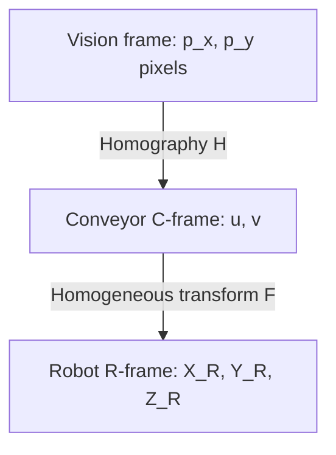
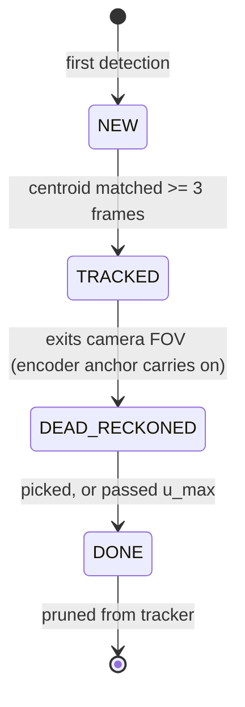

# Basis Theory — Delta Robot Pick-and-Place

> **Scope**: The theoretical framework behind every algorithm in this repository — coordinate
> transforms, kinematics, trajectory profiles, tracking/interception, orientation resolution,
> and the adaptive conveyor speed law.
> **Companions**: [`basis-programming.md`](basis-programming.md) (how the program implements
> this), [`context.md`](context.md) (AI onboarding), [`dev-note.md`](dev-note.md) (developer
> notes & pending calibration).
> **Numeric policy**: formulas here are symbolic; each symbol maps to a `modules/config.json`
> key (tables below). Live values belong to the config, not this document — earlier revisions
> hardcoded worked examples that silently drifted from the deployed config.

---

## 1. Coordinate Frames & Spatial Transformations

Three Cartesian frames map camera pixels to physical robot targets:

1. **Robot frame (R-frame)** — centered at the upper fixed base plate, $+Z$ up, right-hand
   rule. The parallel linkage constrains the end-effector to $Z < 0$ ($Z = 0$: arms fully
   retracted; $Z \approx -305$ mm: end-effector at the belt surface).
2. **Conveyor frame (C-frame)** — 2D planar frame on the belt surface: $+u$ downstream
   (belt flow), $+v$ transverse. Origin $O_C$ is a fixed physical point chosen at calibration.
3. **Vision frame (V-frame)** — 2D pixel space $(p_x, p_y)$ of the camera.

### 1.1. Homogeneous transform F (C → R)

The belt surface is planar and parallel to the robot $XY$ plane at constant pickup height
$Z_{\text{pickup}}$, so a 2D homogeneous transform suffices:

$$
\begin{bmatrix} X_R \\ Y_R \\ 1 \end{bmatrix}
= \mathbf{F}
\begin{bmatrix} u \\ v \\ 1 \end{bmatrix}
=
\begin{bmatrix}
-\sin\theta & \cos\theta & T_X \\
\cos\theta & \sin\theta & T_Y \\
0 & 0 & 1
\end{bmatrix}
\begin{bmatrix} u \\ v \\ 1 \end{bmatrix}
$$

* $\theta$: angle between the belt flow axis ($+u$) and the robot axes
  (`conveyor.frame.theta_deg`).
* $(T_X, T_Y)$: translation of the conveyor origin (`conveyor.frame.robot_origin_uv`).

Implementation: `ConveyorFrame` in `modules/conveyor.py`; calibration procedure via the
`test_vision_only` scenario (see `basis-programming.md`).

### 1.2. Planar homography H (V → C)

For the flat belt surface, pixels map to C-frame via a homography:

$$
\lambda \begin{bmatrix} u \\ v \\ 1 \end{bmatrix}
= \mathbf{H} \begin{bmatrix} p_x \\ p_y \\ 1 \end{bmatrix}
$$

In the deployed system the camera is mounted square to the belt, so $\mathbf{H}$ degenerates
into an axis swap + uniform scale (`vision.pixels_per_mm`, ROI offsets) — see
`M_VISION_TO_CONVEYOR` in `modules/conveyor.py`.

---

## 2. Kinematics of the Delta Mechanism

The kinematics run **on the Omron PLC**, not the PC — this section is the reference model.
The rung-level/ST derivations live in `doc/PLC_Program_description/`
(`inverse_kinematics.md`, `calc_forward_kinematic.md`).

Geometric parameters: $s_b$ base triangle side (320.0 mm), $s_p$ platform side (94.0 mm),
$L$ bicep length (140.0 mm), $l$ forearm length (315.0 mm).

### 2.1. Inverse kinematics (IK)

Given $(X_0, Y_0, Z_0)$, find joint angles $(\theta_1, \theta_2, \theta_3)$. By the 120°
rotational symmetry, the 3D problem reduces to three identical 2D single-arm solvers in a
local $YZ$-plane.

**Single-arm 2D solver** (`Calc_Angles_YZ`): the base joint sits at
$y_1 = -\frac{s_b}{2\sqrt{3}}$ and the platform connection at
$y_{\text{tmp}} = Y_0 - \frac{s_p}{2\sqrt{3}}$. The elbow $(0, y_j, z_j)$ satisfies

1. Bicep circle: $(y_j - y_1)^2 + z_j^2 = L^2$
2. Forearm sphere: $X_0^2 + (y_{\text{tmp}} - y_j)^2 + (Z_0 - z_j)^2 = l^2$

Subtracting gives the line $z_j = a + b\,y_j$ with

$$a = \frac{X_0^2 + y_{\text{tmp}}^2 + Z_0^2 + L^2 - l^2 - y_1^2}{2Z_0},
\qquad b = \frac{y_1 - y_{\text{tmp}}}{Z_0}$$

Substituting back yields $A y_j^2 + B y_j + C = 0$ with $A = 1 + b^2$, $B = 2(ab - y_1)$,
$C = y_1^2 + a^2 - L^2$, whose half-discriminant is

$$d = -(a + b\,y_1)^2 + L^2(b^2 + 1)$$

$d < 0$ ⇒ unreachable. The physical "elbow-down" root is

$$y_j = \frac{y_1 - ab - \sqrt{d}}{b^2 + 1}, \qquad z_j = a + b\,y_j$$

$$\theta = \frac{180}{\pi}\arctan\!\left(\frac{-z_j}{y_1 - y_j}\right) + \theta_{\text{offset}},
\qquad \theta_{\text{offset}} = \begin{cases}180^\circ & y_j > y_1\\ 0 & \text{else}\end{cases}$$

**Top-level coordinator**: rotate the target $(X, Y)$ by ±120° for arms 2 and 3
($X_2 = X\cos 120^\circ + Y\sin 120^\circ$, $Y_2 = -X\sin 120^\circ + Y\cos 120^\circ$;
arm 3 mirrored), with $\theta_3$ negated for the inverted motor direction.

### 2.2. Forward kinematics (FK)

Given $(\theta_1, \theta_2, \theta_3)$, find $(X_0, Y_0, Z_0)$ as the intersection of three
spheres of radius $l$ centered at the elbows. With $w = \frac{s_b - s_p}{2\sqrt{3}}$:

$$\mathbf{J}_1 = \begin{pmatrix} 0 \\ -(w + L\cos\theta_1) \\ -L\sin\theta_1 \end{pmatrix},\;
\mathbf{J}_2 = \begin{pmatrix} (w + L\cos\theta_2)\cos 30^\circ \\ (w + L\cos\theta_2)\sin 30^\circ \\ -L\sin\theta_2 \end{pmatrix},\;
\mathbf{J}_3 = \begin{pmatrix} -(w + L\cos\theta_3)\cos 30^\circ \\ (w + L\cos\theta_3)\sin 30^\circ \\ -L\sin\theta_3 \end{pmatrix}$$

Subtracting sphere 1 from spheres 2 and 3 eliminates the quadratic terms, giving a linear
system solved by Cramer's rule for $X_0 = a_1 + b_1 Z_0$, $Y_0 = a_2 + b_2 Z_0$; substituting
back into sphere 1 yields the quadratic $A_q Z_0^2 + B_q Z_0 + C_q = 0$ with

$$A_q = b_1^2 + b_2^2 + 1,\quad
B_q = 2(a_1 b_1 + a_2 b_2 - y_{j1} b_2 - z_{j1}),\quad
C_q = a_1^2 + a_2^2 - 2 a_2 y_{j1} + r_1 - l^2$$

The physical (lower) root: $Z_0 = \frac{-B_q - \sqrt{B_q^2 - 4 A_q C_q}}{2 A_q}$.

---

## 3. Trajectory Profiles

The PLC executes the trajectory; the PC's `TrajectoryInterpolator`
(`scheduler.interpolator.*` config) mirrors the same model to *predict segment timing* for
gate leads and ETAs. ST derivations: `doc/PLC_Program_description/MC_inter_curve_vel.md`,
`s_and_trapodize.md`, `easy_understand_talet_3d.md`.

### 3.1. Polynomial S-curve profile (jerk-bounded)

For stationary endpoints ($V_{\text{start}} = V_{\text{end}} = 0$), a 4th-order smoothstep
position profile limits jerk. With $\tau = t / t_{\text{acc}}$:

$$S(\tau) = V_{\max}\, t_{\text{acc}} \left(\tau^3 - \tfrac{1}{2}\tau^4\right), \qquad
v(\tau) = V_{\max}(3\tau^2 - 2\tau^3), \qquad
a(\tau) = \frac{6 V_{\max}}{t_{\text{acc}}}\,\tau(1 - \tau)$$

**Shape compensation factor**: the parabolic acceleration peaks at $\tau = 0.5$ with
$a_{\text{peak}} = 1.5 V_{\max} / t_{\text{acc}}$. Requiring $a_{\text{peak}} = A_{\max}$
gives $t_{\text{acc}} = 1.5\, V_{\max} / A_{\max}$ — the **1.5× factor** relative to a linear
ramp (`interpolator.scurve_shape_factor`).

### 3.2. Blended corner velocity

Traversing waypoint $\mathbf{B}$ (from $\mathbf{A}$, toward $\mathbf{C}$) without stopping,
the corner velocity is bounded by the direction-change angle $\Theta$:

$$\cos\Theta = \frac{(\mathbf{B}-\mathbf{A}) \cdot (\mathbf{C}-\mathbf{B})}
{\|\mathbf{B}-\mathbf{A}\|\,\|\mathbf{C}-\mathbf{B}\|},
\qquad
V_{\text{corner}} = V_{\max} \cos\frac{\Theta}{2} = V_{\max}\sqrt{\frac{\cos\Theta + 1}{2}}$$

This bounds centripetal acceleration and mechanical shock at corner transitions
(`corner_blend_xy`).

| Symbol | Config key (`scheduler.`) |
|---|---|
| $V_{\max}$, $A_{\max}$, $D_{\max}$ | `interpolator.v_max` / `.a_max` / `.d_max` |
| soft-start dwell | `interpolator.soft_start_s` |
| 1.5× shape factor | `interpolator.scurve_shape_factor` |
| coarse ETA speeds (logs only, NOT the timing model) | `nominal_xy_speed`, `nominal_z_speed` |

---

## 4. Object Tracking & Interception

### 4.1. Encoder-anchored dead-reckoning

Integrating velocity over time drifts and fails under speed changes. Instead, each detected
object is anchored to the absolute belt encoder position $p(t)$ (mm, from the Siemens PLC)
at its detection instant:

$$u(t) = u_{\text{anchor}} + \big(p(t) - p_{\text{anchor}}\big)$$

Position is a direct function of physical belt displacement — **drift-free** regardless of
speed variation.

### 4.2. Backdated anchoring (camera-latency compensation)

The anchor is only drift-free if $p_{\text{anchor}}$ is the belt position **at frame capture**,
not at ingest. Exposure + decode + YOLO + poll ≈ 80–150 ms, during which the belt advances
$v_{\text{belt}} \cdot \Delta t_{\text{lat}}$ — anchoring stale detections to the *current*
belt position injects that as a fixed upstream error. Solution: stamp each frame with its
decode time backdated by half the exposure (photons integrate over the exposure window), keep
a $(t, p)$ ring buffer, and anchor at the interpolated capture-time position:

$$p_{\text{anchor}} = p(t_{\text{cap}}), \qquad
t_{\text{cap}} = t_{\text{decode}} - \tfrac{1}{2} t_{\text{exposure}}$$

Falls back to the current position when history is unavailable (static/simulated belt).
Implementation: `BeltPositionTracker.position_at`, `_capture_loop` in
`modules/image_processing.py`.

### 4.3. Fixed-point pick-position prediction

The predictor chooses a stable **park position**, not a firing time — the pick itself fires on
a live positional gate (§4.4), making it immune to belt-speed estimate noise (the historical
"arrive → wait → miss" lag).

Iterate to the earliest goto-feasible pick:

1. Guess $t_{\text{pick}}^{(0)} = t_{\text{now}} + \text{lead}$.
2. Project the object: $u(t^{(k)}) = u_{\text{now}} + v_{\text{belt}}(t^{(k)} - t_{\text{now}})$.
3. Map to R-frame; compute robot travel time $\Delta t_{\text{goto}}$.
4. $t^{(k+1)} = t_{\text{now}} + \Delta t_{\text{goto}} + t_{\text{delay}}$; repeat to
   convergence.
5. Apply the minimum lead (`intercept_lead_time_s`) so the arm parks *downstream* of the
   object; clamp $u_{\text{pick}}$ to the workspace edge for danger-zone objects. If the arm
   cannot arrive before the object passes $u_{\text{pick}}$, skip (genuinely unreachable).

### 4.4. Positional pick gate

After parking, **no time math**: the main thread watches the claimed object's live
encoder-anchored position and dispatches the pick the moment

$$u_{\text{now}} \ge u_{\text{pick}} - \text{offset}(v_{\text{belt}})$$

**Lead offset.** Between gate-true and physical suction contact lies
$T_{\text{delay}} =$ `robot_movement_delay_s` + `ethernet_delay_s` (+ sampling latency ≈ gate
poll/2 + perception tick/2). The object moves $v_{\text{belt}} \cdot T_{\text{delay}}$
downstream in that window, so the gate fires early by exactly that displacement:

$$\text{offset}(v_{\text{belt}}) = v_{\text{belt}} \cdot T_{\text{delay}}$$

The general accelerating-belt forms (belt mid-ramp at gate time) are derived by splitting the
window at the ramp end $T_{\text{accel}} = |v_{sp} - v_c| / a_{\text{nom}}$:

* ramp does not finish within the window:
  $\text{offset} = v_c T_{\text{delay}} + \tfrac{1}{2} a T_{\text{delay}}^2$
* ramp finishes: $\text{offset} = \tfrac{v_c + v_{sp}}{2} T_{\text{accel}}
  + v_{sp}(T_{\text{delay}} - T_{\text{accel}})$

These are **not implemented**: the commit-timing strategy (§6.5) guarantees a steady belt at
gate-fire time, so the precision path stays single-term; the live gate absorbs residual drift.
`robot_movement_delay_s` is calibrated from the per-pick `[GATE]` log
(`dispatch_to_contact_s`), `ethernet_delay_s` from `modules/latency_probe.py`.

### 4.5. Oblique intercept (belt-tracking descent, opt-in)

A vertical descent at a fixed R-frame point contacts the board with horizontal *relative*
velocity equal to the belt speed, dragging it during suction settling. With
`scheduler.oblique_descent_enabled`: the arm still **parks above the predicted point**
$\mathbf{p}_{\text{pick}}$ (goto unchanged, stays in-workspace), but the pick-phase **contact
point shifts downstream** by the board's travel during the descent:

$$\mathbf{p}_{\text{contact}} = \mathbf{p}_{\text{pick}} + \hat{u}\,(v_{\text{belt}} \cdot t_d)$$

where $\hat{u}$ is the belt-flow unit vector in the R-frame and $t_d$ the modeled descent time
(one fixed-point pass folding the slant into the segment length). The cup follows the board
and meets it at near-zero relative velocity. The gate lead is **unchanged** (the slant itself
absorbs the $t_d$ travel — $t_d$ is *not* added to the lead).

> A superseded revision moved the *park* upstream by $v \cdot t_d$ instead — at operating belt
> speed that placed the arm outside the workspace. Only the **contact** shifts, never the park.
> Default **off** (vertical descent) until `interpolator.a_max` is calibrated: $t_d$ is
> over-estimated, so at high belt speed the contact can approach $u_{\max}$ (handled as a safe
> dispatch-reject, not a clamp).

### 4.6. Tracked-object lifecycle

### 4.7. Pick-attempt exclusivity (no re-pick)

There is **no slip-detection/retry**: `execute()` reports success when the arm's *motion*
completes; suction is never verified. Exactly-once bookkeeping keys off whether the grip was
actually **dispatched**:

* **Pick dispatched** (success, or failure after the grip command): remove the object from the
  tracker — a possible suction miss is never retried.
* **Aborted pre-grip** (goto timeout, gate stall, track lost): only unclaim; the object stays
  tracked and re-plannable. (Blanket removal used to drop still-pickable objects *and* deflate
  the density count $N$, speeding the belt up right after a failure.)

The gate abort itself is a **progress-based stall check** (object's $u$ advances < 0.5 mm for
several seconds, or track lost), not a wall-clock deadline — a fixed deadline fired spuriously
whenever the belt slowed after plan-build.

---

## 5. Yaw Orientation Resolution (360°)

QFP/TQFP parts have 180° rotational symmetry; YOLO-OBB reports tilt only in $[-90°, 90°)$.
The absolute 360° heading comes from the round locator dot (pin-1 marker): the board→marker
vector $\vec{v} = (x_m - x_b,\, y_m - y_b)$ gives the heading via `atan2`. Because the marker
sits diagonally on the board, a **per-class offset** (`vision.orientation.offset_by_class`)
is added at measurement time. A track that loses the marker in later frames reuses its last
marker-resolved heading rather than falling back to the ±90°-ambiguous OBB fold.

### 5.1. Rotation timeline

The suction rotation is applied **after** the grip, not before: home the axis to 0 during the
goto flight → gate fires → pick descends → once the arm lifts back to
$z \ge z_{\text{pre\_pick}}$, rotate the attached board to the bin orientation. The post-grip
angle is refreshed from the object's live tracked heading at the gate (plan-build values can
be several degrees stale), guarded by `rotate_refresh_max_delta_deg` against outliers.

### 5.2. Angle convention — exactly three layers

One unit per layer, converted only at the boundaries:

**Layer 1 — measurement (pixels → R-frame radians).** The vision heading $h$ (degrees,
measured against image +y **down**) converts once, in
`ConveyorFrame.vision_heading_to_robot_rad`:

$$\varphi_{\text{board}} = \text{wrap}_{\pi}\!\big(\text{rad}(h - 90°) + \theta_{\text{frame}}\big)$$

($0$ = robot $+X$, positive = CCW from above; the $-90°$ fixes the image-axis reference, a
historical constant bias.)

**Layer 2 — algorithm (R-frame radians only).** `TrackedObject.rotation_rad` stores
$\varphi_{\text{board}}$; the post-grip command is

$$\theta_{\text{cmd}} = \text{wrap}_{\pi}\!\big(s\,(\theta_{\text{offset}} - \varphi_{\text{board}})\big)$$

with $\theta_{\text{offset}}$ = `rotate_offset_deg` (bin orientation) and $s$ = `rotate_sign`
$\in \{+1, -1\}$ (physical axis direction vs. R-frame CCW; calibrate with
`python3 -m modules.test_rotate`). The wrap to $[-\pi, \pi)$ **is** the minimal-turn decision,
made exactly once, relative to the homed 0.

**Layer 3 — wire (IPC boundary, verbatim).** The Siemens axis accepts signed degrees in
$[-360, 360]$, shares the R-frame zero, and its command value encodes **both position and spin
direction**. The boundary is therefore a plain radians→degrees identity clamped to
$[-359, 359]$ — **no wrap**:

$$\theta_{\text{wire}} = \text{clamp}_{\pm 359}\big(\deg(\theta_{\text{cmd}})\big)$$

Wrapping here ($180° \to -180°$, $270° \to -90°$) would flip the commanded spin direction and
drive the axis nearly a full turn the wrong way on a $179° \to 180°$ step — the historical
"random over-rotation" fault. Manual/CLI absolute angles pass through untouched.
(`robot_rad_to_wire_deg` / `wire_deg_to_robot_rad` in `modules/EthernetCom.py`.)

**Calibration**: (1) `test_rotate` probe — remap/settle, implied axis speed, visual direction
check for `rotate_sign`, cmd-7→cmd-7 retrigger test; (2) a hardware run reading the per-pick
`[ROTATE]` log (`vision_angle / board_heading / rotate_cmd / rotate_at_gate / rotate_at_end`)
to set `rotate_offset_deg` + `offset_by_class`. `rotate_home_tolerance_deg` > 0 turns
"axis not yet home at grip" into a warn-only check.

---

## 6. Adaptive Conveyor Speed (Rate Regulation)

**Goal: preserve the serial arm's throughput under an unstable feeder.** The belt is a **rate
regulator**, not a transport to maximize: its job is to hold the *presentation rate* of
pickable objects near a nominal target. Belt speed is therefore set **inversely** to object
density.

> **Rejected model**: "run fast when busy" ($v = A \cdot N + v_{\min}$). Belt speed does not
> set throughput — the serial arm's pick cycle does. Speeding up under high density only
> shortens transit time and pushes objects past $u_{\max}$ unpicked.

### 6.1. Symbols ↔ config

| Symbol | Meaning | Config key (`scheduler.`) |
|---|---|---|
| $v_{\min}$ | operational floor (hardware control imprecise at very low speed) | `belt_speed_min_mm_s` |
| $v_{\text{cap}}$ | pickability ceiling, derived $= \min(L/t_{\text{transit}},\, v_{\text{soft}},\, v_{\text{hw}})$ | via `pick_transit_min_s`, `belt_speed_max_mm_s`, `belt_speed_hw_max_mm_s` |
| $a_{\text{nom}}$, $T_{\text{ramp}}$ | belt accel magnitude / jerk-phase build time (informational) | `belt_accel_mm_s2`, `belt_ramp_s` |
| $t_{\text{pick}}$, $\mu_{\max} = 1/t_{\text{pick}}$ | calibrated pick cycle / arm ceiling | `pick_cycle_s` |
| $k$, $\lambda_{\text{nom}} = k\,\mu_{\max}$ | headroom factor / presentation-rate target | `belt_speed_headroom` |
| $L$ | workspace window length $= u_{\max} - u_{\min}$ | `conveyor.workspace_window_uv` |
| $L_{\text{meas}}$ | density region length (0 ⇒ derive $= u_{\max}$) | `belt_density_length_mm` |
| $\Delta_{\min}$, $\Delta v_{\max}$ | commit deadband / per-commit step limit | `belt_speed_deadband_mm_s`, `belt_speed_max_step_mm_s` |

### 6.2. The inverse density law

Presentation rate $\lambda = \rho v$ (linear density × speed). Holding
$\lambda = \lambda_{\text{nom}}$:

$$v = \text{clamp}\!\left(\frac{\lambda_{\text{nom}}}{\rho},\; v_{\min},\; v_{\text{cap}}\right),
\qquad \rho = \frac{N}{L_{\text{meas}}}$$

with $N$ = count of **unclaimed, not-yet-passed** objects ($0 \le u \le u_{\max}$).
Equivalently $v = \lambda_{\text{nom}} L_{\text{meas}} / N$ — **hyperbolic** in $N$.
More density ⇒ *slower* belt: a sparse feeder is sped up so objects reach the arm before it
starves; a dense feeder is slowed so the serial arm gets transit time.

**Pickability ceiling**: the object must stay in the $L$-length window at least
$t_{\text{transit}}$ (`pick_transit_min_s`) for the arm to intercept:
$v_{\text{cap}} = \min(L / t_{\text{transit}},\, v_{\text{soft}},\, v_{\text{hw}})$.

**Rate target**: $\lambda_{\text{nom}} = k\,\mu_{\max}$ with $k < 1$ deliberately below the
arm's ceiling — the headroom absorbs feeder bursts and timing jitter.

### 6.3. Three regimes (one law, two clamps)

1. **Feeder-limited (sparse)**: law wants $v > v_{\text{cap}}$, clamps to $v_{\text{cap}}$.
   The arm is under-fed and the belt is already doing its best.
2. **Regulated (normal)**: $v \in (v_{\min}, v_{\text{cap}})$, arrival held at
   $\lambda_{\text{nom}}$ — sub-unity utilization *by design*.
3. **Overload (dense)**: law pins $v = v_{\min}$; the window stays full and utilization rises
   to ~100 % **emergently** — no separate brake/exception state. The backlog count (in-window
   unpicked objects predicted to pass $u_{\max}$) is telemetry only. If the feeder exceeds
   $\mu_{\max}$ even here, loss is unavoidable — no speed policy recovers a genuinely
   over-saturated cell.

### 6.4. Spacing cap (cluster ceiling)

The count-only law regulates the *average* rate but is blind to clustering: a tight pair and a
spread pair both read $N = 2$ and get the same speed, so a tight trailing object can pass
$u_{\max}$ unpicked. The binding constraint for a burst is the inter-arrival time of adjacent
objects: $s_i / v \ge t_{\text{pick}}$. A **spacing ceiling** is min-ed onto the density law:

$$v_{\text{target}} = \max\!\Big(v_{\min},\; \min\big(v_{\rho},\; g_{\min} / t_{\text{pick}}\big)\Big),
\qquad g_{\min} = \min_i (u_i - u_{i+1})$$

over the leading few objects only (`_SPACING_LEAD_OBJECTS`, default 4) — an upstream cluster
does not force a premature slow-down. A cluster tighter than $v_{\min} t_{\text{pick}}$ pins
the floor (best-effort; the cell is locally over-dense).

### 6.5. Commit policy, anti-thrash, and jerk avoidance

Density is sensed **continuously** (~25 ms perception tick); commits of `change_speed` are
**opportunistic** — allowed from the executor wait loops (goto flight, far gate wait,
post-grip return) and the idle loop, throttled ≥ 0.75 s apart — and **suppressed only inside
the gate-critical window** (object within ~2 s of belt travel of the fire threshold,
`RealtimeState.gate_critical`).

* **Deadband**: commit only if $|v_{\text{target}} - v_{\text{setpoint}}| > \Delta_{\min}$.
* **Step limit**: each commit moves at most $\Delta v_{\max}$ toward the target, so each ramp
  settles in $\Delta v_{\max} / a_{\text{nom}}$ — shorter than the gate-critical lead. (The
  raw hyperbolic law is near bang-bang at small $N$; the $N = 1 \leftrightarrow 2$ jump alone
  would ramp for seconds.)
* **Closed loop**: perception stores the PLC's measured `speed_current`; if it diverges from
  the setpoint > 3 s after the last commit, the setpoint is re-sent (catches lost commands —
  the old controller compared against a phantom setpoint it assumed was applied).

**Jerk avoidance**: modeling the belt's S-curve ramp explicitly in the gate offset would add a
piecewise-cubic bookkeeping for a sub-millimetre correction that only applies mid-ramp.
Instead, the commit policy above guarantees the belt is **steady whenever a gate fires** — by
construction, not by hope — so the precision path keeps the single-term offset of §4.4, and
the live gate absorbs residuals. Startup seeds the belt with `belt_speed_static_mm_s`
unconditionally (adaptive off = static speed).

> Historical note: the original policy committed only at the grip instant (≤ 1 commit per
> 2–10 s pick cycle) — density changes sat uncommitted for seconds and the belt felt laggy and
> uneven on hardware; quantitatively, large speed jumps need ramps longer than the window that
> policy assumed. The inverted (opportunistic + gate-critical-suppression) policy replaced it.

---

## 7. Concurrency Model (summary)

Theory-level view; the full runtime layout is in `basis-programming.md` §1.

* **Background communication process** — sole owner of PLC I/O (snap7 Modbus/TCP to Siemens,
  pylogix EtherNet/IP to Omron); IPC queues isolate network jitter from control loops.
* **Perception/state daemon thread** (~25 ms) — sensor fusion: belt encoder, vision poll,
  tracker refresh, adaptive speed target; sole regular PLC status reader.
* **Decision/execution main thread** — plan build, claim, dispatch, gate wait; reads shared
  state, issues no status I/O of its own.
* Two locks: `ipc_lock` (exactly one dispatch/status round-trip in flight) and `state_lock`
  (guards `RealtimeState` between perception and decision threads).

---

## 8. Future Ideas & Research Proposals

* **Web GUI dashboard v2** — live 3D end-effector trajectory, positional-error graphs from
  `data.log`, sorted-item database views (the current in-process dashboard covers telemetry
  and MJPEG).
* **SQL sorting database** — `product_types` (destinations per class) + `pick_history`
  (per-pick audit trail with timestamps and status).
* **Closed-loop conveyor control via queueing theory** — the §6 rate-regulation law is the
  near-term realization; a full Little's-Law queueing model is the longer-term evolution.
* **Suction verification** — a vacuum-pressure or vision check after the grip would make the
  exactly-once policy (§4.7) retry-capable for true misses.
