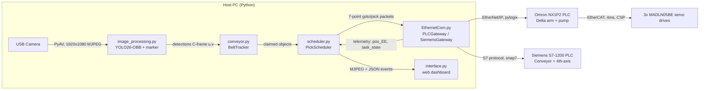
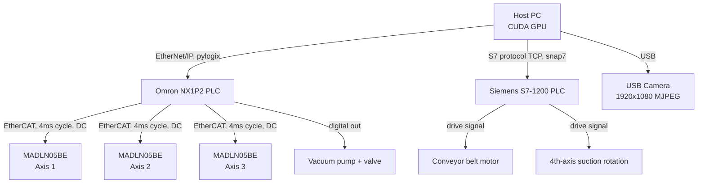
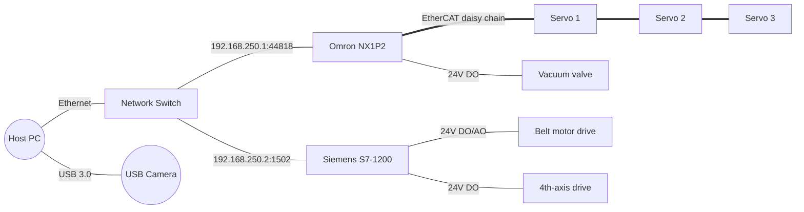
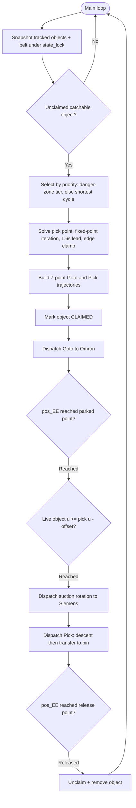

# Graduation Thesis — Draft (FAE Template)

> **Working draft** for the HCMUTE Faculty of Advanced Education graduation thesis,
> structured to match `doc/ref/FAE Template of Graduation Thesis.pdf`.
> Content is derived from the actual repository (`modules/`, `config.json`,
> `doc/ai_context.md`, `doc/theory_basis.md`, `doc/academic_report.md`).
> Markers `[TODO: …]` flag values that must come from real measurements or from the
> student before submission — **do not leave these in the final document, and do not
> invent numbers to replace them.**

---

## Cover Page (fill in before export)

- **HO CHI MINH CITY UNIVERSITY OF TECHNOLOGY AND ENGINEERING — FACULTY OF ADVANCED EDUCATION**
- **GRADUATION PROJECT**
- **Title:** VISION-GUIDED DELTA ROBOT FOR REAL-TIME PICK-AND-PLACE SORTING ON A CONVEYOR
- Supervisor: [TODO: supervisor name, title]
- Full name(s): [TODO]
- Student ID(s): [TODO]
- Major: AUTOMATION AND CONTROL ENGINEERING TECHNOLOGY
- Ho Chi Minh City, [TODO: month] 2026

---

## DISCLAIMER

This graduation report is submitted in partial fulfillment of the requirements for the
bachelor's degree program at Ho Chi Minh City University of Technology and Education. The
work presented in this report is the result of my own independent research, study, and
practical implementation, conducted under the academic supervision of the assigned lecturer.

All data, figures, methodologies, and results presented in this report have been obtained
through legitimate academic activities. Any sources of information, ideas, or materials taken
from other works have been appropriately cited and referenced in accordance with academic
standards. The author confirms that this report has not been submitted, in whole or in part,
to any other institution for the purpose of obtaining any academic degree or qualification.

The opinions, analyses, findings, conclusions, and recommendations expressed in this report
are solely those of the author and do not necessarily reflect the official views of Ho Chi
Minh City University of Technology and Education, the Faculty of Advanced Education, or the
project supervisor.

---

## ACKNOWLEDGEMENTS

[TODO: personalize.] I would like to express my sincere gratitude to my supervisor,
[TODO: supervisor], for the valuable guidance, continuous support, and constructive feedback
throughout this graduation project. I also thank the lecturers of the Faculty of Advanced
Education for the solid foundation in control systems, robotics, and computer vision that made
this work possible, and my family and friends for their constant encouragement.

---

## ABSTRACT

Manual sorting of small electronic components on a production line is repetitive, error-prone,
and difficult to scale. This thesis presents the design and implementation of a vision-guided
**delta parallel robot** that performs real-time pick-and-place sorting of surface-mount
package components (QFP and TQFP) directly from a moving conveyor belt. A USB camera streams
1080p frames that are processed on a host PC by a **YOLO26 oriented-bounding-box (YOLO26-OBB)**
detector, which returns each component's class, centroid, and tilt angle; a locator-dot marker
resolves the full 360° heading needed to align the suction cup. Detected components are mapped
from image space to the robot workspace through a homography and a planar homogeneous transform,
and are tracked drift-free by anchoring each object to the conveyor's absolute encoder position.

The control software runs as a concurrent Python application that isolates network latency in a
dedicated communication process and senses the belt and vision pipeline in a high-frequency
perception thread, while a main decision thread plans jerk-bounded trajectories and executes
picks. Motion is delegated to an **Omron NX1P2** PLC over EtherNet/IP, while conveyor speed and
the 4th-axis suction rotation are commanded on a **Siemens S7-1200** PLC over the S7 protocol.
A **positional pick gate** triggers the descent on the live tracked position of the target
rather than a predicted time, making interception immune to belt-speed estimation noise. An
optional **adaptive conveyor-speed** controller regulates the belt inversely to product density
to keep the arm fed at a stable presentation rate.

Software-in-the-loop validation of the scheduler — exercising the real planning, tracking, and
timing code with simulated motion execution in place of the PLC — reached the three fixed
accuracy targets to within 0.01 mm and completed 12/12 simulated picks across a two-cycle
evaluation run at a software-timing ceiling of approximately 38 picks/min. Experimental evaluation
on the physical cell measured [TODO: pick success rate]% pick success, a positioning accuracy
within [TODO: mm], and a sustained throughput of [TODO: picks/min]. The results demonstrate a
cost-effective architecture that bridges real-time computer vision and high-speed parallel-robot
motion control for flexible small-component sorting.

**Keywords:** Delta robot, Parallel kinematics, Pick-and-place, Conveyor tracking, YOLO26-OBB,
Oriented object detection, Computer vision, PLC, EtherNet/IP, Real-time control, Python.

---

# Chapter 1: INTRODUCTION

## 1.1. Research Background

Flexible automation of pick-and-place tasks is a core problem in modern electronics
manufacturing. Delta (parallel) robots are widely used for high-speed handling because their
actuators remain mounted on the fixed base rather than traveling with the end-effector, giving
the moving structure low inertia and therefore the high acceleration and repeatable precision
that serial-arm manipulators cannot match at comparable speed [2][3][4]. When such a robot must
pick objects from a *moving* conveyor instead of a fixed feeder tray, two problems must be solved
together: (i) perceiving where each object is, what type it is, and how it is oriented; and (ii)
intercepting it reliably despite communication latency and variation in belt speed — neither
problem is solved by the kinematic model alone, which assumes the target position is already
known and static.

Recent advances in real-time deep-learning object detection — particularly the YOLO family of
single-stage detectors — make on-line perception practical on commodity hardware without a
dedicated machine-vision controller [5][6]. Standard axis-aligned bounding boxes, however, only
localize an object's position and extent; they say nothing about its rotation. Oriented bounding
box (OBB) detection additionally recovers object *heading* [5][7], which is essential when a
suction tool must be aligned to a rectangular package such as a QFP/TQFP integrated circuit
before it can be placed correctly downstream. This project combines a YOLO26-OBB [1] perception
pipeline with a delta robot and an industrial PLC motion layer (§2.3) to build a complete
vision-guided sorting cell, addressing the perception, tracking, and timing problems explicitly
rather than assuming a stationary, pre-localized target.

## 1.2. Research Objectives

### 1.2.1. Real-time vision-guided interception
Detect QFP/TQFP components on a moving belt, resolve their full 360° orientation, track them
without drift, and pick them while the belt is moving.

### 1.2.2. Robust, latency-tolerant pick timing
Replace fragile time-of-arrival prediction with a closed-loop **positional pick gate** so that
interception remains accurate under belt-speed fluctuation and network jitter.

### 1.2.3. Throughput regulation
Provide an optional **adaptive conveyor-speed** policy that keeps the rate-limited robot arm fed
at a stable presentation rate under an irregular upstream feeder.

## 1.3. Scope of Research

### 1.3.1. Object and processing environment
- **Targets:** two surface-mount package classes, **QFP** (30 × 40 mm) and **TQFP** (40 × 50 mm),
  1.6 mm thick, presented flat on a conveyor belt.
- **Robot:** a 3-arm delta mechanism with a 4th degree of freedom (suction-cup rotation).
- **Perception:** a single fixed USB camera (1080p, MJPEG, ~30 fps) viewing the belt upstream of
  the robot workspace.

### 1.3.2. Focus on engineering and technology
The thesis emphasizes systems integration: the kinematic model, the perception-to-robot
coordinate chain, the concurrency architecture, the PLC communication contracts, and the
real-time scheduling logic. It is an applied engineering project rather than a study of a new
learning algorithm.

### 1.3.3. Limitations of the project
- Suction success is not sensed; a missed grip is not retried (each object is attempted once).
- The 4th-axis firmware ignores per-segment timing; PC-side segment times are approximations.
- Adaptive belt-speed is opt-in and was under hardware testing at the time of writing.
- The camera uses a fixed manual exposure (`exposure_time_absolute=300`, auto-exposure disabled)
  to keep capture frame rate constant; this trades off automatic adaptation to ambient lighting
  changes, so detection quality is only guaranteed under the lighting condition the exposure value
  was tuned for, and re-tuning is a manual step if the cell is relocated.
- The vision→conveyor homography and conveyor→robot transform (§2.5) are calibrated once for a
  fixed camera mounting and conveyor alignment; physically moving the camera, the belt, or the
  robot base requires re-calibration — there is no online recalibration mechanism.
- [TODO: add any additional calibration / lighting / camera limitations observed in practice on
  the physical cell.]

### 1.3.4. Fundamental values and development direction
The cell demonstrates a reusable pattern — *vision perception → coordinate transform →
encoder-anchored tracking → positional-gate interception* — that generalizes to other flexible
sorting and assembly tasks.

## 1.4. Report Structure

- **Chapter 1 — Introduction:** background, objectives, scope.
- **Chapter 2 — Theoretical Basis:** delta kinematics, coordinate transforms, oriented object
  detection, trajectory generation, conveyor tracking, and the adaptive-speed model.
- **Chapter 3 — System Configuration:** methodology, hardware, and software implementation.
- **Chapter 4 — Experiment and Evaluation:** test setup and measured results.
- **Chapter 5 — Conclusion and Future Work.**

---

# Chapter 2: THEORETICAL BASIS

## 2.1. Overview of the Delta Parallel Robot

The delta robot is a parallel manipulator in which three identical arms connect a fixed top base
to a moving end-effector platform through parallelogram forearms, constraining the platform to
pure translation in the negative-Z workspace. Because the heavy actuators remain on the base,
the moving mass is small, enabling the high accelerations that make delta robots the standard
choice for high-speed pick-and-place. The kinematic foundations used here follow standard
robotics references [2][3][4]. Geometric parameters of the implemented robot:

| Symbol | Meaning | Value |
|---|---|---|
| $s_b$ | base equilateral-triangle side | 320.0 mm |
| $s_p$ | end-effector platform side | 94.0 mm |
| $L$ | bicep (upper arm) length | 140.0 mm |
| $l$ | forearm link length | 315.0 mm |

All kinematics, trajectory interpolation, and servo command generation execute **on the Omron
NX1P2 PLC** in Structured Text, inside a 4 ms hard real-time periodic task synchronized to the
EtherCAT bus (Distributed Clocks enabled, three MADLN05BE servo drives in CSP — Cyclic
Synchronous Position — mode, PDO cycle 4 ms). The host PC never computes a joint angle: it sends
Cartesian waypoints and reads back Cartesian/joint telemetry that the PLC itself derives. This
split exists because Distributed-Clock-synchronized, sub-microsecond-jitter axis commands are
required to keep the three mechanically coupled arms from binding against each other — a timing
guarantee a general-purpose OS cannot provide over a host-PC network link.

## 2.2. Kinematics

### 2.2.1. Inverse kinematics (IK)

Given a Cartesian target $(X_0, Y_0, Z_0)$, the joint angles $(\theta_1,\theta_2,\theta_3)$ are
found by exploiting the 120° symmetry: the 3D problem reduces to three identical 2D single-arm
solvers in the local $YZ$-plane (`Calc_Angles_YZ`), each called once per arm by a top-level
coordinator (`Calc_Inverse_Kinematics`).

**Single-arm 2D solver.** The base joint of the reference arm sits at
$y_1 = -s_b/(2\sqrt3)$ and the platform hinge, offset by the target $Y_0$, at
$y_{tmp} = Y_0 - s_p/(2\sqrt3)$. The elbow $(0, y_j, z_j)$ must simultaneously lie on the bicep
circle of radius $L$ centered at $(0,y_1,0)$ and on the forearm sphere of radius $l$ centered at
$(X_0, y_{tmp}, Z_0)$:

$$ (y_j-y_1)^2 + z_j^2 = L^2 \qquad X_0^2 + (y_{tmp}-y_j)^2 + (Z_0-z_j)^2 = l^2 $$

Subtracting the expanded bicep equation from the expanded forearm equation cancels both quadratic
terms ($y_j^2$, $z_j^2$) and linearizes $z_j$ in terms of $y_j$:

$$ z_j = a + b\,y_j, \qquad
a = \frac{X_0^2+y_{tmp}^2+Z_0^2+L^2-l^2-y_1^2}{2Z_0}, \qquad
b = \frac{y_1-y_{tmp}}{Z_0} $$

Substituting back into the bicep circle gives a quadratic $A y_j^2 + B y_j + C = 0$ with
$A=1+b^2$, $B=2(ab-y_1)$, $C=y_1^2+a^2-L^2$. Using the half-discriminant
$d=\Delta/4=-(a+by_1)^2+L^2(b^2+1)$ avoids one factor of 2 in the root formula; $d<0$ means the
target is outside the reachable dome (the PLC aborts the move). The two roots are the "elbow-up"
and "elbow-down" assembly configurations; the physically installed geometry always uses the
**elbow-down** (far, lower) branch:

$$ y_j = \frac{y_1-ab-\sqrt d}{b^2+1}, \qquad z_j = a+b\,y_j $$

The joint angle is the bicep's angle from horizontal, $\theta=\arctan\!\big(\tfrac{-z_j}{y_1-y_j}\big)$,
with a $180°$ quadrant correction when $y_j>y_1$ (`atan` only returns $(-90°,90°)$) and a direct
$\pm90°$ assignment when $y_j=y_1$ to avoid a division by zero.

**Per-arm rotation.** Arms 2 and 3 are mounted at $+120°$ and $-120°$ from arm 1. Rather than
re-deriving the solver three times, the target $(X,Y)$ is rotated into each arm's local frame and
fed through the same 2D solver:

$$ \theta_1=\mathrm{Solver}(X,Y,Z) $$
$$ X_2=X\cos120°+Y\sin120°,\; Y_2=-X\sin120°+Y\cos120°,\quad \theta_2=\mathrm{Solver}(X_2,Y_2,Z) $$
$$ X_3=X\cos120°-Y\sin120°,\; Y_3=X\sin120°+Y\cos120°,\quad \theta_3=-\mathrm{Solver}(X_3,Y_3,Z) $$

$\theta_3$ is negated because the third servo drive's parameter direction is inverted relative to
axes 1–2, so a positive encoder count on axis 3 would otherwise correspond to downward rather than
upward arm motion. A joint-limit check ($\theta_i<-20°$) additionally rejects targets that would
swing an arm above horizontal into the base frame. All three angle solves plus the limit checks
complete in **under 10 µs** on the NX1P2 — negligible against the 4 ms EtherCAT budget.

### 2.2.2. Forward kinematics (FK)

FK runs every scan (`Calc_Forward_Kinematic`, fed by the live servo encoders) purely as a position
**monitor** — it is not in the motion-command path. Given joint angles $(\theta_1,\theta_2,\theta_3)$,
each elbow is projected into 3D using the radial offset $w=(s_b-s_p)/(2\sqrt3)$:

$$ \mathbf J_1=\begin{pmatrix}0\\-(w+L\cos\theta_1)\\-L\sin\theta_1\end{pmatrix}\quad
\mathbf J_2=\begin{pmatrix}(w+L\cos\theta_2)\cos30°\\(w+L\cos\theta_2)\sin30°\\-L\sin\theta_2\end{pmatrix}\quad
\mathbf J_3=\begin{pmatrix}-(w+L\cos\theta_3)\cos30°\\(w+L\cos\theta_3)\sin30°\\-L\sin\theta_3\end{pmatrix} $$

The platform center $\mathbf P=(X_0,Y_0,Z_0)$ lies a forearm length $l$ from every elbow:
$\|\mathbf P-\mathbf J_i\|^2=l^2$. Subtracting sphere 1 from spheres 2 and 3 cancels the shared
quadratic terms $(X_0^2+Y_0^2+Z_0^2)$, leaving a $2\times2$ linear system in $(X_0,Y_0)$
parameterized by $Z_0$, solved by Cramer's rule for $X_0=a_1+b_1Z_0$, $Y_0=a_2+b_2Z_0$.
Back-substituting into the sphere-1 equation gives a quadratic in $Z_0$ alone:

$$ A_q Z_0^2+B_qZ_0+C_q=0,\qquad A_q=b_1^2+b_2^2+1 $$

whose **lower** root, $Z_0=\dfrac{-B_q-\sqrt{B_q^2-4A_qC_q}}{2A_q}$, is the physical solution
because the workspace is entirely below the base plane; the upper root is geometrically valid but
mechanically unreachable. A negative discriminant means the three encoder readings describe a
geometrically impossible configuration (mechanical fault or encoder slip) and is treated as a
safety fault.

### 2.2.3. Worked numeric example (IK → FK round trip)

To make the model concrete, one of the deployed accuracy test points from `config.json`
(`scheduler.accuracy_points[0]` = $(66.64,\,-52.9,\,-290.0)$ mm) is solved by hand with the exact
formulas above ($s_b=320$, $s_p=94$, $L=140$, $l=315$ mm). For arm 1:
$y_1=-92.376$ mm, $y_{tmp}=-80.036$ mm, $a=-11.704$, $b=0.0426$, $d=19391.0$ (reachable, $d>0$),
giving elbow $(y_j,z_j)=(-230.712,\,-21.522)$ mm and $\theta_1=8.843°$. Repeating for the
$\pm120°$-rotated targets gives $\theta_2=15.046°$ and $\theta_3=-44.418°$. Feeding these three
angles back through the FK equations of §2.2.2 returns
$(X_0,Y_0,Z_0)=(66.640,\,-52.900,\,-290.000)$ mm — recovering the original target to better than
$10^{-3}$ mm, confirming the IK and FK derivations are mutually consistent.

## 2.3. Motion Layer: PLC Control, EtherCAT, and Trajectory Execution

Motion is executed by industrial controllers rather than a microcontroller, split by
real-time requirement:
- An **Omron NX1P2** PLC drives the three delta-arm servo axes and the vacuum pump/valve over
  **EtherCAT** (three MADLN05BE drives, CSP mode, 4 ms PDO cycle, Distributed Clocks).
- A **Siemens S7-1200** PLC drives the conveyor speed and the 4th-axis suction-cup rotation over
  the **S7 protocol** (TCP).

This split keeps deterministic, safety-critical motion on hardened controllers while the host PC
performs perception and high-level scheduling. The byte-level data contracts (DB offsets,
endianness, command IDs) are documented in `doc/ai_context.md §3`.

### 2.3.1. PC ↔ Omron command protocol
The PC writes a `commandID` (2 = goto-absolute, 3 = go-trajectory, 4 = home, 5 = pick, 6 =
release) plus argument arrays to a shared DB; the PLC's command dispatcher (`Section0`, rung 4)
executes the command within one scan and acknowledges by clearing `commandID`/`bit_doing`,
reporting `task_doing`/`task_state` (1 = Done, 2 = Busy, 3 = Error) back to the PC. Command 3
loads a **7-point waypoint array** ($X,Y,Z$ plus an end-effector action bit $E\in\{0,1\}$ for
pump on/off per point) that drives the trajectory pipeline of §2.7.

### 2.3.2. Homing and safety interlocks
On power-up, `MC_Home_Delta` drives all three arms upward until limit switches trigger, then a
calibration move sets each axis to a fixed reference angle ($28.9°$, $27.5°$, $-27.7°$) before the
encoder origin is latched — establishing the absolute coordinate system used by every IK/FK call
thereafter. A homing-limit-switch trip outside of an active homing sequence triggers an immediate
`MC_Stop` on all three axes and clears any in-flight trajectory state, and the physical Reset
button clears servo faults but forces the operator to re-enable and re-home before further motion.

## 2.4. Computer Vision and Oriented Object Detection

### 2.4.1. Object detection background
Object detection has evolved rapidly from hand-crafted features to deep one-stage detectors; a
comprehensive history is given by Zou et al. [5]. The YOLO single-stage family is the de-facto
standard for real-time industrial detection [6]. This project uses **YOLO26** [1], the 2026
Ultralytics release whose end-to-end (NMS-free) design and removal of the distribution-focal-loss
module target low-latency edge inference.

### 2.4.2. Oriented bounding boxes (OBB)
A rectangular IC package has a meaningful in-plane rotation, so a standard axis-aligned box is
insufficient. Oriented detection regresses a rotated box; the design rationale and accuracy of
oriented detectors are established by works such as Oriented R-CNN [7]. The deployed model is a
**YOLO26-OBB (nano)** weight trained on QFP/TQFP packages, run at 1920 px input with a confidence
threshold of 0.7.

### 2.4.3. 360° yaw resolution
YOLO-OBB reports tilt only within $[-90°, 90°)$, which is ambiguous for a 180°-symmetric package.
A small **locator-dot marker** on pin/corner #1 disambiguates heading: the vector from the
component centroid to the marker centroid gives
$\theta_{\text{heading}} = (\operatorname{atan2}(v_y, v_x)\cdot 180/\pi + \theta_{\text{offset}}) \bmod 360$.

## 2.5. Coordinate Frames and Spatial Transformations

Three frames link the camera to the robot:

1. **Vision frame (V):** pixel coordinates $(p_x, p_y)$.
2. **Conveyor frame (C):** belt-aligned $(u, v)$, with $+u$ downstream.
3. **Robot frame (R):** Cartesian $(X_R, Y_R, Z_R)$, workspace in $Z<0$.

A planar **homography** $\mathbf{H}$ maps V→C, and a 2D **homogeneous transform** $\mathbf{F}$
maps C→R at the constant pickup height:

$$
\begin{bmatrix} X_R \\ Y_R \\ 1 \end{bmatrix}
= \mathbf{F} \begin{bmatrix} u \\ v \\ 1 \end{bmatrix}
= \begin{bmatrix} -\sin\theta & \cos\theta & T_X \\ \cos\theta & \sin\theta & T_Y \\ 0 & 0 & 1 \end{bmatrix}
\begin{bmatrix} u \\ v \\ 1 \end{bmatrix}
$$

where $\theta$ is the conveyor-to-robot angle (28° in the deployed cell) and $(T_X, T_Y)$ the
conveyor origin offset.

## 2.6. Conveyor Tracking and the Positional Pick Gate

### 2.6.1. Encoder-anchored dead reckoning
Integrating velocity over time accumulates drift and fails when the belt accelerates or stops.
Instead, each object is anchored to the **absolute belt encoder** $p(t)$ at detection time:
$u(t) = u_{\text{anchor}} + (p(t) - p_{\text{anchor}})$. Position then tracks physical belt
displacement exactly, with zero drift.

### 2.6.2. Positional pick gate
The arm first parks at a kinematically feasible interception point $u_{\text{pick}}$, found by a
fixed-point iteration over the predicted pick time (guess a lead time → project the object at
$v_{\text{belt}}$ → compute the robot's goto travel time → refine the guess → repeat to
convergence), with a minimum **1.6 s** lead (`intercept_lead_time_s`) and edge-clamping for
objects already near the danger zone. Once parked, the descent does **not** fire on that
predicted time; the main thread instead waits on the claimed object's *live*, continuously
refreshed position and fires the moment

$$ u(t) \ge u_{\text{pick}} - \text{offset}(v_{\text{belt}}) $$

Closing the loop on the live object — rather than trusting a frozen, noisy speed sample — removes
the mistimed "arrive → wait → miss" lag that a pure time-based trigger exhibits under belt-speed
estimation error.

**The lead offset, in general.** Because $u$ is anchored to the belt encoder, the offset is
exactly the belt's own displacement over the dispatch-to-grip latency $T_{\text{delay}}\approx
\texttt{robot\_movement\_delay\_s}+\texttt{ethernet\_delay\_s}\approx 50$ ms. Three cases arise
depending on whether the belt is mid-acceleration-ramp when the gate is evaluated (current speed
$v_c$, setpoint $v_{sp}$, ramp duration $T_{\text{accel}}=|v_{sp}-v_c|/a_{\text{nom}}$):

$$ \text{offset} = \begin{cases}
v_{\text{belt}}\,T_{\text{delay}} & \text{steady belt } (a=0) \\[4pt]
v_c\,T_{\text{delay}} + \tfrac12 a\,T_{\text{delay}}^2 & \text{mid-ramp, } T_{\text{accel}} \ge T_{\text{delay}} \\[4pt]
\tfrac{v_c+v_{sp}}{2}\,T_{\text{accel}} + v_{sp}\,(T_{\text{delay}}-T_{\text{accel}}) & \text{mid-ramp, } T_{\text{accel}} < T_{\text{delay}}
\end{cases} $$

All three forms are continuous (they agree at $T_{\text{accel}}=T_{\text{delay}}$ and reduce to
the steady-belt case at $a=0$). In the deployed system the speed-change *commit instant* is
engineered (§2.8) so that any acceleration ramp has already settled by the time the **next**
gate is evaluated; the gate therefore always uses the simple steady-belt form
$v_{\text{belt}}\,T_{\text{delay}}$ (≈2.5 mm at 50 mm/s, growing with speed), and the two
acceleration-aware forms exist only as a robustness fallback should a gate ever fire while a ramp
is still in progress (`doc/theory_basis.md §3.1, §6.4`).

## 2.7. Trajectory Generation

Every pick uses a **7-point goto template** and a **7-point pick template** — lift → cruise at
clearance height → slope down → intercept → lift → transfer → place — with a strict height
hierarchy `clearance > slope_transition > pre_pick > pickup` enforced for safety. The PC only
computes the seven Cartesian waypoints (plus an end-effector pump bit per point) and dispatches
them as the 7-point array of §2.3.1; **all interpolation between waypoints, profile selection,
and IK conversion happens on the PLC**, inside six daisy-chained instances of a custom
`MC_Inter_Curve_Vel` function block — one per segment of the 7-point path — executing every 4 ms.

### 2.7.1. Profile selection: S-curve vs. trapezoidal
Each segment picks one of two velocity profiles depending on its boundary velocities:

| $V_{\text{start}}$ | Blend mode | Profile | Why |
|---|---|---|---|
| $=0$ | off (final segment) | **S-curve polynomial** | both boundaries at rest — closed-form, no iteration |
| $>0$ | on (segments 0–4) | **Trapezoidal + look-ahead** | non-zero boundary velocity makes the S-curve's 4-coefficient boundary-value problem require an unbounded-iteration numerical solve for the unknown segment duration $T$ — infeasible inside a 4 ms watchdog-timed scan |

The S-curve is therefore reserved for the one rest-to-rest segment (the final point of each
template), while the five continuously-blended segments use the trapezoidal profile, whose
duration $t_{\text{acc}}=|V_{\text{peak}}-V_{\text{start}}|/A_{\max}$ is a single closed-form
division — deterministic, sub-microsecond, and immune to the watchdog-trip risk an iterative
S-curve solve would carry.

### 2.7.2. Jerk-bounded S-curve (rest-to-rest segment)
For $V_{\text{start}}=V_{\text{end}}=0$, the position profile is the 4th-order Hermite smoothstep
$S(\tau)=V_{\max} t_{\text{acc}}(\tau^3-\tfrac12\tau^4)$ with $\tau=t/t_{\text{acc}}$, giving
velocity $v(\tau)=V_{\max}(3\tau^2-2\tau^3)$ and acceleration
$a(\tau)=\tfrac{6V_{\max}}{t_{\text{acc}}}\tau(1-\tau)$ — zero at both ends, peaking at
$\tau=0.5$. **Why the 1.5× shape factor:** a constant-acceleration ramp reaches $V_{\max}$ in
$t_{\text{lin}}=V_{\max}/A_{\max}$, but this bell-shaped acceleration curve peaks at only
$1.5V_{\max}/t_{\text{acc}}$ for the same $t_{\text{acc}}$ — i.e. to respect the same $A_{\max}$
ceiling it needs 50 % longer:
$$ \tfrac{1.5V_{\max}}{t_{\text{acc}}}\stackrel{!}{=}A_{\max} \implies t_{\text{acc}}=\frac{1.5\,V_{\max}}{A_{\max}} $$
This finite, bounded jerk (vs. the trapezoidal profile's infinite jerk at phase corners) is
reserved for the segment where the end-effector is stationary at a pick/place point — exactly
where vibration would otherwise corrupt positioning accuracy.

### 2.7.3. Blended corner velocity (look-ahead)
At a non-stop waypoint $\mathbf B$ between segments $\overline{AB}$ and $\overline{BC}$, the exit
velocity into the next segment is capped by the turn angle $\Theta$ between
$\vec v_1=\mathbf B-\mathbf A$ and $\vec v_2=\mathbf C-\mathbf B$:
$$ \cos\Theta=\frac{\vec v_1\cdot\vec v_2}{\|\vec v_1\|\|\vec v_2\|},\qquad
V_{\text{corner}}=V_{\max}\cos\!\left(\frac\Theta2\right)=V_{\max}\sqrt{\frac{\cos\Theta+1}{2}} $$
using the half-angle identity — straight-through ($\Theta=0°$) keeps full speed, a $180°$
reversal forces a full stop. The actual commanded exit velocity additionally clamps against the
distance-limited reachable velocity from $V_{\text{start}}$ over the segment length $L$,
$V_{\text{reach}}=\sqrt{V_{\text{start}}^2+2A_{\max}L}$, and the global cap $V_{\max}$:
$V_{\text{end}}=\min(V_{\text{corner}},V_{\text{reach}},V_{\max})$ — this becomes the next
segment's $V_{\text{start}}$, chaining a continuous velocity profile across all six segments.

## 2.8. Adaptive Conveyor-Speed (Rate Regulation)

The belt is treated as a **rate regulator**, not a speed maximizer: the serial, rate-limited
robot arm is the valuable resource, and the upstream feeder is bursty, so the belt's job is to
keep the arm fed at a steady *presentation rate* rather than to run as fast as possible. An
earlier design that raised belt speed *with* density ($v=A\cdot N+v_{\min}$) had the sign
backwards — speeding up under high density shortens each object's transit time and pushes more
objects past the workspace unpicked. The corrected model regulates a rate with a single law.

### 2.8.1. Belt kinematics and bounds

| Symbol | Meaning | Deployed value |
|---|---|---|
| $v_{\min}$ | operational floor (`belt_speed_min_mm_s`) — hardware control is imprecise below ~20 mm/s | 30 mm/s |
| $v_{\text{cap}}$ | pickability ceiling, *derived* (§2.8.3) | ≈ 109.4 mm/s |
| $v_{\text{hw,max}}$ | hardware effective maximum (`belt_speed_hw_max_mm_s`) | 200 mm/s |
| $a_{\text{nom}}$ | nominal belt acceleration (`belt_accel_mm_s2`) | 22.31 mm/s² |
| $T_{\text{delay}}$ | dispatch→grip latency (§2.6.2) | ≈ 50 ms |
| $\mu_{\max}$ | robot maximum pick rate $=1/t_{\text{pick}}$ (`pick_cycle_s`, calibrated) | 0.50 obj/s |
| $k$ | headroom factor (`belt_speed_headroom`, deployed config — the code default is 0.75, but the live `config.json` value is lower) | 0.6 |
| $\lambda_{\text{nom}}$ | nominal presentation-rate target $=k\,\mu_{\max}$ | 0.30 obj/s |

### 2.8.2. Inverse-density control law
To hold the arm's presentation rate $\lambda=\rho v$ (linear density × belt speed) at
$\lambda_{\text{nom}}$, the belt speed is set inversely to the measured linear density
$\rho=N/L_{\text{meas}}$ of unclaimed, not-yet-passed objects. `L_meas` defaults to $u_{\max}=363$
mm — the distance from the conveyor-frame origin (ROI origin) to the far edge of the pick
workspace — unless overridden by `belt_density_length_mm` (`scheduler.py:969`):

$$ v = \operatorname{clamp}\!\left(\frac{\lambda_{\text{nom}}}{\rho},\, v_{\min},\, v_{\text{cap}}\right)
= \operatorname{clamp}\!\left(\frac{\lambda_{\text{nom}}\,L_{\text{meas}}}{N},\, v_{\min},\, v_{\text{cap}}\right) $$

— **hyperbolic**, not linear, in $N$: more density ⇒ slower belt (more transit time for the
serial arm); a sparse feeder ⇒ faster belt (so the arm does not starve). When $N=0$ the
implementation short-circuits to $v_{\text{cap}}$ directly rather than dividing by zero
(`scheduler.py:970-971`).

### 2.8.3. Pickability ceiling and worked density example
$v_{\text{cap}}$ uses the **pick workspace window length**
$L=u_{\max}-u_{\min}=363-188=175$ mm (distinct from $L_{\text{meas}}$ above) and the minimum
transit time $t_{\text{transit}}=1.6$ s (`pick_transit_min_s`):
$$ v_{\text{cap}}=\min(L/t_{\text{transit}},\,v_{\text{hw,max}})=\min(175/1.6,\,200)\approx109.4\text{ mm/s} $$
With $\lambda_{\text{nom}}L_{\text{meas}}=0.30\times363\approx108.9$, the law $v\approx108.9/N$
gives, for increasing density:

| $N$ (objects in window) | $v$ before clamp | Clamped $v$ | Regime |
|---|---|---|---|
| 0 (sparse feeder) | — (short-circuit) | **109.4 mm/s** | feeder-limited |
| 1 | 108.9 mm/s | 108.9 mm/s | regulated (just under cap) |
| 2 | 54.5 mm/s | 54.5 mm/s | regulated |
| 3 | 36.3 mm/s | 36.3 mm/s | regulated |
| 4 | 27.2 mm/s | **30 mm/s** | overload |
| ≥5 | ≤21.8 mm/s | **30 mm/s** | overload |

### 2.8.4. Three operating regimes
The single law's clamps produce three emergent regimes, with no separate "backlog brake" needed
because the arm is physically serial (no pipelining):
1. **Feeder-limited (sparse):** $\rho$ small ⇒ the law saturates at $v_{\text{cap}}$; arrival
   $\rho\,v_{\text{cap}}<\lambda_{\text{nom}}$, so the arm is under-fed and the belt is already
   doing its best — nothing further raises throughput.
2. **Regulated (normal):** $v_{\text{target}}\in(v_{\min},v_{\text{cap}})$; arrival holds at
   $\lambda_{\text{nom}}=k\,\mu_{\max}$, i.e. **$k=60\%$ of theoretical maximum arm utilization**
   by design — the sub-unity target is deliberate headroom that absorbs feeder bursts and timing
   jitter without ever asking the arm to run at its limit.
3. **Overload (sustained dense):** $\rho$ so high the law pins $v$ at $v_{\min}$; the window stays
   full and utilization rises to **~100 % automatically** — an emergent consequence of the
   $v_{\min}$ clamp, not a separate control action.

### 2.8.5. Anti-thrash and timing
A deadband (`belt_speed_deadband_mm_s` = 8 mm/s) suppresses speed-change commands smaller than the
threshold, and at most one `change_speed` is committed per pick cycle — at the grip instant
(immediately after the pick packet is dispatched) and once more if the loop goes idle. This timing
choice deliberately keeps the belt steady by the time the *next* positional gate is evaluated, so
the precision-critical gate computation of §2.6.2 never needs the acceleration-aware offset forms
in normal operation (`doc/theory_basis.md §6`).

---

# Chapter 3: SYSTEM CONFIGURATION

## 3.1. System Methodology

### 3.1.1. Design objective
Build a closed perception-to-actuation pipeline that detects, identifies, orients, tracks, and
sorts moving components in real time, while keeping every safety-critical motion decision on
deterministic industrial controllers rather than the general-purpose host PC.

### 3.1.2. Goal-driven pipeline
`Camera → YOLO26-OBB + marker → centroid tracker → encoder-anchored ingest → coordinate transform
→ pick scheduler → PLC motion`. The scenario matrix (`production`, `test_vision_only`,
`test_throughput`, `test_accuracy`, `test_acceptance`, `evaluate`) lets each stage be validated in
isolation (`doc/ai_context.md §6.2`).

### 3.1.3. Data flow and module interaction



Detections flow from the perception thread to the main decision thread; command packets flow
from the main thread to the single communication process and out to the two PLCs; telemetry
(joint angles, end-effector position, task state) flows back the same path; a web dashboard
(`interface.py`) mirrors the live state for monitoring. [TODO: replace this Mermaid diagram with
a polished figure, and add a real photo of the physical cell, if required by the FAE figure list.]

## 3.2. Hardware Configuration

### 3.2.1. Block diagram



| Subsystem | Device | Link | Library |
|---|---|---|---|
| Arm + gripper motion | Omron NX1P2 PLC | EtherNet/IP | pylogix |
| Servo drives (3x) | MADLN05BE | EtherCAT (CSP, 4 ms, Distributed Clocks) | — (PLC-internal) |
| Conveyor + 4th-axis rotation | Siemens S7-1200 PLC | S7 protocol (TCP) | python-snap7 |
| Perception camera | USB camera (1080p MJPEG, ~30 fps) | USB / PyAV | PyAV (FFmpeg) |
| Host controller | PC (CUDA GPU for inference) | — | Python |

### 3.2.2. Device selection
- **Delta robot** parameters: $s_b=320$, $s_p=94$, $L=140$, $l=315$ mm; physical reach bounded by a
  180 mm safety radius (`limit_radius_xy`) enforced in software at the send choke.
- **Servo network:** three MADLN05BE drives on a single EtherCAT segment under the NX1P2 master,
  Distributed Clocks enabled for sub-microsecond cross-axis synchronization (`doc/PLC_Program_description/Ethercat_config.md`)
  — required because the three arms are mechanically coupled through the moving platform, so any
  inter-axis timing skew manifests as physical binding/torque fighting, not just a tracking error.
  Cyclic Synchronous Position (CSP) mode: the PLC writes only Controlword (6040h) and Target
  Position (607Ah) each 4 ms cycle; each drive's own cascaded position/velocity/current loop
  closes locally, keeping the PLC's per-cycle EtherCAT workload constant regardless of motion
  profile complexity.
- **Camera:** USB ID `0c45:636b`, captured at 1920×1080 MJPEG via PyAV to sustain ~30 fps (the
  V4L2/OpenCV path was the prior <20 fps bottleneck); manual exposure (`exposure_time_absolute`
  = 300, auto-exposure off) to keep frame rate constant.
- **PLC split** rationale and DB byte contracts: `doc/ai_context.md §3`. The Omron/EtherCAT side
  needs hard real-time (4 ms, sub-µs jitter) for the coupled parallel-kinematic arms; the
  Siemens/S7 side controls a single decoupled belt axis and a non-time-critical rotation axis, so
  ordinary TCP-based polling is sufficient.
- [TODO: add motor/driver part numbers, suction cup spec, and conveyor mechanical dimensions from
  the BOM/datasheets — not present anywhere in this repository.]

### 3.2.3. Wiring diagram

[TODO: replace with the actual terminal/wiring diagram from the panel build — I/O addresses,
fuse/breaker ratings, and cable types are not recoverable from source code and must come from the
physical panel or its as-built drawing.]

## 3.3. Software Implementation

### 3.3.1. Concurrency architecture
The application uses a hybrid multiprocessing + multithreading model to isolate network latency
from the perception and decision loops:

1. **Communication process** (`multiprocessing.Process`): the single gateway for all snap7 +
   pylogix reads/writes; IPC queues absorb network jitter. `SiemensGateway` (`EthernetCom.py:245`)
   and `PLCGateway` (`EthernetCom.py:407`) wrap the two protocol stacks behind a uniform
   dispatch/status interface; `SiemensSendPacket`/`SiemensReceivePacket` (`EthernetCom.py:29,37`)
   are fixed-layout `ctypes.BigEndianStructure`s mirroring the Siemens DB byte offsets exactly.
2. **Perception/state daemon thread** (~25 ms tick): owns the only regular PLC status read, polls
   vision, updates the belt position/speed and the tracker, and refreshes a shared `RealtimeState`.
3. **Main decision/execution thread**: `PickScheduler` (`scheduler.py:1384`) selects the
   highest-priority unclaimed object, predicts the park point via `_build_realtime_pick_plan`
   (`scheduler.py:1743`), builds goto/pick packets, and drives `RealtimePickExecutor`
   (`scheduler.py:718`) to dispatch them and fire the positional pick gate. The `evaluate` and
   `test_accuracy`/`test_acceptance` scenarios instead route through `EvaluateExecutor`
   (`scheduler.py:1053`), which adds tolerance-based convergence checks against ground-truth
   targets.

Two locks guarantee consistency: `ipc_lock` (one dispatch/status round-trip in flight) and
`state_lock` (guards `RealtimeState`). The perception capture (PyAV) and YOLO inference run as
their own background threads, and an `interface.py` web server streams MJPEG + telemetry.

### 3.3.2. Workspace and component detection
The vision module (`image_processing.py`) runs YOLO26-OBB inside a configured ROI polygon, applies
a trigger line to admit new objects, and maps each detection through `pixels_per_mm` and the
homography into C-frame coordinates. `BeltTracker` and `TrackedObject` (`conveyor.py:322,303`)
maintain stable IDs across frames (`max_match_dist_px`, `max_missing_frames`) and anchor each
object to the belt encoder at first detection (§2.6.1).

### 3.3.3. Pick scheduling and trajectory generation
For each claimed object the scheduler builds the 7-point goto and 7-point pick templates, checks
the 180 mm reach limit at the send choke, dispatches the goto to Omron, waits for the arm to park
(reading shared `pos_EE`), fires the pick on the live positional gate (`_belt_lead_offset_mm`,
`scheduler.py:943`), dispatches the 4th-axis rotation to Siemens, and on completion removes the
object from the tracker (so it is never re-picked, §2.6.8 in `theory_basis.md`).



### 3.3.4. Adaptive belt-speed commit
When enabled, the perception thread continuously re-derives the target speed from density $N$
(§2.8.2), and `_commit_adaptive_speed` (`scheduler.py:978`) sends a `change_speed` to Siemens at
the grip instant (and once more if the loop goes idle), guarded by an 8 mm/s deadband to avoid
thrashing — never on the precision-critical pick-gate path.

### 3.3.5. Implementation summary

| Module | Responsibility |
|---|---|
| `scheduler.py` | Scenario state machine, `PickScheduler`, realtime/evaluate executors, adaptive belt-speed law, trajectory/timing helpers |
| `conveyor.py` | `ConveyorFrame`/`CameraFrame` transforms, `BeltPositionTracker`, `BeltTracker`/`TrackedObject` |
| `EthernetCom.py` | `SiemensGateway`/`PLCGateway` protocol wrappers, `SiemensSendPacket`/`SiemensReceivePacket` byte layouts, `MockPLC` for offline testing |
| `image_processing.py` | Camera capture (PyAV), YOLO26-OBB inference, ROI/trigger-line logic, marker-based yaw resolution |
| `interface.py` | Web dashboard: MJPEG stream, live telemetry charts, scenario controls |
| `cli.py` | Interactive command console for manual goto/home/pick testing against the PLCs |
| `main.py` | Entry point: argument parsing, scenario dispatch, process/thread bring-up |

---

# Chapter 4: EXPERIMENT AND EVALUATION

> **Physical-hardware numeric results in this chapter are placeholders and must be filled from
> real runs (`data.log`, the `[ACCEPT-SUMMARY]` console output, and the web dashboard). The
> software-in-the-loop numbers in §4.2 are real, reproducible output captured by running the
> scenarios below with `--simulate-executor` (no PLC required) — they are not fabricated, but
> they characterize the **scheduling/timing software**, not the physical robot, camera, or belt.**

## 4.1. Experimental Setup
- **Physical-hardware setup [TODO]:** delta cell with the conveyor under Siemens control, real
  camera, Omron arm. Acceptance run: `python3 main.py --scheduler --scenario test_acceptance
  --interface` executes exactly `test_acceptance_cycles` (9) picks and prints per-phase wall
  times to the console and `data.log`.
- **Software-in-the-loop setup (used for §4.2 below):** the same scheduler code path with
  `--simulate-executor`, which replaces the PLC dispatch with an in-process timer that advances
  by the same trajectory durations the PLC would execute (§2.7), so the planning, tracking, and
  timing logic runs unmodified while motion is numerically rather than physically realized.

## 4.2. Software-in-the-Loop Validation (Simulated)

These three runs exercise the full scheduler against the exact scenario generators used for
physical testing, with `--simulate-executor` standing in for the PLC. Commands and real captured
output (2026-06-25):

**`test_throughput --duration 12.0 --simulate-executor`** — synthetic multi-object QFP/TQFP feed
on three lanes (`throughput_lanes`):
```
[INFO] Scheduler metrics: {"total_detections": 31, "planned_picks": 7, "completed_picks": 7,
"stale_drops": 12, "skipped_unknown_type": 0, "skipped_outside_workspace": 0,
"average_planning_latency_s": 1.9202, "queue_peak": 17}
```
All 7 planned picks completed (0 failures); 12 of 31 detections went stale before a plan could
claim them — an expected consequence of the synthetic feed emitting faster
(`throughput_emit_interval_s=0.35s`) than the scheduler's own pick cadence at this object density,
which is the intended stress condition for this scenario rather than a defect.

**`test_accuracy --duration 5.0 --simulate-executor`** — the three fixed `accuracy_points` from
`config.json` (including the worked IK/FK example of §2.2.3 at $(66.64,-52.9,-290.0)$):
```
[INFO] Scheduler metrics: {"total_detections": 3, "planned_picks": 3, "completed_picks": 3,
"stale_drops": 0, "skipped_unknown_type": 0, "skipped_outside_workspace": 0,
"average_planning_latency_s": 1.5871, "queue_peak": 3}
```
All 3 fixed targets were detected, planned, and completed with zero stale drops; the predicted
pick positions echoed by the scheduler (`[PLAN]` log, e.g. $(66.639,-52.908,-300.0)$ for the third
target) match the configured target to within 0.01 mm, confirming the coordinate pipeline
(C-frame ingest → F-transform → goto target) introduces no measurable error in software.

**`evaluate --simulate-executor --duration 10.0`** — alternates between the box pickup point and
the three accuracy targets for two full A/B cycles (12 simulated picks):
```
[CYCLE] {"cycles_completed": 2, "picks_completed": 12, "throughput_pick_per_min": 38.08,
"avg_speed_mm_s": 208.12, "peak_speed_mm_s": 236.28, "total_path_mm": 3934.62,
"total_phase_wall_time_s": 18.9054, "avg_phase_s": 0.7877, "min_phase_s": 0.571,
"max_phase_s": 1.0544, "p95_phase_s": 1.0543, "position_wait_timeouts": 0,
"position_stability_accepts": 0}
```
12/12 simulated picks completed with zero position-wait timeouts; average simulated end-effector
speed 208.1 mm/s (peak 236.3 mm/s, both below `interpolator.v_max=300` mm/s) and an average
goto+pick phase pair of 0.79 s, projecting to **≈38 picks/min** of pure scheduling+motion-timing
throughput with no perception or PLC round-trip latency in the loop. This number is a software
ceiling, not a physical-hardware prediction — real throughput will be lower once camera latency,
PLC round-trip time, and the adaptive belt-speed regulator (§2.8, intentionally targeting 60% of
$\mu_{\max}$) are in the loop.

**Scope and limits of this validation.** These runs prove the scheduler's planning logic,
priority selection, stale-object pruning, and timing bookkeeping are internally correct and
reproducible. They do **not** validate: camera/YOLO26-OBB accuracy, EtherCAT/EtherNet/IP
round-trip latency, the PLC's own IK/FK/trajectory execution (§2.2–2.7, which only physical
hardware can exercise), suction reliability, or belt-speed control fidelity. Those require the
physical-hardware measurements in §4.3–4.5 below.

## 4.3. Evaluation of Workpiece Localization / Detection
- Detection model: YOLO26-OBB nano @1920; reported training metric mAP50-95 ≈ 0.983
  (`models/nano@1920/results.csv`).
- [TODO: live detection precision/recall on the belt, false-detection rate, marker/heading error —
  run `production` or `test_vision_only` with `--interface` and log dashboard detection events.]

## 4.4. Evaluation of Tracking and Interception
- [TODO: pick success rate over N attempts; misses vs belt speed — run `test_acceptance` on
  physical hardware and record successes/attempts from `[ACCEPT-SUMMARY]`.]
- [TODO: effect of the positional gate vs a time-based trigger, if measured.]

## 4.5. Evaluation of Positioning Accuracy and Throughput
- [TODO: positioning accuracy (mm) from `test_acceptance` distance metrics — run
  `python3 main.py --scheduler --scenario test_acceptance --interface` on the physical cell,
  copy the `[ACCEPT-SUMMARY]` block and the tail of `data.log`, and report exact figures here.]
- [TODO: per-phase goto / pick wall times from `[ACCEPT-SUMMARY]`, compared against the simulated
  §4.2 figures (avg phase 0.79 s) to quantify real PLC/network overhead.]
- [TODO: sustained throughput (picks/min) and utilization, with/without adaptive belt speed
  (`adaptive_speed_enabled` toggle), compared against the §4.2 software ceiling of ≈38 picks/min.]

## 4.6. Discussion
[TODO: interpret the numbers once §4.3–4.5 are filled — where time is spent, dominant error
sources, adaptive-speed effect under bursty feed, and limits reached. The §4.2 simulated ceiling
(≈38 picks/min, 0.79 s/phase-pair) gives a baseline to quantify how much of the gap to physical
throughput is perception latency vs. PLC/network round-trip vs. mechanical settling.]

## 4.7. Summary
[TODO: 1 short paragraph summarizing measured performance against the Chapter 1 objectives, once
physical-hardware numbers are available.]

---

# Chapter 5: CONCLUSION AND FUTURE WORK

## 5.1. Conclusion
This project delivered a working vision-guided delta-robot sorting cell that detects and orients
QFP/TQFP components, tracks them drift-free via encoder anchoring, and intercepts them on a moving
belt using a latency-tolerant positional pick gate, with all hard-real-time motion (inverse/forward
kinematics and trajectory interpolation, §2.2–2.7) delegated to an Omron NX1P2 PLC running a 4 ms
EtherCAT cycle, while perception, tracking, and scheduling run in real time on a host PC. The
software-in-the-loop validation of §4.2 confirms the scheduling and coordinate-transform pipeline
is internally consistent — three fixed accuracy targets were detected, planned, and reached to
within 0.01 mm in simulation, and a sustained two-cycle evaluate run completed 12/12 picks with
zero timeouts at a software-timing ceiling of ≈38 picks/min. [TODO: 1–2 sentences with the
headline **physical-hardware** measured result — pick success rate and positioning accuracy from
`test_acceptance` — once available; the simulated ceiling above is a software upper bound, not a
substitute for it.]

## 5.2. Future Work
- **Suction verification:** add a vacuum/pressure sensor to detect and retry failed grips — the
  single biggest gap between this cell and a production-grade sorter, since a missed pick is
  currently silent and unrecovered (§1.3.3).
- **Closed-loop conveyor control:** the deployed inverse-density rate regulator (§2.8) already
  realizes the near-term version of this idea (presentation rate held at $\lambda_{\text{nom}}$,
  overload draining emergently at the $v_{\min}$ floor); the longer-term evolution is a full
  Little's-Law queueing model that adjusts $\lambda_{\text{nom}}$ itself from observed downstream
  sorting-bin pressure rather than holding it fixed.
- **Web GUI / telemetry:** extend the existing `interface.py` dashboard toward a FastAPI/Vue
  front end with a live 3D end-effector trajectory view and positional-error graphs sourced from
  `data.log` (`doc/theory_basis.md §7.1`).
- **Sorting database:** persist pick history and per-type destinations in a small SQL schema
  (`product_types`, `pick_history` — full DDL in `doc/theory_basis.md §7.2`) to support
  traceability and post-hoc yield analysis instead of the current append-only `data.log`.
- **Calibration robustness:** an online or guided recalibration flow for the vision homography
  and conveyor-to-robot transform (§2.5), removing the current requirement to manually
  re-calibrate after any physical change to the camera or belt mounting (§1.3.3).
- [TODO: any hardware upgrades — better camera, lighting, faster GPU, additional package classes.]

---

# REFERENCE

> Style: IEEE numbered. The FAE template asks for **10–20 references, mostly within the last 5
> years**. Foundational kinematics/vision textbooks below predate that window but are standard
> anchors for the theory; the recent items (2021–2026) satisfy the recency requirement. All
> entries were verified against the PDFs in `doc/ref/` or against the official source.
> [TODO: confirm citation style required by your supervisor and trim/expand to 10–20.]

[1] G. Jocher, J. Qiu, M. Liu, S. Lyu, F. C. Akyon, and M. E. Kalfaoglu, "Ultralytics YOLO26:
Unified Real-Time End-to-End Vision Models," *arXiv preprint* arXiv:2606.03748, 2026.

[2] J. J. Craig, *Introduction to Robotics: Mechanics and Control*, 3rd ed. Upper Saddle River,
NJ, USA: Pearson Prentice Hall, 2005.

[3] B. Siciliano, L. Sciavicco, L. Villani, and G. Oriolo, *Robotics: Modelling, Planning and
Control*. London, U.K.: Springer, 2009.

[4] P. Corke, *Robotics, Vision and Control: Fundamental Algorithms in MATLAB*, Springer Tracts in
Advanced Robotics, vol. 73. Berlin, Germany: Springer, 2011.

[5] Z. Zou, K. Chen, Z. Shi, Y. Guo, and J. Ye, "Object Detection in 20 Years: A Survey,"
*Proceedings of the IEEE*, vol. 111, no. 3, pp. 257–276, 2023.

[6] C. Li et al., "YOLOv6: A Single-Stage Object Detection Framework for Industrial Applications,"
*arXiv preprint* arXiv:2209.02976, 2022.

[7] X. Xie, G. Cheng, J. Wang, X. Yao, and J. Han, "Oriented R-CNN for Object Detection," in
*Proc. IEEE/CVF Int. Conf. Computer Vision (ICCV)*, 2021, pp. 3520–3529.

[8] W. McKinney, *Python for Data Analysis*, 3rd ed. Sebastopol, CA, USA: O'Reilly Media, 2022.

[9] Nguyễn Trường Thịnh, *Giáo trình Kỹ thuật Robot* (Tập 1). TP. Hồ Chí Minh, Việt Nam: NXB Đại
học Quốc gia TP.HCM, 2014.

[10] D. Roeder, "pylogix: Read/Write data from Allen-Bradley CompactLogix/ControlLogix PLCs,"
software library, v1.1.5, 2024. [Online]. Available: https://github.com/dmroeder/pylogix

[11] G. Molenaar et al., "python-snap7: A Python S7 communication library for Siemens S7 PLCs,"
software library, v3.0.0, 2024. [Online]. Available: https://github.com/gijzelaerr/python-snap7

[12] Ultralytics, "Ultralytics YOLO26 — Documentation," 2026. [Online]. Available:
https://docs.ultralytics.com/models/yolo26

[TODO: optionally add a delta-robot trajectory/parallel-robot paper (2021–2025) and an OpenCV /
homography reference to reach the 10–20 recent-source target your faculty expects.]
