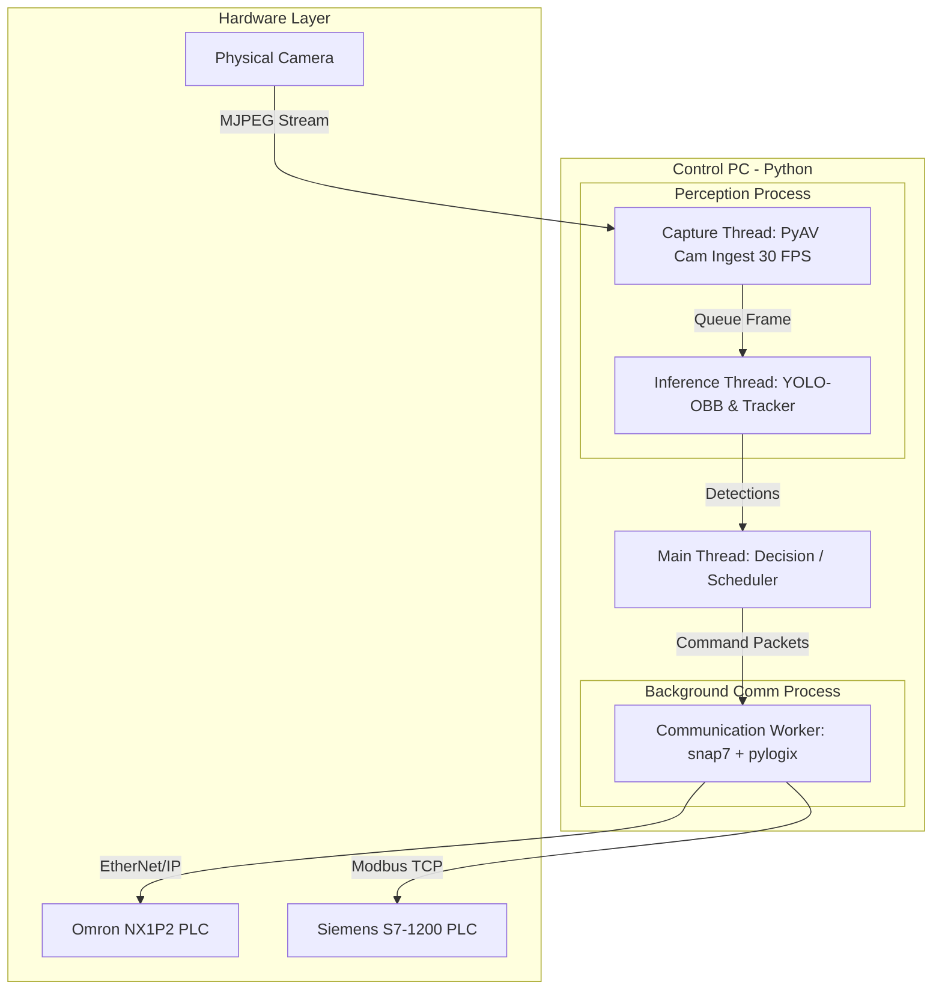
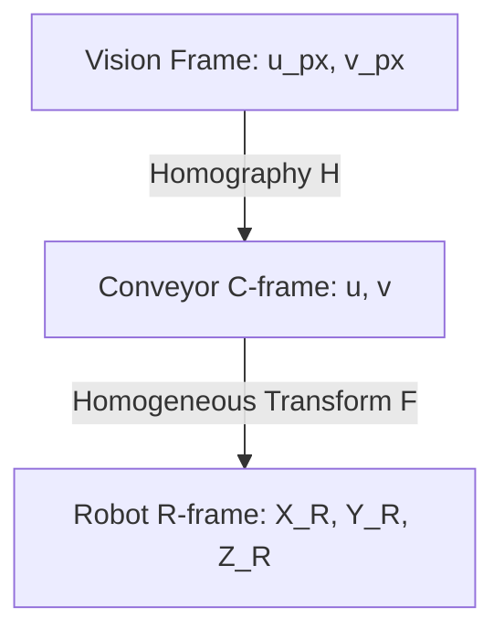
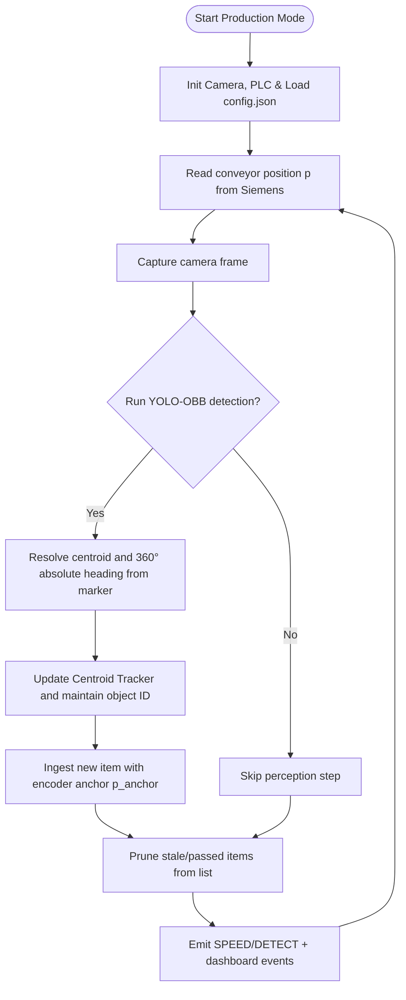
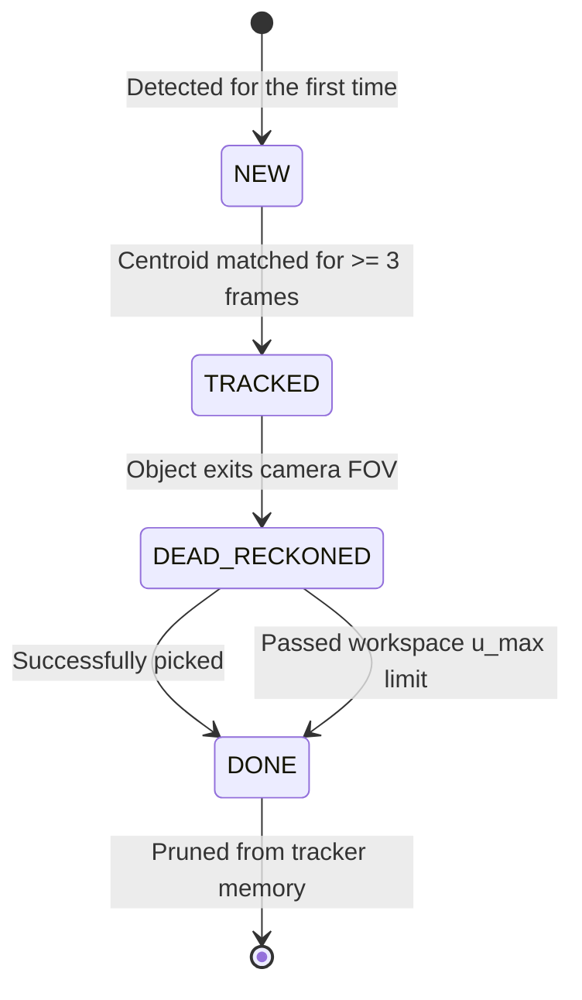

# Delta Robot Pick-and-Place: Theory Basis & Future Research
> **Target Audience**: Human Developers, Thesis Students, and Researchers.
> **Note**: This file is maintained by the human team. It focuses on clarity, software flowcharts, and high-level concepts rather than hard physical realities. Some calibration parameters or temporary coordinate offsets might differ in implementation.

---

## 1. Software Architecture & Multitasking Model

The Delta Robot real-time control system utilizes a multitasking model combining **Multiprocessing** and **Multithreading**. This isolates network communication latency, ensuring the decision loop and perception loop run at high frequencies without blocking.



### 1.1. Thread Isolation
The software separates execution into four distinct resource areas:
1.  **Background Communication Process** (`multiprocessing.Process`): Handles connections over socket, EtherNet/IP (`pylogix` to Omron), and Modbus TCP (`snap7` to Siemens). It exchanges packets with the main thread via IPC queues (`multiprocessing.Queue`), isolating network jitter.
2.  **Main Decision Thread**: Executes the core `Scheduler Loop`, calculating trajectory points, executing safety radius checks, and planning picks.
3.  **Perception Process Threads**:
    *   **Capture Thread**: Uses **PyAV** to decode camera frames at 30 FPS at 1080p.
    *   **Inference Thread**: Runs YOLO-OBB on the latest frame, tracks objects using the Centroid Tracker, and returns coordinates.
4.  **UI Web Server Thread**: Runs a lightweight in-process server (`modules/interface.py`) streaming telemetry and video to a web browser.

---

## 2. Coordinate Systems & Spatial Transformations

The sorting cell utilizes three coordinate frames to map camera pixel coordinates to physical robot arm targets.



### 2.1. Robot Frame (R-frame)
* **Origin**: Centered under the top base plate of the delta structure.
* **Orientation**: Standard Cartesian right-hand rule.
* **Kinematics constraint**: Due to the parallel linkage design, the end-effector operates in the negative Z region.
  * $Z = 0$ mm: Arms fully retracted.
  * $Z = -305$ mm: End-effector lowered to the conveyor belt.

### 2.2. Conveyor Frame (C-frame)
* **Origin**: An arbitrary fixed physical point $O_C$ on the conveyor frame body chosen at calibration time.
* **Axes**: 
  * $u$: Along the flow direction of the belt (downstream).
  * $v$: Transverse coordinate across the belt width.

### 2.3. Homogeneous Transform matrix F ($C \to R$)
Since the conveyor belt surface is planar and parallel to the robot $XY$ plane, a 2D homogeneous transformation relates C-frame coordinates $(u, v)$ to R-frame coordinates $(X_R, Y_R)$ at the constant pickup height $Z_{\text{pickup}}$:

$$
\begin{bmatrix} 
X_R \\ 
Y_R \\ 
1 
\end{bmatrix} 
= \mathbf{F} 
\begin{bmatrix} 
u \\ 
v \\ 
1 
\end{bmatrix} 
= 
\begin{bmatrix} 
-\sin\theta & \cos\theta & T_X \\ 
\cos\theta & \sin\theta & T_Y \\ 
0 & 0 & 1 
\end{bmatrix}
\begin{bmatrix} 
u \\ 
v \\ 
1 
\end{bmatrix}
$$

* $\theta$: The angle between the conveyor flow axis ($+u$) and the robot axes.
* $(T_X, T_Y)$ represents the translation vector of the conveyor origin.

---

## 3. Object Tracking & Interception Prediction

To pick a moving component from the conveyor belt, the controller must predict where the item will be when the arm descends.

### 3.1. Fixed-Point Pick-Position Prediction (with a live position gate)
The iterative solver (`_predict_pick_position`) is **kept**, but its output is used to choose
a stable **pick position**, not to fire the pick on a converged *time*. This is the core of
the real-time rewrite: it makes the pick immune to the ±60% belt-speed estimate noise that
previously caused the "arrive → wait → miss" lag at object density.

**Step 1 — solve for the park position.** Iterate to the earliest goto-feasible pick:
1. Guess a pick time: $t_{\text{pick}}^{(0)} = t_{\text{now}} + \text{lead time}$.
2. Project the object forward at belt velocity $v_{\text{belt}}$:
   $$u(t_{\text{pick}}^{(k)}) = u_{\text{now}} + v_{\text{belt}} \cdot (t_{\text{pick}}^{(k)} - t_{\text{now}})$$
3. Map to R-frame and compute the robot travel duration $\Delta t_{\text{goto}}$.
4. Update: $t_{\text{pick}}^{(k+1)} = t_{\text{now}} + \Delta t_{\text{goto}} + t_{\text{delay}}$.
5. Repeat until convergence; apply the **1.6 s minimum lead** (`intercept_lead_time_s`) so the
   arm parks downstream of the object, and clamp $u_{\text{pick}}$ to the workspace edge for
   danger-zone objects. The result is the **parked pick position** $u_{\text{pick}}$ — a fixed
   straight-down point. If the arm cannot arrive before the object passes $u_{\text{pick}}$,
   the object is skipped (genuinely unreachable).

**Step 2 — fire on a live positional gate (no time math).** After the arm has parked at
$u_{\text{pick}}$, the pick is **not** scheduled by the predicted time. The main thread waits
on the claimed object's live position (refreshed by the perception thread) and dispatches the
pick the moment:
$$u_{\text{now}} \ge u_{\text{pick}} - \text{offset}(v_{\text{belt}})$$
Closing the loop on the live object — rather than trusting a frozen, noisy speed sample — is
what removed the mistimed wait.

**The lead `offset`.** There is a latency $T_{\text{delay}}$ between the instant the gate
condition is evaluated true and the instant the suction cup actually contacts the object
(command dispatch + PLC pickup + soft-start descent; in code
$T_{\text{delay}} \approx \texttt{command\_delay\_s} = \texttt{robot\_movement\_delay\_s} +
\texttt{ethernet\_delay\_s} \approx 50\text{ ms}$). During $T_{\text{delay}}$ the object keeps
moving downstream, so the gate must fire **early** by exactly that displacement. Because the
object's $u$ is anchored to the belt encoder (§3.2), this displacement *is* the belt's
displacement over $T_{\text{delay}}$. In the steady-belt case it is simply
$$\text{offset}(v_{\text{belt}}) = v_{\text{belt}} \cdot T_{\text{delay}}$$
which the system engineers to be the normal regime via the speed-change timing strategy (§6.6).
The full belt-acceleration form (the robustness fallback, derived in **§6.4**) is *not*
implemented: the §6.6 timing strategy keeps the belt steady at gate-fire time and the live gate
corrects any residual, so the precision path stays single-term. `_belt_lead_offset_mm` now
returns $v_{\text{belt}} \cdot T_{\text{delay}}$ — about 2.5 mm at 50 mm/s, growing with speed —
correcting the small systematic *late* pick the old `0.0` stub left behind.

### 3.2. Why Encoder-Based Dead-Reckoning is Superior
Integrating velocity over time ($\Delta t$) to track position accumulates drift and fails when the conveyor speed varies or stops. 

**Solution**: Anchor the object to the absolute encoder counter ($p(t)$, in mm) from the Siemens PLC at the moment of detection ($p_{\text{anchor}}$):

$$\Delta p(t) = p(t) - p_{\text{anchor}}$$
$$u(t) = u_{\text{anchor}} + \Delta p(t)$$

This method is **drift-free** because position is determined directly by physical belt movement rather than time integration.

---

## 4. Yaw Orientation Resolution (360° Angle)

QFP/TQFP components have 180° rotational symmetry. YOLO-OBB only detects the tilt angle within $[-90^\circ, 90^\circ)$. To drive the suction rotation mechanism to an absolute 360° angle:

1. **Marker Detection**: YOLO recognizes the round locator dot marking pin/corner #1 on the component.
2. **Heading Vector**: Compute the vector from the component center $\mathbf{P}_{\text{board}}$ to the marker center $\mathbf{P}_{\text{marker}}$:
   $$\vec{\mathbf{v}} = (x_m - x_b, y_m - y_b)$$
3. **Heading Angle**:
   $$\theta_{\text{heading}} = \left(\text{atan2}(v_y, v_x) \cdot \frac{180}{\pi} + \theta_{\text{offset}}\right) \pmod{360}$$

---

## 5. Flowcharts & State Machines

### 5.1. CLI Interactive Mode Flowchart
CLI mode allows engineers to type commands directly to test motion configurations.


---

### 5.2. Production Scenario Execution Flowchart
The production scenario coordinates camera, conveyor encoder, and robot arm.



> **Note:** the boxes above run on the **perception/state thread** (`_realtime_perception_loop`,
> ~25 ms). It owns the single PLC status read and keeps shared `RealtimeState` (belt
> position/speed, `pos_EE`, the tracker, claimed ids) fresh. The **main decision/execution
> thread** below runs concurrently and reads that shared state — its wait loops issue no PLC
> I/O of their own. The two share an `ipc_lock` (one round-trip in flight) and a `state_lock`.


> The **positional pick gate** (`GateObject`) replaces the old "re-predict object arrival
> time" step: once the arm is parked, the pick fires purely on the live object reaching
> $u_{\text{pick}}$ — no time recomputation, immune to belt-speed estimate noise.

---

### 5.3. TrackedObject Lifecycle State Machine
Each object on the belt is managed through a state machine to optimize memory and CPU.



---

## 6. Adaptive Conveyor Speed Design

**Goal: preserve the delta arm's throughput in an *unstable feeder* environment.** Upstream
supply is bursty and irregular; the serial arm is the valuable, rate-limited resource. The belt
is therefore treated as a **rate regulator** — its job is to keep the arm fed at a steady
*presentation rate*, **not** to maximise its own speed. Belt speed is set **inversely** to
product density so the rate of pickable objects arriving at the workspace stays near a nominal
target (§6.1, §6.5). The speed-change *timing* is chosen so the belt's acceleration ramp never
enters a precision-critical computation (§6.6).

> **Rejected (the old "run fast when busy" model).** Earlier drafts made belt speed rise with
> density (`v = A·N + v_min`) and patched a "backlog brake" on top. This is backwards in
> nature: belt speed does **not** set robot throughput — the serial arm's pick cycle does
> (`μ_max`, §6.2). Speeding the belt up under high density only shortens each object's transit
> time and pushes objects past `u_max` unpicked, *increasing* misses. The corrected model below
> regulates a *rate*, with a single law and no contradictory terms.

### 6.0. Belt kinematics & bounds

| Symbol | Meaning | Value |
|---|---|---|
| $v_{\min}$ | operational floor — hardware control is imprecise below 20 mm/s, so a margin is kept (`belt_speed_min_mm_s`) | 30 mm/s |
| $v_{\text{cap}}$ | pickability ceiling — *derived* $= L/t_{\text{transit}}$, the arm must still intercept (§6.2) | ≈ 87.5 mm/s |
| $v_{\text{hw,max}}$ | hardware effective maximum, hard clamp on $v_{\text{cap}}$ (`belt_speed_hw_max_mm_s`) | 200 mm/s |
| $a_{\text{nom}}$ | nominal belt acceleration magnitude (`belt_accel_mm_s2`) | 22.31 mm/s² |
| $T_{\text{ramp}}$ | acceleration **build** interval (jerk phase: accel ramps $0 \to a_{\text{nom}}$ and back; `belt_ramp_s`) | ≈ 0.25 s |
| $T_{\text{delay}}$ | dispatch→grip latency at the pick gate (§3.1) = `robot_movement_delay_s` + `ethernet_delay_s` | ≈ 50 ms |
| $\mu_{\max}$ | robot maximum pick rate $= 1/t_{\text{pick}}$ (`pick_cycle_s`, a **calibrated** value) | ≈ 0.50 obj/s |
| $\lambda_{\text{nom}}$ | nominal presentation-rate target $= k\,\mu_{\max}$ (`belt_speed_headroom` $k$) | ≈ 0.38 obj/s |

The adaptive controller operates inside $[v_{\min}, v_{\text{cap}}]$ — well below the 200 mm/s
hardware limit, because pickability (§6.2), not the motor, is the binding constraint. The
*setpoint policy* (which speed inside that band, §6.1/§6.5) is driven by holding the arm's
presentation rate at $\lambda_{\text{nom}}$, deliberately below the arm's ceiling $\mu_{\max}$.

> **Implementation note.** As of the adaptive-speed implementation these symbols are config keys
> under `scheduler` (opt-in via `adaptive_speed_enabled`). $t_{\text{pick}}$ is **calibrated** —
> the real arm runs faster than the original 2.5 s assumption — so `pick_cycle_s` defaults to
> 2.0 s; set it from the measured `throughput_pick_per_min` in `data.log`. The controller is
> `_adaptive_belt_speed()` and the gate offset is `_belt_lead_offset_mm()` in `modules/scheduler.py`.

### 6.1. Rate-Regulation Control Model (inverse density law)
The arm is fed at a **presentation rate** $\lambda = \rho \cdot v$ (linear density × belt speed:
objects/mm × mm/s = objects/s). To hold $\lambda$ at the nominal target $\lambda_{\text{nom}}$,
solve for $v$ and clamp to the physical band:
$$v = \text{clamp}\!\left(\frac{\lambda_{\text{nom}}}{\rho},\; v_{\min},\; v_{\text{cap}}\right)$$
* $\rho$: **linear density** of **unclaimed, not-yet-passed** products — count per unit belt
  length over the density region, $\rho = N / L_{\text{meas}}$.
* $N$: that same object count (objects with $0 \le u \le u_{\max}$); $L_{\text{meas}}$: the region
  length. The law is thus equivalently $v = \lambda_{\text{nom}} \cdot L_{\text{meas}} / N$ —
  **hyperbolic** (inverse) in $N$, *not* linear.
* $L_{\text{meas}}$ spans the C-frame origin $O_C$ to $u_{\max}$, i.e. $L_{\text{meas}} = u_{\max}$
  (= `workspace_window_uv[1]` = 363 mm). This works because $O_C$ coincides with the ROI origin,
  so no separate camera window is needed (`belt_density_length_mm = 0` ⇒ derive $= u_{\max}$).
* $v_{\min}, v_{\text{cap}}$: the §6.0 floor and *derived* pickability ceiling (30 / ≈87.5 mm/s).

**Direction is the whole point: more density ⇒ *slower* belt.** A sparse feeder is sped up so
the few available objects reach the arm before it starves; a dense feeder is slowed so the
serial arm gets transit time and objects are not shoved past $u_{\max}$. (Contrast the rejected
`v = A·N + v_{\min}` of the §6 note, which had the sign backwards because it regulated belt
speed as if it were robot throughput.)

### 6.2. Parameter Calculations
**Pickability ceiling (derived).** With the workspace window length $L = u_{\max} - u_{\min} =
363 - 188 = 175$ mm, the arm needs the object in-window long enough to intercept it:
* Transit time: $t_{\text{transit}} \geq 2.0$ s (`pick_transit_min_s`).
* $v_{\text{cap}} = \min(L / t_{\text{transit}},\, v_{\text{hw,max}}) = \min(175/2.0,\, 200)
  \approx 87.5$ mm/s.

**Rate target.** The arm's ceiling is $\mu_{\max} = 1/t_{\text{pick}} = 1/2.0 = 0.50$ obj/s
(calibrated; the arm beats the old 2.5 s assumption). We hold the presentation rate at
$\lambda_{\text{nom}} = k\,\mu_{\max} = 0.75 \times 0.50 = 0.375$ obj/s, leaving 25 % headroom
(§6.5). With $L_{\text{meas}} = u_{\max} = 363$ mm, the inverse law
$v = \lambda_{\text{nom}} \cdot L_{\text{meas}} / N = 136.1 / N$ gives:
* $N = 1$ ⇒ $v = 136$ mm/s, **clamped to $v_{\text{cap}} = 87.5$** (sparse / feeder-limited).
* $N = 2$ ⇒ $v = 68$ mm/s (regulated band).
* $N = 3$ ⇒ $v = 45$ mm/s (regulated band).
* $N \geq 5$ ⇒ $v \leq 27$ mm/s, **clamped to $v_{\min} = 30$** (overload; floor reached).

So a single constant — $\lambda_{\text{nom}}$ — plus the band $[v_{\min}, v_{\text{cap}}]$
replaces the old per-product slope $A$.

### 6.3. Belt acceleration & ramp model
$a_{\text{nom}}$ and $T_{\text{ramp}}$ describe **different** things and must not be conflated.
The physical speed transition is an S-curve: the acceleration itself ramps $0 \to a_{\text{nom}}$
over $T_{\text{ramp}} \approx 0.25$ s (the *jerk phase*), holds at $a_{\text{nom}}$, then ramps
back to $0$. The **constant-acceleration approximation** treats the whole transition as a single
constant $a = \pm a_{\text{nom}}$ (sign $+$ for speed-up, $-$ for slow-down). Under it, the time to
move from a current speed $v_c$ to a setpoint $v_{sp}$ is **not** a fixed 0.25 s but
$$T_{\text{accel}} = \frac{|v_{sp} - v_c|}{a_{\text{nom}}}.$$
$T_{\text{ramp}} \approx 0.25$ s is then just the jerk-phase error band at the two edges of this
ramp — the term we deliberately neglect (§6.6).

### 6.4. Lead-offset coupling
This generalises the pick-gate `offset` of §3.1. Because the object's $u$ is anchored to the belt
encoder, the lead offset equals the belt's displacement over the latency window $T_{\text{delay}}$:

* **Steady belt** ($a = 0$, the engineered normal regime):
$$\text{offset} = v_{\text{belt}} \cdot T_{\text{delay}}$$
* **Mid-ramp, ramp does *not* finish within $T_{\text{delay}}$** ($T_{\text{accel}} \ge T_{\text{delay}}$):
$$\text{offset} = v_c \cdot T_{\text{delay}} + \tfrac{1}{2}\,a\,T_{\text{delay}}^{2}$$
* **Mid-ramp, ramp finishes within $T_{\text{delay}}$** ($T_{\text{accel}} < T_{\text{delay}}$) — split into two phases:
$$\text{offset}_1 = v_c \cdot T_{\text{accel}} + \tfrac{1}{2}\,a\,T_{\text{accel}}^{2} = \tfrac{v_c + v_{sp}}{2}\,T_{\text{accel}}$$
$$\text{offset}_2 = v_{sp} \cdot (T_{\text{delay}} - T_{\text{accel}})$$
$$\text{offset} = \text{offset}_1 + \text{offset}_2$$

These forms are continuous: at $T_{\text{accel}} = T_{\text{delay}}$ the two-phase result equals
the single-phase one (with $\text{offset}_2 = 0$), and at $a = 0$ all forms reduce to
$v_{\text{belt}} \cdot T_{\text{delay}}$. The timing strategy of §6.6 guarantees the belt is
steady at gate-fire time, so the gate uses the simple $v_{\text{belt}} \cdot T_{\text{delay}}$;
the acceleration forms are the **robustness fallback** for the rare case where a gate fires while
a ramp is still settling.

### 6.5. Control law: rate regulation with three regimes
There is **one** law — the inverse rate regulator of §6.1,
$v_{\text{target}} = \text{clamp}(\lambda_{\text{nom}}/\rho,\, v_{\min},\, v_{\text{cap}})$ — and
its clamps produce three operating regimes. The arm is **physically serial — no pipelining**, so
the band edges, not a separate brake, do the protective work.

1. **Feeder-limited (sparse).** $\rho$ small ⇒ the law wants $v > v_{\text{cap}}$, so it clamps
   to $v_{\text{cap}}$. Arrival $\rho \cdot v_{\text{cap}} < \lambda_{\text{nom}}$: the arm is
   under-fed and the belt is already doing its best. Throughput is feeder-limited; nothing the
   belt can do raises it.
2. **Regulated (normal).** $v_{\text{target}} = \lambda_{\text{nom}}/\rho \in (v_{\min}, v_{\text{cap}})$.
   Arrival is held at $\lambda_{\text{nom}}$, i.e. **70–80 % arm utilisation**. The sub-unity
   target is deliberate **headroom**: it absorbs feeder bursts and timing jitter. This is *why*
   the nominal operating point is below 100 % — running flat-out would leave no slack and any
   burst would overflow.
3. **Overload (sustained dense).** $\rho$ so high the law pins $v$ at $v_{\min}$. The window
   stays full, the arm never idles, and **utilisation rises to ~100 % automatically** — the
   §6.2 headroom is intrinsically *spent* draining the burst. This is an **emergent** outcome of
   the $v_{\min}$ clamp + sub-unity $\lambda_{\text{nom}}$, **not** a separate control action: at
   $v_{\min}$ there is no slower setpoint to fall to, so the arm simply works at capacity. The
   backlog count $B$ — in-window unpicked objects predicted to pass $u_{\max}$ before the serial
   arm clears them (proxy: in-window unpicked count $-\,1$) — is the **detector** that overload
   has been entered, used only for telemetry/alerting. If the feeder rate exceeds $\mu_{\max}$
   even here, loss is unavoidable: the cell is genuinely over-saturated and no speed policy can
   recover it.

This resolves the dense-feeder counter-argument directly: utilisation climbs from the nominal
70–80 % to 100 % on its own, with no second control term fighting the first.

**Anti-thrash** (each avoided speed change is one fewer acceleration ramp):
* **Deadband** — only issue `change_speed` if $|v_{\text{target}} - v_{\text{setpoint}}| > \Delta_{\min}$ (≈ 5–10 mm/s).
* **Rate limit** — at most one speed change per pick cycle, only at the §6.6 dispatch instant.

### 6.6. Jerk evaluation & timing avoidance
**Cost of modeling jerk explicitly:** the $\tfrac{1}{2}a t^2$ term would be replaced by the
integral of a jerk-limited S-curve velocity profile (the same family as the PLC's
`MC_inter_curve_vel` trajectory): a piecewise *cubic* with 3–7 segments of bookkeeping, and it
needs a belt jerk limit the hardware spec does not give directly (only $a_{\text{nom}}$ and
$T_{\text{ramp}}$ are known).

**Benefit:** at $T_{\text{delay}} \approx 50$ ms the jerk term shifts the displacement by
**sub-millimetre**, and it applies *only* during a ramp — which the strategy below pushes entirely
into the goto/park phase, where the **live positional gate corrects it anyway**. High cost,
negligible benefit ⇒ **explicit jerk modeling is rejected.**

**Timing avoidance (chosen, revised):** density $N$ is sensed **continuously** by the perception
thread (every ~25 ms tick, under `state_lock`, pure arithmetic — see §5.2), refreshing
$v_{\text{target}}$ live instead of once per multi-second pick cycle. The speed change itself is
committed **at the grip instant** — immediately after the pick packet is dispatched (the arm is
already descending/gripping; the *next* object's positional gate has not yet been evaluated) — and
again when the loop is idle (no candidate) so a cleared belt ramps back toward $v_{\text{cap}}$ to
fetch the next objects fast. Consequences:
* a density change ("an object was just lifted") is reflected immediately at the pick that caused it, not deferred to the start of the next ~multi-second cycle — this was the responsiveness fix (the controller previously looked mistimed/laggy);
* the 0.25 s accel-build plus the $T_{\text{accel}} = \Delta v / a_{\text{nom}}$ ramp complete during the *current* pick's descend/grip/lift/return and the *next* object's goto/park, so by the time the **next** positional gate matters the belt is already steady at $v_{\text{target}}$;
* the gate-time offset still reduces to $v_{\text{target}} \cdot T_{\text{delay}}$ ($a = 0$) — no accel/jerk term in the precision-critical computation;
* any in-flight position drift during the ramp is absorbed by the live gate (the core property of the §3 redesign);
* the deadband still caps commits to one per pick (plus the idle case), never during descent/grip of the pick that triggers it — the commit happens *after* that pick's descent is already dispatched.

**Predictor coupling (removed):** an earlier revision projected the in-flight object at the
post-ramp $v_{\text{target}}$ inside the same plan-build call that committed the speed change. Now
that the commit is decoupled from plan-build (it happens at the *previous* pick's grip instant),
the live encoder sample (`state.belt_speed_mm_s`) already reflects the settled post-ramp speed by
the time the next plan is built — no explicit coupling term is needed.

### 6.7. Operational logic flow
Two threads (§5.2): the **perception thread** ticks every ~25 ms, refreshing the live belt
sample, the tracker, and — when adaptive speed is enabled — re-deriving $v_{\text{target}}$ from
the current density $N$ (pure arithmetic under `state_lock`). The **main decision/execution
thread** builds and runs one pick plan at a time and commits the speed change:

```mermaid
flowchart TD
    subgraph Perception["Perception thread (~25 ms tick)"]
        PTick([Tick]) --> PSample[Sample belt + poll vision; update tracker under state_lock]
        PSample --> PDensity[N = unclaimed objects with 0<=u<=u_max]
        PDensity --> PTarget[state.belt_speed_target_mm_s = adaptive_belt_speed(N)]
        PTarget --> PTick
    end

    subgraph Main["Main decision/execution thread"]
        Loop([Main loop]) --> Build[Build pick plan from live sample; select unclaimed catchable object]
        Build --> Select{Plan found?}
        Select -- No --> Idle[Commit adaptive speed if due belt relaxes toward v_cap]
        Idle --> Loop
        Select -- Yes --> DispatchGoto[Dispatch Goto]
        DispatchGoto --> WaitPark[Wait for arm to park]
        WaitPark --> Gate{Live object u reached u_pick minus offset?  offset is v times T_delay}
        Gate -- Reached --> DispatchPick[Dispatch rotate + Pick: grip at u_pick]
        DispatchPick --> Commit[Commit adaptive speed if beyond deadband fire-and-forget]
        Commit --> WaitLift[Wait for arm to lift and return to park]
        WaitLift --> Done[Unclaim + remove object from tracker; advance arm to bin]
        Done --> Loop
    end

    PTarget -.->|state.belt_speed_target_mm_s, under state_lock| Commit
```

> The speed commit fires **right after the pick dispatch** (the grip instant), not at the goto —
> so a density drop from "this object was just lifted" is applied immediately rather than waiting
> for the next ~multi-second cycle. Its 0.25 s ramp settles during the *current* pick's
> descend/grip/lift/return and the *next* object's goto/park, so by the time the **next** gate is
> evaluated the belt is steady — the commit is never on the gate's own critical path (the gate for
> the pick that triggers the commit has already fired). The picked object is removed from the
> tracker in `Done`, never left to be re-selected as a candidate (§6.8).

### 6.8. Pick-attempt exclusivity (no re-pick)
There is **no intentional slip-detection/retry logic** anywhere in the scheduler — `execute()`
returns success once the arm's *motion* completes; suction is never verified. An earlier
implementation gap meant a completed pick's object stayed in the tracker (only excluded from
candidate selection by `claimed_object_ids`, which is cleared right after `execute()` returns),
so it could be re-selected on the very next plan build — a "pick plan for a board that no longer
exists." Fixed by removing the object from the tracker as part of the same post-`execute()`
bookkeeping (`Done` in §6.7), for both success and failure, plus a defensive
`planned_object_ids` skip in the candidate loop. **Consequence (intended):** each detected object
is pick-attempted **exactly once** — a genuine suction miss is no longer retried; the object
simply rides past $u_{\max}$ uncaught instead of triggering a noisy phantom re-pick.

---

## 7. Future Ideas & Research Proposals

### 7.1. Web GUI Dashboard
FastAPI backend with a Vue.js/React frontend visualizing:
* Live 3D Delta arm end-effector trajectory.
* Telemetry graphs plotting positional error from `data.log`.
* Active conveyor queues and database records of sorted items.

### 7.2. SQL Sorting Database Schema
```sql
CREATE TABLE product_types (
    type_id VARCHAR(50) PRIMARY KEY,
    description VARCHAR(255),
    sorting_destination_x REAL NOT NULL,
    sorting_destination_y REAL NOT NULL,
    sorting_destination_z REAL NOT NULL
);

CREATE TABLE pick_history (
    pick_id VARCHAR(50) PRIMARY KEY,
    object_id VARCHAR(50) NOT NULL,
    product_type VARCHAR(50) REFERENCES product_types(type_id),
    detected_timestamp REAL NOT NULL,
    picked_timestamp REAL,
    actual_speed_x REAL,
    actual_speed_y REAL,
    status VARCHAR(20) DEFAULT 'planned' -- 'completed', 'failed', 'stale'
);
```

### 7.3. Closed-Loop Conveyor Control
Implement closed-loop speed scaling using Little's Law to dynamically adjust speed setpoints written to the S7-1200 based on incoming queue pressure, avoiding overflow at the downstream limits.

> The **rate-regulation law of §6.5** (presentation rate held at $\lambda_{\text{nom}}$ via the
> inverse density law; overload drains emergently at the $v_{\min}$ clamp) is the near-term
> realization of this idea; a full Little's-Law queueing model is the longer-term evolution.
