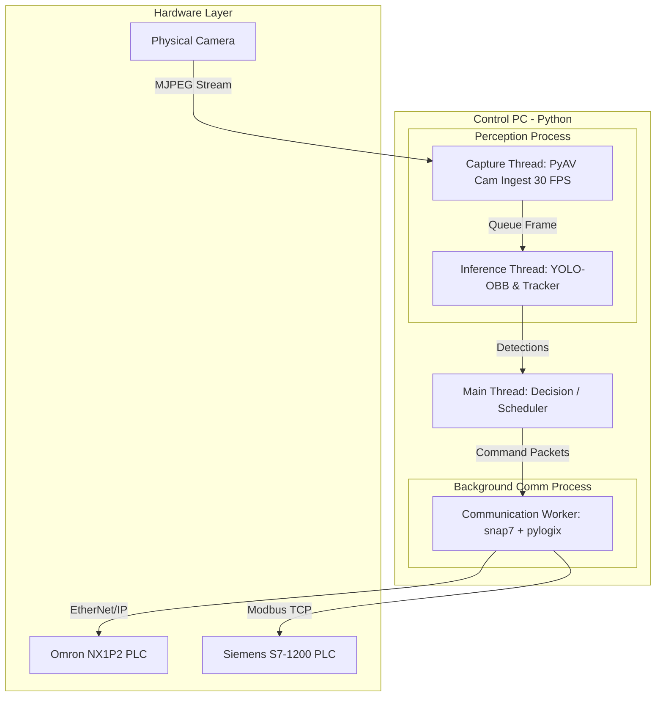
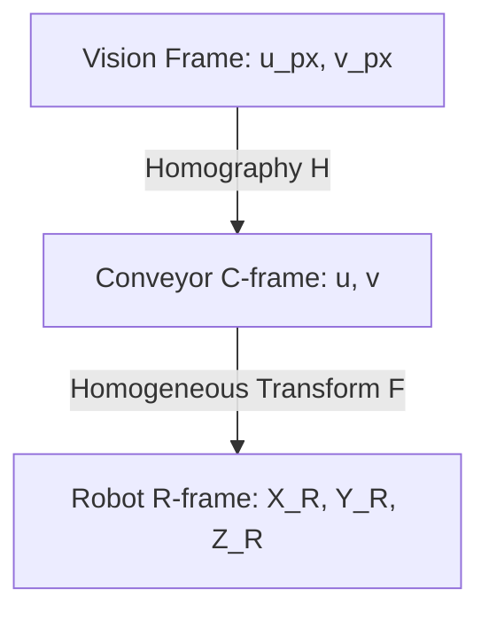
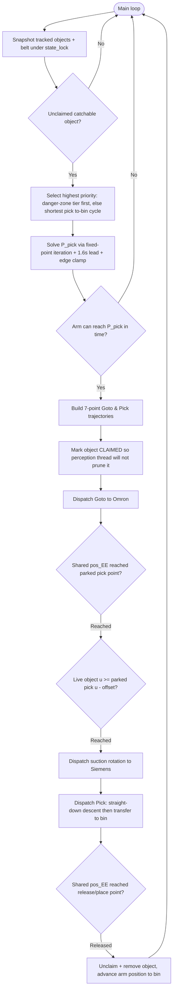
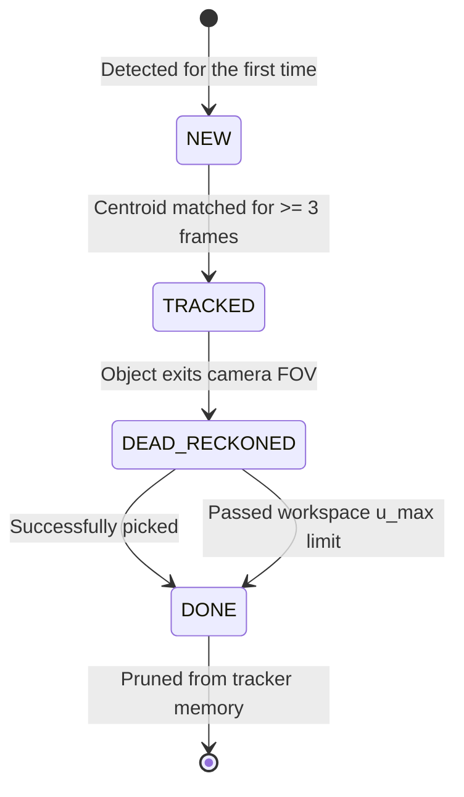

# Delta Robot Pick-and-Place: Theory Basis & Future Research
> **Target Audience**: Human Developers, Thesis Students, and Researchers.
> **Note**: This file is maintained by the human team. It focuses on clarity, software flowcharts, and high-level concepts rather than hard physical realities. Some calibration parameters or temporary coordinate offsets might differ in implementation.

---

## 1. Software Architecture & Multitasking Model

The Delta Robot real-time control system utilizes a multitasking model combining **Multiprocessing** and **Multithreading**. This isolates network communication latency, ensuring the decision loop and perception loop run at high frequencies without blocking.



### 1.1. Thread Isolation
The software separates execution into four distinct resource areas:
1.  **Background Communication Process** (`multiprocessing.Process`): Handles connections over socket, EtherNet/IP (`pylogix` to Omron), and Modbus TCP (`snap7` to Siemens). It exchanges packets with the main thread via IPC queues (`multiprocessing.Queue`), isolating network jitter.
2.  **Main Decision Thread**: Executes the core `Scheduler Loop`, calculating trajectory points, executing safety radius checks, and planning picks.
3.  **Perception Process Threads**:
    *   **Capture Thread**: Uses **PyAV** to decode camera frames at 30 FPS at 1080p.
    *   **Inference Thread**: Runs YOLO-OBB on the latest frame, tracks objects using the Centroid Tracker, and returns coordinates.
4.  **UI Web Server Thread**: Runs a lightweight in-process server (`modules/interface.py`) streaming telemetry and video to a web browser.

---

## 2. Coordinate Systems & Spatial Transformations

The sorting cell utilizes three coordinate frames to map camera pixel coordinates to physical robot arm targets.



### 2.1. Robot Frame (R-frame)
* **Origin**: Centered under the top base plate of the delta structure.
* **Orientation**: Standard Cartesian right-hand rule.
* **Kinematics constraint**: Due to the parallel linkage design, the end-effector operates in the negative Z region.
  * $Z = 0$ mm: Arms fully retracted.
  * $Z = -305$ mm: End-effector lowered to the conveyor belt.

### 2.2. Conveyor Frame (C-frame)
* **Origin**: An arbitrary fixed physical point $O_C$ on the conveyor frame body chosen at calibration time.
* **Axes**: 
  * $u$: Along the flow direction of the belt (downstream).
  * $v$: Transverse coordinate across the belt width.

### 2.3. Homogeneous Transform matrix F ($C \to R$)
Since the conveyor belt surface is planar and parallel to the robot $XY$ plane, a 2D homogeneous transformation relates C-frame coordinates $(u, v)$ to R-frame coordinates $(X_R, Y_R)$ at the constant pickup height $Z_{\text{pickup}}$:

$$
\begin{bmatrix} 
X_R \\ 
Y_R \\ 
1 
\end{bmatrix} 
= \mathbf{F} 
\begin{bmatrix} 
u \\ 
v \\ 
1 
\end{bmatrix} 
= 
\begin{bmatrix} 
-\sin\theta & \cos\theta & T_X \\ 
\cos\theta & \sin\theta & T_Y \\ 
0 & 0 & 1 
\end{bmatrix}
\begin{bmatrix} 
u \\ 
v \\ 
1 
\end{bmatrix}
$$

* $\theta$: The angle between the conveyor flow axis ($+u$) and the robot axes.
* $(T_X, T_Y)$ represents the translation vector of the conveyor origin.

---

## 3. Object Tracking & Interception Prediction

To pick a moving component from the conveyor belt, the controller must predict where the item will be when the arm descends.

### 3.1. Fixed-Point Pick-Position Prediction (with a live position gate)
The iterative solver (`_predict_pick_position`) is **kept**, but its output is used to choose
a stable **pick position**, not to fire the pick on a converged *time*. This is the core of
the real-time rewrite: it makes the pick immune to the ±60% belt-speed estimate noise that
previously caused the "arrive → wait → miss" lag at object density.

**Step 1 — solve for the park position.** Iterate to the earliest goto-feasible pick:
1. Guess a pick time: $t_{\text{pick}}^{(0)} = t_{\text{now}} + \text{lead time}$.
2. Project the object forward at belt velocity $v_{\text{belt}}$:
   $$u(t_{\text{pick}}^{(k)}) = u_{\text{now}} + v_{\text{belt}} \cdot (t_{\text{pick}}^{(k)} - t_{\text{now}})$$
3. Map to R-frame and compute the robot travel duration $\Delta t_{\text{goto}}$.
4. Update: $t_{\text{pick}}^{(k+1)} = t_{\text{now}} + \Delta t_{\text{goto}} + t_{\text{delay}}$.
5. Repeat until convergence; apply the **1.6 s minimum lead** (`intercept_lead_time_s`) so the
   arm parks downstream of the object, and clamp $u_{\text{pick}}$ to the workspace edge for
   danger-zone objects. The result is the **parked pick position** $u_{\text{pick}}$ — a fixed
   straight-down point. If the arm cannot arrive before the object passes $u_{\text{pick}}$,
   the object is skipped (genuinely unreachable).

**Step 2 — fire on a live positional gate (no time math).** After the arm has parked at
$u_{\text{pick}}$, the pick is **not** scheduled by the predicted time. The main thread waits
on the claimed object's live position (refreshed by the perception thread) and dispatches the
pick the moment:
$$u_{\text{now}} \ge u_{\text{pick}} - \text{offset}(v_{\text{belt}})$$
The latency `offset` is currently `0` (`_belt_lead_offset_mm` returns `0.0`; negligible at
50–100 mm/s) and is a future-roadmap knob. Closing the loop on the live object — rather than
trusting a frozen, noisy speed sample — is what removed the mistimed wait.

### 3.2. Why Encoder-Based Dead-Reckoning is Superior
Integrating velocity over time ($\Delta t$) to track position accumulates drift and fails when the conveyor speed varies or stops. 

**Solution**: Anchor the object to the absolute encoder counter ($p(t)$, in mm) from the Siemens PLC at the moment of detection ($p_{\text{anchor}}$):

$$\Delta p(t) = p(t) - p_{\text{anchor}}$$
$$u(t) = u_{\text{anchor}} + \Delta p(t)$$

This method is **drift-free** because position is determined directly by physical belt movement rather than time integration.

---

## 4. Yaw Orientation Resolution (360° Angle)

QFP/TQFP components have 180° rotational symmetry. YOLO-OBB only detects the tilt angle within $[-90^\circ, 90^\circ)$. To drive the suction rotation mechanism to an absolute 360° angle:

1. **Marker Detection**: YOLO recognizes the round locator dot marking pin/corner #1 on the component.
2. **Heading Vector**: Compute the vector from the component center $\mathbf{P}_{\text{board}}$ to the marker center $\mathbf{P}_{\text{marker}}$:
   $$\vec{\mathbf{v}} = (x_m - x_b, y_m - y_b)$$
3. **Heading Angle**:
   $$\theta_{\text{heading}} = \left(\text{atan2}(v_y, v_x) \cdot \frac{180}{\pi} + \theta_{\text{offset}}\right) \pmod{360}$$

---

## 5. Flowcharts & State Machines

### 5.1. CLI Interactive Mode Flowchart
CLI mode allows engineers to type commands directly to test motion configurations.


---

### 5.2. Production Scenario Execution Flowchart
The production scenario coordinates camera, conveyor encoder, and robot arm.


> **Note:** the boxes above run on the **perception/state thread** (`_realtime_perception_loop`,
> ~25 ms). It owns the single PLC status read and keeps shared `RealtimeState` (belt
> position/speed, `pos_EE`, the tracker, claimed ids) fresh. The **main decision/execution
> thread** below runs concurrently and reads that shared state — its wait loops issue no PLC
> I/O of their own. The two share an `ipc_lock` (one round-trip in flight) and a `state_lock`.



> The **positional pick gate** (`GateObject`) replaces the old "re-predict object arrival
> time" step: once the arm is parked, the pick fires purely on the live object reaching
> $u_{\text{pick}}$ — no time recomputation, immune to belt-speed estimate noise.

---

### 5.3. TrackedObject Lifecycle State Machine
Each object on the belt is managed through a state machine to optimize memory and CPU.



---

## 6. Adaptive Conveyor Speed Design

Adjusts conveyor belt speed dynamically based on upstream queue density.

### 6.1. Linear Control Model
$$v_{\text{belt}} = A \cdot N + v_{\text{min}}$$
* $N$: Number of products waiting in the camera FOV.
* $v_{\text{min}}$: Minimum speed to avoid stalling (e.g., 20 mm/s).
* $A$: Adaptation constant (mm/s per object).

### 6.2. Parameter Calculations
Assuming a robot pick cycle of $t_{\text{pick}} = 2.5$ s and a workspace window length of $L = 130$ mm. To ensure the robot has time to pick an object:
* Transit time: $t_{\text{transit}} \geq 2.0$ s.
* Max speed limit: $v_{\text{belt}} \leq 65$ mm/s.
By establishing boundaries (e.g. 40 mm/s for 1 item, 80 mm/s for 5 items), we solve:
$$A = 10\text{ mm/s/product}, \quad v_{\text{min}} = 30\text{ mm/s}$$

---

## 7. Future Ideas & Research Proposals

### 7.1. Web GUI Dashboard
FastAPI backend with a Vue.js/React frontend visualizing:
* Live 3D Delta arm end-effector trajectory.
* Telemetry graphs plotting positional error from `data.log`.
* Active conveyor queues and database records of sorted items.

### 7.2. SQL Sorting Database Schema
```sql
CREATE TABLE product_types (
    type_id VARCHAR(50) PRIMARY KEY,
    description VARCHAR(255),
    sorting_destination_x REAL NOT NULL,
    sorting_destination_y REAL NOT NULL,
    sorting_destination_z REAL NOT NULL
);

CREATE TABLE pick_history (
    pick_id VARCHAR(50) PRIMARY KEY,
    object_id VARCHAR(50) NOT NULL,
    product_type VARCHAR(50) REFERENCES product_types(type_id),
    detected_timestamp REAL NOT NULL,
    picked_timestamp REAL,
    actual_speed_x REAL,
    actual_speed_y REAL,
    status VARCHAR(20) DEFAULT 'planned' -- 'completed', 'failed', 'stale'
);
```

### 7.3. Closed-Loop Conveyor Control
Implement closed-loop speed scaling using Little's Law to dynamically adjust speed setpoints written to the S7-1200 based on incoming queue pressure, avoiding overflow at the downstream limits.
