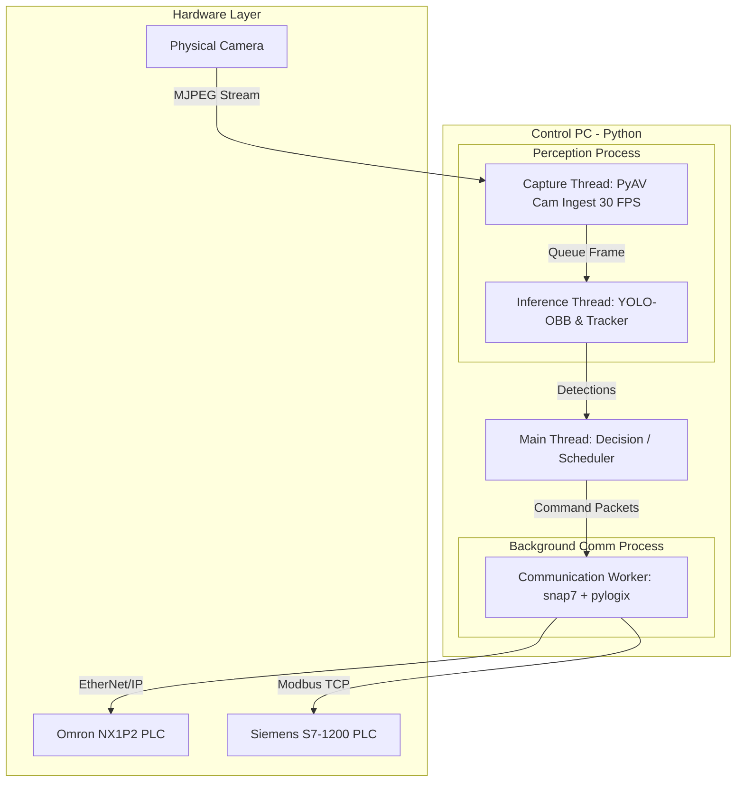
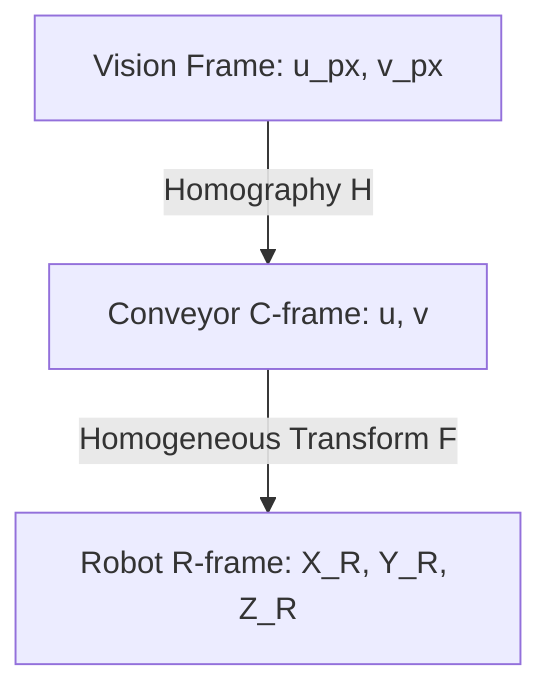
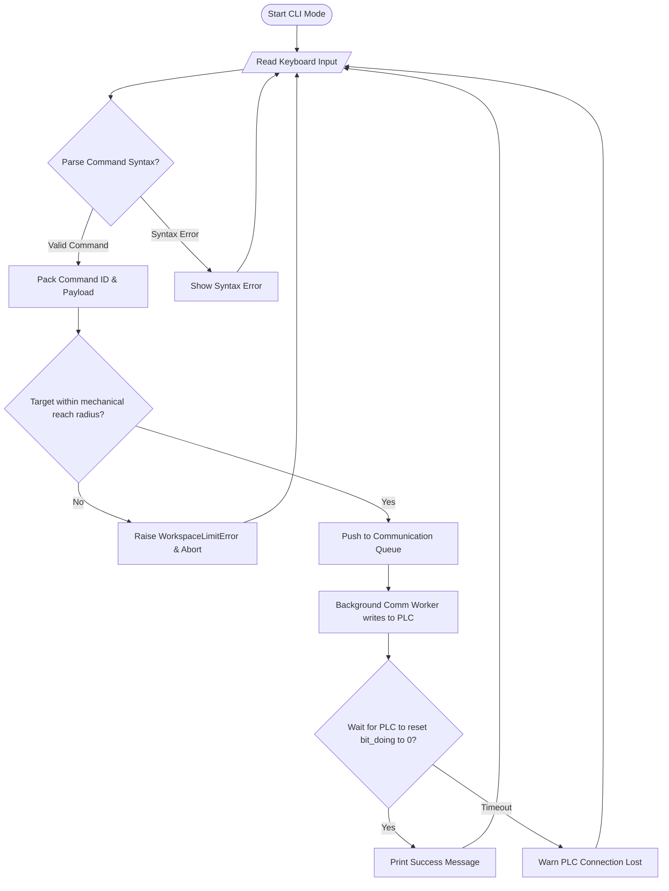
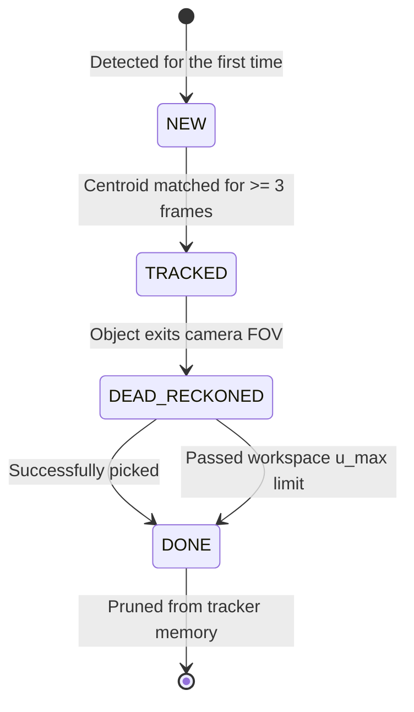

# Delta Robot Pick-and-Place: Theory Basis & Future Research
> **Target Audience**: Human Developers, Thesis Students, and Researchers.
> **Note**: This file is maintained by the human team. It focuses on clarity, software flowcharts, and high-level concepts rather than hard physical realities. Some calibration parameters or temporary coordinate offsets might differ in implementation.

---

## 1. Software Architecture & Multitasking Model

The Delta Robot real-time control system utilizes a multitasking model combining **Multiprocessing** and **Multithreading**. This isolates network communication latency, ensuring the decision loop and perception loop run at high frequencies without blocking.



### 1.1. Thread Isolation
The software separates execution into four distinct resource areas:
1.  **Background Communication Process** (`multiprocessing.Process`): Handles connections over socket, EtherNet/IP (`pylogix` to Omron), and Modbus TCP (`snap7` to Siemens). It exchanges packets with the main thread via IPC queues (`multiprocessing.Queue`), isolating network jitter.
2.  **Main Decision Thread**: Executes the core `Scheduler Loop`, calculating trajectory points, executing safety radius checks, and planning picks.
3.  **Perception Process Threads**:
    *   **Capture Thread**: Uses **PyAV** to decode camera frames at 30 FPS at 1080p.
    *   **Inference Thread**: Runs YOLO-OBB on the latest frame, tracks objects using the Centroid Tracker, and returns coordinates.
4.  **UI Web Server Thread**: Runs a lightweight in-process server (`modules/interface.py`) streaming telemetry and video to a web browser.

---

## 2. Coordinate Systems & Spatial Transformations

The sorting cell utilizes three coordinate frames to map camera pixel coordinates to physical robot arm targets.



### 2.1. Robot Frame (R-frame)
* **Origin**: Centered under the top base plate of the delta structure.
* **Orientation**: Standard Cartesian right-hand rule.
* **Kinematics constraint**: Due to the parallel linkage design, the end-effector operates in the negative Z region.
  * $Z = 0$ mm: Arms fully retracted.
  * $Z = -305$ mm: End-effector lowered to the conveyor belt.

### 2.2. Conveyor Frame (C-frame)
* **Origin**: An arbitrary fixed physical point $O_C$ on the conveyor frame body chosen at calibration time.
* **Axes**: 
  * $u$: Along the flow direction of the belt (downstream).
  * $v$: Transverse coordinate across the belt width.

### 2.3. Homogeneous Transform matrix F ($C \to R$)
Since the conveyor belt surface is planar and parallel to the robot $XY$ plane, a 2D homogeneous transformation relates C-frame coordinates $(u, v)$ to R-frame coordinates $(X_R, Y_R)$ at the constant pickup height $Z_{\text{pickup}}$:

$$
\begin{bmatrix} 
X_R \\ 
Y_R \\ 
1 
\end{bmatrix} 
= \mathbf{F} 
\begin{bmatrix} 
u \\ 
v \\ 
1 
\end{bmatrix} 
= 
\begin{bmatrix} 
-\sin\theta & \cos\theta & T_X \\ 
\cos\theta & \sin\theta & T_Y \\ 
0 & 0 & 1 
\end{bmatrix}
\begin{bmatrix} 
u \\ 
v \\ 
1 
\end{bmatrix}
$$

* $\theta$: The angle between the conveyor flow axis ($+u$) and the robot axes.
* $(T_X, T_Y)$ represents the translation vector of the conveyor origin.

---

## 3. Object Tracking & Interception Prediction

To pick a moving component from the conveyor belt, the controller must predict where the item will be when the arm descends.

### 3.1. Fixed-Point Interception Prediction
To compute the interception time $t_{\text{pick}}$:
1. Make an initial guess for the pick time: $t_{\text{pick}}^{(0)} = t_{\text{now}} + \text{lead time}$.
2. Project the object's coordinate at this future time using the belt velocity $v_{\text{belt}}$:
   $$u(t_{\text{pick}}^{(k)}) = u_{\text{now}} + v_{\text{belt}} \cdot (t_{\text{pick}}^{(k)} - t_{\text{now}})$$
3. Map this coordinate to R-frame and calculate the robot's required travel duration ($\Delta t_{\text{goto}}$).
4. Update the guess: $t_{\text{pick}}^{(k+1)} = t_{\text{now}} + \Delta t_{\text{goto}} + t_{\text{delay}}$.
5. Repeat until the prediction converges (typically converges within 6 iterations, error $< 10$ ms).

### 3.2. Why Encoder-Based Dead-Reckoning is Superior
Integrating velocity over time ($\Delta t$) to track position accumulates drift and fails when the conveyor speed varies or stops. 

**Solution**: Anchor the object to the absolute encoder counter ($p(t)$, in mm) from the Siemens PLC at the moment of detection ($p_{\text{anchor}}$):

$$\Delta p(t) = p(t) - p_{\text{anchor}}$$
$$u(t) = u_{\text{anchor}} + \Delta p(t)$$

This method is **drift-free** because position is determined directly by physical belt movement rather than time integration.

---

## 4. Yaw Orientation Resolution (360° Angle)

QFP/TQFP components have 180° rotational symmetry. YOLO-OBB only detects the tilt angle within $[-90^\circ, 90^\circ)$. To drive the suction rotation mechanism to an absolute 360° angle:

1. **Marker Detection**: YOLO recognizes the round locator dot marking pin/corner #1 on the component.
2. **Heading Vector**: Compute the vector from the component center $\mathbf{P}_{\text{board}}$ to the marker center $\mathbf{P}_{\text{marker}}$:
   $$\vec{\mathbf{v}} = (x_m - x_b, y_m - y_b)$$
3. **Heading Angle**:
   $$\theta_{\text{heading}} = \left(\text{atan2}(v_y, v_x) \cdot \frac{180}{\pi} + \theta_{\text{offset}}\right) \pmod{360}$$

---

## 5. Flowcharts & State Machines

### 5.1. CLI Interactive Mode Flowchart
CLI mode allows engineers to type commands directly to test motion configurations.



---

### 5.2. Production Scenario Execution Flowchart
The production scenario coordinates camera, conveyor encoder, and robot arm.

```mermaid
flowchart TD
    Start([Start Production Mode]) --> InitSystems[Init Camera, PLC & Load config.json]
    InitSystems --> ReadPLC[Read conveyor position p from Siemens]
    
    ReadPLC --> Capture[Capture camera frame]
    Capture --> YOLO{Run YOLO-OBB detection?}
    
    YOLO -- Yes --> ResolveYaw[Resolve centroid and 360° absolute heading from marker]
    ResolveYaw --> TrackUpdate[Update Centroid Tracker and maintain object ID]
    TrackUpdate --> Ingest[Ingest new item with encoder anchor p_anchor]
    YOLO -- No --> Skip1[Skip perception step]
    
    Ingest & Skip1 --> Prune[Prune stale/passed items from list]
    
    Prune --> CheckPlanned{Item not planned yet?}
    
    CheckPlanned -- Yes --> PlanNext[Run fixed-point iteration for P_pick]
    PlanNext --> BuildTraj[Build 7-point Goto & Pick trajectories]
    BuildTraj --> CommitPlan[Mark item as planned]
    
    CheckPlanned -- No/Wait --> LoopRobot
    CommitPlan --> LoopRobot
    
    subgraph Execution [Robot Execution Coordinator]
        LoopRobot{Is there a planned pick?} -- Yes --> WaitDispatch{Wait for item to reach pick position using encoder position}
        WaitDispatch -- Reached pick point --> SendGoto[Send Goto trajectory to Omron]
        SendGoto --> WaitGoto{Wait for pos_EE to reach pre-pick point}
        
        WaitGoto -- Reached --> SendRotate[Send suction rotation angle to Siemens]
        SendRotate --> LateRepredict[Re-read encoder & update exact pick location]
        LateRepredict --> SendPick[Send Pick trajectory to Omron]
        SendPick --> WaitPick{Wait for pos_EE to reach release point}
        WaitPick -- Released --> MarkComplete[Mark pick complete & release robot]
    end
    
    MarkComplete --> ReadPLC
    LoopRobot -- No --> ReadPLC
```



---

### 5.3. TrackedObject Lifecycle State Machine
Each object on the belt is managed through a state machine to optimize memory and CPU.



---

## 6. Adaptive Conveyor Speed Design

Adjusts conveyor belt speed dynamically based on upstream queue density.

### 6.1. Linear Control Model
$$v_{\text{belt}} = A \cdot N + v_{\text{min}}$$
* $N$: Number of products waiting in the camera FOV.
* $v_{\text{min}}$: Minimum speed to avoid stalling (e.g., 20 mm/s).
* $A$: Adaptation constant (mm/s per object).

### 6.2. Parameter Calculations
Assuming a robot pick cycle of $t_{\text{pick}} = 2.5$ s and a workspace window length of $L = 130$ mm. To ensure the robot has time to pick an object:
* Transit time: $t_{\text{transit}} \geq 2.0$ s.
* Max speed limit: $v_{\text{belt}} \leq 65$ mm/s.
By establishing boundaries (e.g. 40 mm/s for 1 item, 80 mm/s for 5 items), we solve:
$$A = 10\text{ mm/s/product}, \quad v_{\text{min}} = 30\text{ mm/s}$$

---

## 7. Future Ideas & Research Proposals

### 7.1. Web GUI Dashboard
FastAPI backend with a Vue.js/React frontend visualizing:
* Live 3D Delta arm end-effector trajectory.
* Telemetry graphs plotting positional error from `data.log`.
* Active conveyor queues and database records of sorted items.

### 7.2. SQL Sorting Database Schema
```sql
CREATE TABLE product_types (
    type_id VARCHAR(50) PRIMARY KEY,
    description VARCHAR(255),
    sorting_destination_x REAL NOT NULL,
    sorting_destination_y REAL NOT NULL,
    sorting_destination_z REAL NOT NULL
);

CREATE TABLE pick_history (
    pick_id VARCHAR(50) PRIMARY KEY,
    object_id VARCHAR(50) NOT NULL,
    product_type VARCHAR(50) REFERENCES product_types(type_id),
    detected_timestamp REAL NOT NULL,
    picked_timestamp REAL,
    actual_speed_x REAL,
    actual_speed_y REAL,
    status VARCHAR(20) DEFAULT 'planned' -- 'completed', 'failed', 'stale'
);
```

### 7.3. Closed-Loop Conveyor Control
Implement closed-loop speed scaling using Little's Law to dynamically adjust speed setpoints written to the S7-1200 based on incoming queue pressure, avoiding overflow at the downstream limits.

# 24/6 
tôi vừa thực hiện 1 đợt cập nhật lớn về tài liệu, tiếp theo là code. Dựa trên lượng tài liệu mới (đặt biệt là PLC_program_description), đánh tính cấp thiết và độ phức tạp của từng mục:
- tích hợp calibrate_everything vào cli dưới dạng lệnh validate. lệnh này sẽ validate config
- cli thêm các lệnh để calibrate: 
 - lệnh speed_tuning: chạy một hình thất giác nghiên 3d để đo vận tốc của cơ cấu. logic: trước tiên lệnh cho cơ cấu di chuyển tới điểm đầu tiên của quỹ đạo, sau đó truyền quỹ đạo và bắt đầu đo. độ nghiên phụ thuộc vào 2 thiết lập clearance_height và slope_transition_height. bán kính chạy là 1 nửa vòng cấm limit_radius_xy.
 - lệnh camera_tuning: chạy script camera_calibrate
- rebuild test_module: với sự tham khảo từ PLC_Program_description/ , giờ đây chúng ta có thể mô phỏng hệ thống robot một cách chính xác. note: tài liệu trong PLC_program_description hiện chỉ mô tả code của plc omron, plc siemen vẫn đang để trống - nhưng có thể bỏ qua vì plc siemen chỉ đảm nhận vài chức năng phụ và có thể dùng giả thiết để thay thế.
- thay đổi thuật toán lặp tìm vị trí và thời gian dự đoán. dựa trên mô tả code plc, có một hàm dùng để tính thời gian thực hiện quỹ đạo, có thể trực tiếp tính chính xác gototime.
- thay đổi cách config để dễ dàng tùy chỉnh vị trí thực tế của băng tải hơn: hiện T_X và T_Y trong ma trận F buộc phải nhân vecto tịnh tiến với ma trận xoay để có kết quá chính xác. cập nhật config để có thể nhập trực tiếp vecto tịnh tiến (C-frame -> R-frame)
